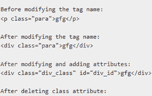

# 美化组–修改树

> 原文:[https://www . geesforgeks . org/beautulsoup-modification-the-tree/](https://www.geeksforgeeks.org/beautifulsoup-modifying-the-tree/)

**先决条件:** [美丽组](https://www.geeksforgeeks.org/implementing-web-scraping-python-beautiful-soup/)

是一个用于网页抓取的 Python 库。这个强大的 python 工具也可以用来修改 html 网页。本文描述了如何使用美丽的输出来修改解析树。美化组用于搜索解析树，并允许您修改树。您可以重命名标记，更改其属性值，添加和删除属性。

### **修改标签名称及其属性**

您可以通过添加或删除标签来更改标签的名称并修改其属性。

*   要更改标签名称:

> **语法:**tag . name =“new _ tag”

*   要修改其属性或添加新属性:

> **语法:**标记[“属性”] =“值”

*   要删除任何属性:

> **语法:** del 标记[“属性”]

还可以通过在所需位置插入新元素来修改树。

*   函数的作用是:在任意位置插入新元素

> **语法:**标记. insert()

*   函数的作用是:在解析树的某个元素之后插入元素。

> **语法:** tag.insert_after()

*   函数的作用是:在解析树中的某个元素之前插入元素。

> **语法:** tag.insert_before()

**进场:**

*   导入模块
*   从网页上删除数据
*   解析抓取到 html 的字符串
*   选择必须在其中执行修改的标签
*   进行必要的更改

**例 1:**

## 蟒蛇 3

```
# importing module
from bs4 import BeautifulSoup

markup = """<p class="para">gfg</p>

"""

# parsering string to HTML
soup = BeautifulSoup(markup, 'html.parser')

# extracting a tag
tag = soup.p

print("Before modifying the tag name: ")
print(tag)
print()

# modifying tag name
tag.name = "div"

print("After modifying the tag name: ")
print(tag)
print()
# modifying its class attribute
tag['class'] = "div_class"

# adding new attribute
tag['id'] = "div_id"

print("After modifying and adding attributes: ")
print(tag)
print()

# to delete any attributes
del tag["class"]

print("After deleting class attribute: ")
print(tag)
print()

# modifying the tags content
tag.string = "Geeks"

print("After modifying tag string: ")
print(tag)
print()

# using insert function.
tag = soup.div
print("Before inserting: ")
print(tag)
print()

# inserting content
tag.insert(1, " for Geeks")
print("After inserting: ")
print(tag)
print()
```

**输出:**



**例 2:**

## 蟒蛇 3

```
# importing module
from bs4 import BeautifulSoup

soup = BeautifulSoup("<b>| A Computer Science portal</b>", 'html.parser')

tag = soup.new_tag("p")
tag.string = "Geeks"

# insert before
soup.b.string.insert_before(tag)
print(soup.b)
print()

# insert after
soup.b.p.insert_after(soup.new_string(" for Geeks"))
print(soup.b)
```

**输出:**


### **添加新标签并**包裹**元素**

可以通过在任何需要的位置添加新标签来修改树。我们也可以包装元素来修改它。

*   函数的作用是:添加一个新的标签

> **语法:** new_tag(“属性”)

*   wrap()函数将在指定的标记中包含一个元素，并返回一个新的包装

> **语法:**换行()

*   函数的作用是:打开包装好的元素。

> **语法:**打开()

**示例:**

## 蟒蛇 3

```
# importing module
from bs4 import BeautifulSoup

markup = '

<p>Geeks for Geeks</p>

'

# parsering string to HTML
soup = BeautifulSoup(markup, 'html.parser')
print(soup)

# wrapping around the string
soup.p.string.wrap(soup.new_tag("i"))
print(soup)

# wrapping around the tag
soup.p.wrap(soup.new_tag("div"))
print(soup)

# unwrapping the i tag

soup.p.i.unwrap()

print(soup)

old_tag = soup.div

# new tag
new_tag = soup.new_tag('div')
new_tag.string = "| A Computer Science portal for geeks"

# adding new tag
old_tag.append(new_tag)

print(soup)
```

**输出:**


### 替换元素

函数的作用是:在解析树中，用新的标记或字符串替换旧的标记或字符串。

> **语法:**替换为()

**示例:**

## 蟒蛇 3

```
# importing BeautifulSoup Module
from bs4 import BeautifulSoup

markup = '<a href="http://gfg.com/">Geeks for Geeks <i>gfg.com</i></a>'

# parsering string to HTML
soup = BeautifulSoup(markup, 'html.parser')

# tag to be replaced
old_tag = soup.a

# new tag
new_tag = soup.new_tag("p")

# input string
new_tag.string = "gfg.in"

'''replacing tag  page_element.replace_with("string")
removes a tag or string from the tree, and replaces
it with the tag or string of your choice.'''

old_tag.i.replace_with(new_tag)

print(old_tag)
```