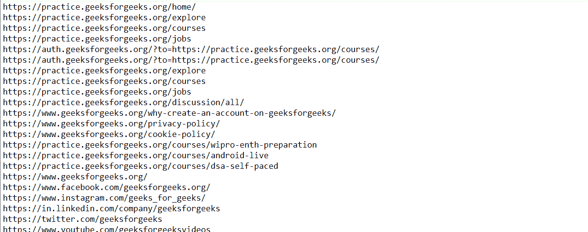

# 漂亮的链接–从 HTML 中抓取链接

> 原文:[https://www . geesforgeks . org/beautulsoup-scratch-link-from-html/](https://www.geeksforgeeks.org/beautifulsoup-scraping-link-from-html/)

**先决条件:** [用美图实现 Python 中的网页抓取](https://www.geeksforgeeks.org/implementing-web-scraping-python-beautiful-soup/)

在本文中，我们将了解如何使用 Python 从网址或 HTML 文档中提取所有链接。

### **所需库:**

*   **bs4(美化程序):**它是 python 中的一个库，可以很容易地从网页中抓取信息，并有助于从 HTML 和 XML 文件中提取数据。这个库需要从外部下载，因为它没有 Python 包。要安装此库，请在终端中键入以下命令。

```
pip install bs4
```

*   **请求:**这个库使得发送 HTTP 请求和获取网页内容变得非常容易。该库也需要从外部下载，因为它不容易与 Python 包一起提供。要安装此库，请在终端中键入以下命令。

```
pip install requests
```

### 应遵循的步骤:

*   导入所需的库(bs4 和请求)
*   创建一个函数，使用 *requests.get()* 方法从网址中获取 HTML 文档，方法是将网址传递给它。
*   使用*美化程序(*方法创建一个解析树对象，即汤对象，并将其传递给上面提取的 HTML 文档和 Python 内置的 HTML 解析器。
*   使用 *a* 标签从美丽的输出对象中提取链接。
*   用 *get()* 方法从表单中获取所有锚标签对象的实际网址，并将 *href* 参数传递给它。
*   此外，您可以使用 *get()* 方法并向其传递 *title* 参数来获取网址的标题。

### 实施:

## 蟒蛇 3

```
# import necessary libraries
from bs4 import BeautifulSoup
import requests
import re

# function to extract html document from given url
def getHTMLdocument(url):

    # request for HTML document of given url
    response = requests.get(url)

    # response will be provided in JSON format
    return response.text

# assign required credentials
# assign URL
url_to_scrape = "https://practice.geeksforgeeks.org/courses/"

# create document
html_document = getHTMLdocument(url_to_scrape)

# create soap object
soup = BeautifulSoup(html_document, 'html.parser')

# find all the anchor tags with "href" 
# attribute starting with "https://"
for link in soup.find_all('a', 
                          attrs={'href': re.compile("^https://")}):
    # display the actual urls
    print(link.get('href'))  
```

**输出:**

