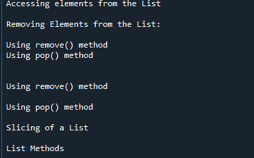

# 漂亮的组图–从 HTML 中抓取列表

> 原文:[https://www . geesforgeks . org/beautulsoup-scratch-list-from-html/](https://www.geeksforgeeks.org/beautifulsoup-scraping-list-from-html/)

**先决条件:**

*   [请求](https://www.geeksforgeeks.org/python-requests-tutorial/)
*   [美丽的脉冲星](https://www.geeksforgeeks.org/implementing-web-scraping-python-beautiful-soup/)

Python 可以用来从网页中删除信息。它还可以用来检索特定标签中提供的数据，本文介绍了如何从 HTML 中抓取列表元素。

**所需模块:**

*   **bs4:** 美人汤(bs4)是一个从 HTML 和 XML 文件中拉出数据的 Python 库。这个模块没有内置 Python。要安装此软件，请在终端中键入以下命令。

```
pip install bs4
```

*   **请求:** Requests 可以让你极其轻松地发送 HTTP/1.1 请求。该模块也没有内置 Python。要安装此软件，请在终端中键入以下命令。

```
pip install requests
```

**进场:**

*   导入模块
*   使用请求模块获取 HTML 代码
*   使用 **find_all()** 方法查找所有列表标签。
*   使用文本属性遍历所有列表标签并获取文本

**示例 1:** 从 HTML 代码中抓取列表

## 蟒蛇 3

```
# Import Required Modules
from bs4 import BeautifulSoup
import requests

# HTML Code
html_content = """
<ul>
  <li>Coffee</li>
  <li>Tea</li>
  <li>Milk</li>
</ul>
"""

# Parse the html content
soup = BeautifulSoup(html_content, "lxml")

# Find all li tag
datas = soup.find_all("li")

# Iterate through all li tags
for data in datas:
    # Get text from each tag
    print(data.text)

print(f"Total {len(datas)} li tag found")
```

**输出:**

> 咖啡
> 
> 茶
> 
> 牛奶
> 
> 总共找到 3 个 li 标记

**示例 2:** 从网页网址抓取列表

## 蟒蛇 3

```
# Import Required Modules
from bs4 import BeautifulSoup
import requests

# HTML Code
html_content = """
<ul>
  <li>Coffee</li>
  <li>Tea</li>
  <li>Milk</li>
</ul>
"""

# Parse the html content
soup = BeautifulSoup(html_content, "lxml")

# Find all li tag
datas = soup.find_all("li")

# Iterate through all li tags
for data in datas:
    # Get text from each tag
    print(data.text)

print(f"Total {len(datas)} li tag found")
```

**输出:**

