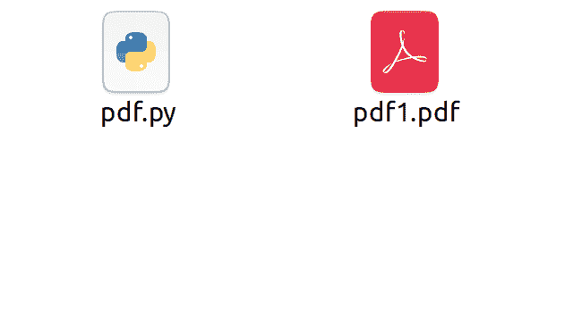

# 使用请求和美化程序用 Python 下载 PDFs】

> 原文:[https://www . geesforgeks . org/downling-pdf-with-python-use-requests-and-beauty ulsup/](https://www.geeksforgeeks.org/downloading-pdfs-with-python-using-requests-and-beautifulsoup/)

[](https://www.geeksforgeeks.org/beautifulsoup-object-python-beautifulsoup/)**对象由美人汤提供，美人汤是 Python 的网页抓取框架。网页抓取是使用自动化工具从网站中提取数据的过程，以使该过程更快。*美化组*对象代表整个解析后的文档。大多数情况下，您可以将其视为标签对象。**

**[**Requests**](https://www.geeksforgeeks.org/python-requests-tutorial/) 库是 Python 的一个组成部分，用于向指定的 URL 发出 HTTP 请求。无论是 REST APIs 还是 Web 报废，*要求必须学习*才能继续使用这些技术。当一个人向 URI 提出请求时，它会返回一个响应。Python *请求*提供了管理请求和响应的内置功能。**

**本文涉及使用 python 中的*美化程序*和*请求*库下载 pdf。*美化程序*和请求有助于从网页中提取所需信息。**

****进场:****

**要找到 PDF 并下载，我们必须遵循以下步骤:**

*   **导入*美化组*并请求库。**
*   **请求网址并获取响应对象。**
*   **查找网页上的所有超链接。**
*   **检查这些链接中的 PDF 文件链接。**
*   **使用响应对象获取一个 PDF 文件。**

****实施:****

## **蟒蛇 3**

```
# Import libraries
import requests
from bs4 import BeautifulSoup

# URL from which pdfs to be downloaded
url = "https://www.geeksforgeeks.org/how-to-extract-pdf-tables-in-python/"

# Requests URL and get response object
response = requests.get(url)

# Parse text obtained
soup = BeautifulSoup(response.text, 'html.parser')

# Find all hyperlinks present on webpage
links = soup.find_all('a')

i = 0

# From all links check for pdf link and
# if present download file
for link in links:
    if ('.pdf' in link.get('href', [])):
        i += 1
        print("Downloading file: ", i)

        # Get response object for link
        response = requests.get(link.get('href'))

        # Write content in pdf file
        pdf = open("pdf"+str(i)+".pdf", 'wb')
        pdf.write(response.content)
        pdf.close()
        print("File ", i, " downloaded")

print("All PDF files downloaded")
```

****输出:****

```
Downloading file:  1
File  1  downloaded
All PDF files downloaded
```

****

**上面的程序从提供的网址下载 PDF 文件，文件名分别为 pdf1、pdf2、pdf3 等。**