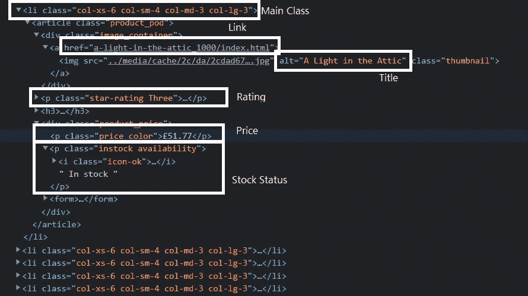
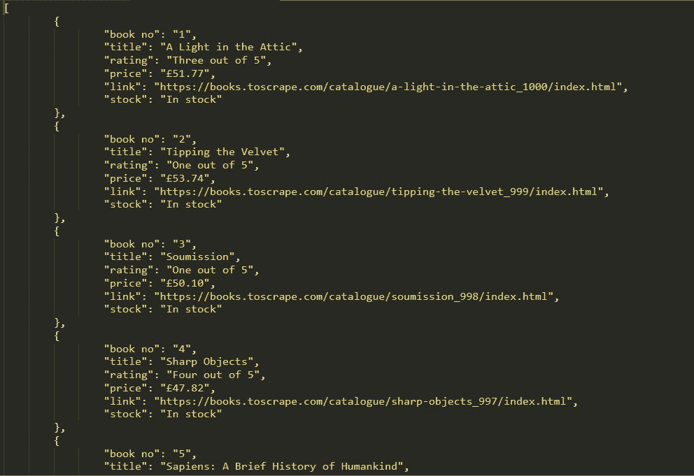

# 使用 Python 中的美化程序从 HTML 中提取 JSON】

> 原文:[https://www . geeksforgeeks . org/extract-JSON-from-html-using-beautulsoup-in-python/](https://www.geeksforgeeks.org/extract-json-from-html-using-beautifulsoup-in-python/)

在本文中，我们将使用 Python 中的美丽输出从 HTML 中提取 JSON。

### **需要的模块**

*   [**<u>bs4</u>**](https://www.geeksforgeeks.org/implementing-web-scraping-python-beautiful-soup/)**:**美人汤(bs4)是一个从 HTML 和 XML 文件中拉出数据的 Python 库。这个模块没有内置 Python。要安装此软件，请在终端中键入以下命令。

```
pip install bs4
```

*   [**<u>请求</u>**](https://www.geeksforgeeks.org/python-requests-tutorial/) **:** 请求让你发送 HTTP/1.1 请求极其轻松。该模块也没有内置 Python。要安装此软件，请在终端中键入以下命令。

```
pip install requests
```

**进场:**

*   导入所有必需的模块。
*   在 get 函数(UDF)中传递 URL，这样它会将 GET 请求传递给 URL，并返回响应。

> ***语法:** requests.get(url，args)*

*   现在使用 bs4 解析 HTML 内容。

> ***语法:*** 美化组
> 
> **参数:**
> 
> *   **page.text** *:是原始的 HTML 内容。*
> *   ***html.parser** :指定我们想要使用的 html 解析器。*

*   现在用 find()函数获取所有需要的数据。

现在找到带有 li、a、p 标签的客户列表，其中有一些唯一的类或 id。您可以在浏览器中打开网页，并按下右键检查相关元素，如图所示。



*   创建一个 json 文件，使用 *json.dump()* 方法将 python 对象转换成合适的 Json 对象。

**以下是完整实现:**

## 蟒蛇 3

```
# Import the required modules
import requests
from bs4 import BeautifulSoup
import json

# Function will return a list of dictionaries
# each containing information of books.
def json_from_html_using_bs4(base_url):

    # requests.get(url) returns a response that is saved
    # in a response object called page.
    page = requests.get(base_url)

    # page.text gives us access to the web data in text
    # format, we pass it as an argument to BeautifulSoup
    # along with the html.parser which will create a
    # parsed tree in soup.
    soup = BeautifulSoup(page.text, "html.parser")

    # soup.find_all finds the div's, all having the same
    # class "col-xs-6 col-sm-4 col-md-3 col-lg-3" that is
    # stored in books
    books = soup.find_all(
        'li', attrs={'class':
                'col-xs-6 col-sm-4 col-md-3 col-lg-3'})

    # Initialise the required variables
    star = ['One', 'Two', 'Three', 'Four', 'Five']
    res, book_no = [], 1

    # Iterate books classand check for the given tags
    # to get the information of each books.
    for book in books:

        # Title of book in  tag with "alt" key.
        title = book.find('img')['alt']

        # Link of book in <a> tag with "href" key
        link = base_url[:37] + book.find('a')['href']

        # Rating of book from

<p> tag
        for index in range(5):
            find_stars = book.find(
            'p', attrs={'class': 'star-rating ' + star[index]})

            # Check which star-rating class is not
            # returning None and then break the loop
            if find_stars is not None:
                stars = star[index] + " out of 5"
                break

        # Price of book from

<p> tag in price_color class
        price = book.find('p', attrs={'class': 'price_color'
                                                    }).text

        # Stock Status of book from

<p> tag in
        # instock availability class.
        instock = book.find('p', attrs={'class':
                        'instock availability'}).text.strip()

        # Create a dictionary with the above book information
        data = {'book no': str(book_no), 'title': title,
            'rating': stars, 'price': price, 'link': link,
            'stock': instock}

        # Append the dictionary to the list
        res.append(data)
        book_no += 1
    return res

# Main Function
if __name__ == "__main__":

    # Enter the url of website
    base_url = "https://books.toscrape.com/catalogue/page-1.html"

    # Function will return a list of dictionaries
    res = json_from_html_using_bs4(base_url)

    # Convert the python objects into json object and export
    # it to books.json file.
    with open('books.json', 'w', encoding='latin-1') as f:
        json.dump(res, f, indent=8, ensure_ascii=False)
    print("Created Json File")
```

**输出:**

```
Created Json File
```

**我们的 JSON 文件输出:**

