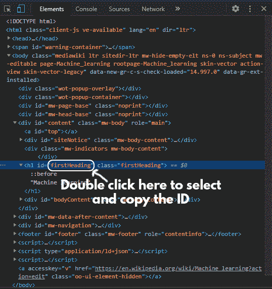
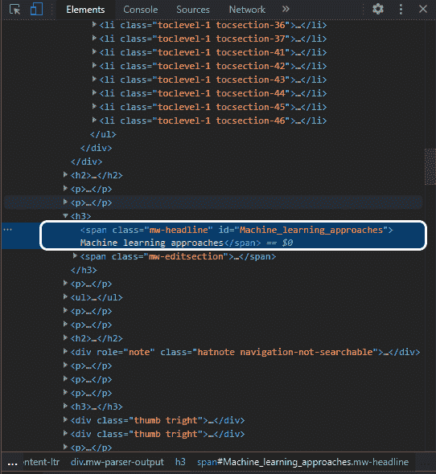

# 使用 beautulsup

提取给定标签及其父标签的 HTML 代码

> 原文:[https://www . geeksforgeeks . org/extract-the-html-code-of-the-given-tag-and-it-parent-use-beauty sup/](https://www.geeksforgeeks.org/extract-the-html-code-of-the-given-tag-and-its-parent-using-beautifulsoup/)

在本文中，我们将讨论如何使用 BeautifulSoup 提取给定标签及其父标签的 HTML 代码。

### 需要的模块

首先，我们需要在计算机上安装所有这些模块。

*   [**【美观组:**](https://www.geeksforgeeks.org/beautifulsoup-object-python-beautifulsoup/) 我们的主模块包含一个通过 HTTP 访问网页的方法。

```
pip install bs4
```

*   **lxml:** 处理 python 语言网页的助手库。

```
pip install lxml
```

*   [**请求:**](https://www.geeksforgeeks.org/python-requests-tutorial/) 使发送 HTTP 请求的过程完美无瑕.函数的输出。

```
pip install requests
```

### 抓取示例网站

*   我们导入我们漂亮的输出模块和请求。我们声明了 Header 并添加了一个用户代理。这确保了我们要进行网页抓取的目标网站不会将来自我们程序的流量视为垃圾邮件，并最终被它们阻止。

## 蟒蛇 3

```
# importing the modules
from bs4 import BeautifulSoup
import requests

# URL to the scraped
URL = "https://en.wikipedia.org/wiki/Machine_learning"

# getting the contents of the website and parsing them
webpage = requests.get(URL)
soup = BeautifulSoup(webpage.content, "lxml")
```

*   现在，要瞄准您想要获取信息的元素，右键单击它，然后单击检查元素。然后从“检查元素”窗口中，尝试找到一个其他元素独有的 HTML 属性。大多数时候是元素的 Id。



这里要提取网站标题的 HTML，我们可以使用标题的 id 轻松提取。

## 蟒蛇 3

```
# getting the h1 with id as firstHeading and printing it
title = soup.find("h1", attrs={"id": 'firstHeading'})
print(title)
```

*   现在提取相关标签的内容，我们可以简单地使用。get_text()方法。实施如下:

## 蟒蛇 3

```
# getting the text/content inside the h1 tag we
# parsed on the previous line
cont = title.get_text()
print(cont)
```

*   现在，为了提取相关元素的父元素的 HTML，让我们举一个具有标识“机器学习方法”的跨度的例子。



我们需要提取它，以列表的形式显示 HTML。

## 蟒蛇 3

```
# getting the HTML of the parent parent of 
# the h1 tag we parsed earlier
parent = soup.find("span", 
                   attrs={"id": 'Machine_learning_approaches'}).parent()
print(parent)
```

**下面是完整的程序:**

## 蟒蛇 3

```
# importing the modules
from bs4 import BeautifulSoup 
import requests 

# URL to the scraped
URL = "https://en.wikipedia.org/wiki/Machine_learning"

# getting the contents of the website and parsing them
webpage = requests.get(URL) 
soup = BeautifulSoup(webpage.content, "lxml")

# getting the h1 with id as firstHeading and printing it
title = soup.find("h1", attrs={"id": 'firstHeading'})
print(title)

# getting the text/content inside the h1 tag we 
# parsed on the previous line
cont = title.get_text()
print(cont)

# getting the HTML of the parent parent of 
# the h1 tag we parsed earlier
parent = soup.find("span", 
                   attrs={"id": 'Machine_learning_approaches'}).parent()
print(parent)
```

**输出:**


#### 您也可以参考此视频了解解释:

<video class="wp-video-shortcode" id="video-568987-1" width="640" height="360" preload="metadata" controls=""><source type="video/mp4" src="https://media.geeksforgeeks.org/wp-content/uploads/20210305150433/comp_super.mp4?_=1">[https://media.geeksforgeeks.org/wp-content/uploads/20210305150433/comp_super.mp4](https://media.geeksforgeeks.org/wp-content/uploads/20210305150433/comp_super.mp4)</video>