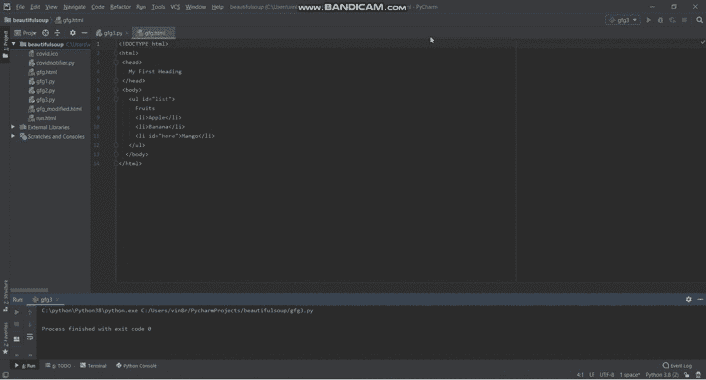

# 用美丽的鼠标点击按钮后获取数值

> 原文:[https://www . geeksforgeeks . org/按钮点击后获取价值-with-beautiful sup/](https://www.geeksforgeeks.org/getting-value-after-button-click-with-beautifulsoup/)

该库除了从 HTML 或 XML 文件中提取数据之外，还有助于搜索、修改和导航解析树。按钮单击后，您是否无法从小部件中获取值？别担心。只需通读一遍文章，就能知道用“美丽”按钮点击后获取值的过程。

### 逐步方法:

*   首先，导入美丽的库，操作系统和 Tkit。

> 从 bs4 导入美丽的组作为 bs
> 
> 来自 tkinter 导入*
> 
> 导入操作系统

*   现在，通过输入您当前工作所在的 Python 文件的名称来删除路径的最后一段。

> base = OS . path . dirname(OS . path . abpath(#您当前工作所在的 Python 文件的名称))

*   然后，打开要从中读取值的 HTML 文件。

> html=open(os.path.join(base，' #您希望从中读取值的 html 文件的名称'))

*   此外，解析美丽的汤里的 HTML 文件

> shoot = bs(html，‘html . parser’)

*   接下来，在找到希望从中获取值的小部件后获取文本。

> value = soup . find(“# widget 的名称”，{“id”:# widget 的 Id 名称”})。文本

*   此外，创建一个你可以点击按钮的应用程序

> app=Tk()

*   把标题和几何图形给你的应用。

> 应用标题(“#应用标题”)
> 
> app . Geometry(#您希望提供给 app 的几何图形)

*   稍后，创建一个任意名称的函数，当点击按钮时执行。您可以给出任何函数名。在这种情况下，我们假设函数名是 func。在函数中，单击按钮后，获取要获取值的文件。接下来，在按钮单击后，将值写入您希望获得的文件中

> def func():
> 
> 使用 open(' #要在其中写入值的文本文件的名称'，" w "，编码='utf-8 ')作为 f_output:
> 
> f_output.write(值)

*   在应用程序中构建按钮，当点击该按钮时会给出结果

> b1 =按钮(应用程序，文本= ' #您想给按钮的文本'，命令=功能)

*   此外，显示上一步中创建的按钮。

> b1 .网格(padx = #轴填充，pady = #轴填充)

*   最后，循环在屏幕上显示图形用户界面应用程序。

> 应用程式主目录( )

### 实施:

考虑下面的 HTML 源代码。

## 超文本标记语言

```
<!DOCTYPE html>
<html>
 <head>
   My First Heading
 </head>
 <body>
   <ul id="list">
     Fruits
     <li>Apple</li>
     <li>Banana</li>
     <li id="here">Mango</li>
   </ul>
  </body>
</html>
```

让我们考虑一下你想在 txt 文件‘text _ file’中获取值‘Mango’后点击按钮‘点击这里！’，则可以编写以下代码。

## 计算机编程语言

```
# Python program to obtain value after button click

# Import the libraries BeautifulSoup, tkinter and os
from bs4 import BeautifulSoup as bs
import os
from tkinter import *

# Remove the last segment of the path
base = os.path.dirname(os.path.abspath('gfg3.py'))

# Open the HTML in which you want to make changes
html = open(os.path.join(base, 'gfg.html'))

# Parse HTML file in Beautiful Soup
soup = bs(html, 'html.parser')

# Find the value which you want to obtain after button click
value = soup.find("li", {"id": "here"}).text

# Construct the app for clicking of button
app = Tk()

# Give title to your GUI app
app.title("Vinayak App")

# Set dimensions for the app
app.geometry('600x400')

def apple():

    # Open the file in which you want to obtain the value
    with open('text_file.txt', "w", encoding='utf-8') as f_output:

        # Writing the value in the file
        f_output.write(value)

# Construct the button in your app
b1 = Button(app, text='Click Here!', command=apple)

# Display the button created in previous step
b1.grid(padx=250, pady=150)

# Make the loop for displaying app
app.mainloop()
```

**输出:**

