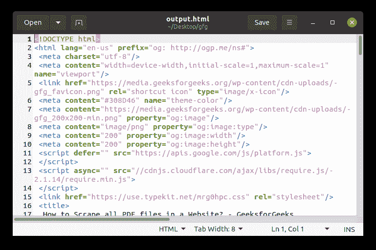

# 如何用 Python 美化程序将输出写入 HTML 文件？

> 原文:[https://www . geeksforgeeks . org/如何使用 python-beautulsoup/将输出写入 html 文件/](https://www.geeksforgeeks.org/how-to-write-the-output-to-html-file-with-python-beautifulsoup/)

在本文中，我们将使用 Python [美化输出](https://www.geeksforgeeks.org/implementing-web-scraping-python-beautiful-soup/)将输出写入一个 HTML 文件。美化输出是一个主要用于网页抓取的 python 库，但是在本文中，我们将讨论如何将输出写入一个 HTML 文件。

**所需模块及安装:**

```py
pip install bs4
```

**进场:**

*   我们将首先导入所有必需的库。
*   向所需的网址发出获取请求，并提取其页面内容。
*   使用 python 的文件数据类型，将输出写入一个新文件。

**应遵循的步骤:**

**步骤 1:** 导入所需的库。

## 蟒蛇 3

```py
# Import libraries
from bs4 import BeautifulSoup
import requests
```

**第二步:**我们将对谷歌搜索引擎主页执行 get 请求，提取其页面内容，并通过将其传递给美丽的汤来制作一个汤对象，我们将标记设置为 html.parser。

**注意:**如果您正在提取一个 xml 页面，请将标记设置为 xml.parser

## 蟒蛇 3

```py
# set the url to perform the get request
URL = 'https://www.geeksforgeeks.org/how-to-scrape-all-pdf-files-in-a-website/'
page = requests.get(URL)

# load the page content
text = page.content

# make a soup object by using beautiful
# soup and set the markup as html parser
soup = BeautifulSoup(text, "html.parser")
```

**第三步:**我们使用 python 的文件数据类型，在输出文件中写入 shot 对象。我们将把编码设置为 UTF-8。我们会用。函数的作用是:使汤变得更容易阅读。在编写之前，我们将把汤对象转换成字符串。

我们将输出文件存储在名为 output.html 的同一个目录中

## 蟒蛇 3

```py
# open the file in w mode
# set encoding to UTF-8
with open("output.html", "w", encoding = 'utf-8') as file:

    # prettify the soup object and convert it into a string  
    file.write(str(soup.prettify()))
```

**以下是完整实现:**

## 蟒蛇 3

```py
# Import libraries
from bs4 import BeautifulSoup
import requests

# set the url to perform the get request
URL = 'https://www.geeksforgeeks.org/how-to-scrape-all-pdf-files-in-a-website/'
page = requests.get(URL)

# load the page content
text = page.content

# make a soup object by using
# beautiful soup and set the markup as html parser
soup = BeautifulSoup(text, "html.parser")

# open the file in w mode
# set encoding to UTF-8
with open("output.html", "w", encoding = 'utf-8') as file:

    # prettify the soup object and convert it into a string
    file.write(str(soup.prettify()))
```

**输出:**

