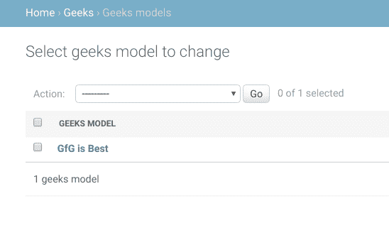

# 使用 __str__ 函数更改对象显示名称–姜戈模型| Python

> 原文:[https://www . geesforgeks . org/change-object-display-name-using-_ _ str _ _-function-django-models-python/](https://www.geeksforgeeks.org/change-object-display-name-using-__str__-function-django-models-python/)

如何在 Django 管理界面中更改对象的显示名称？每当在姜戈创建模型实例时，它都会将对象显示为**模型名称对象(1)** 。本文将探讨如何使用`def __str__(self)`更改模型中的显示名称来更改您的 Django 模型。

## 姜戈模型中的对象显示名称

考虑一个名为`geeksforgeeks`的项目，它有一个名为`geeks`的应用程序。

> 请参考以下文章，查看如何在 Django 中创建项目和应用程序。
> 
> *   [如何利用姜戈的 MVT 创建基础项目？](https://www.geeksforgeeks.org/how-to-create-a-basic-project-using-mvt-in-django/)
> *   [如何在姜戈创建 App？](https://www.geeksforgeeks.org/how-to-create-an-app-in-django/)

将以下代码输入**极客** app 的`models.py`文件。

```
from django.db import models
from django.db.models import Model
# Create your models here.

class GeeksModel(Model):
    geeks_field = models.CharField(max_length = 200)
```

在 Django 上运行 makemigrations 和 migration 并渲染上述模型后，让我们尝试使用字符串“ **GfG 为 Best** ”创建一个实例。

现在它将在管理界面中显示与**极客模型对象(1)** 相同的对象。


#### 如何在 Django 管理界面更改模型实例的显示名称？

要更改显示名称，我们将在模型中使用`def __str__()`功能。django 模型中的 **str** 函数返回一个字符串，该字符串被精确地呈现为该模型实例的显示名称。
例如，如果我们将上述型号. py 改为

```
from django.db import models
from django.db.models import Model
# Create your models here.

class GeeksModel(Model):
    geeks_field = models.CharField(max_length = 200)

    def __str__(self):
         return "something"
```

这将在管理界面中始终将对象显示为**或**。
T3】

大多数情况下，我们使用`self`对象来命名可以理解的显示名称。例如，上述函数中的`return self.geeks_field`将返回存储在该对象的 geeks_field 中的字符串，并显示在管理界面中。
。

注意**字符串**函数总是返回一个字符串，可以根据自己的方便进行修改。

#### 另请检查–

*   [姜戈管理界面中的渲染模型](https://www.geeksforgeeks.org/render-model-in-django-admin-interface/)
*   [内置现场验证–姜戈车型](https://www.geeksforgeeks.org/built-in-field-validations-django-models/)