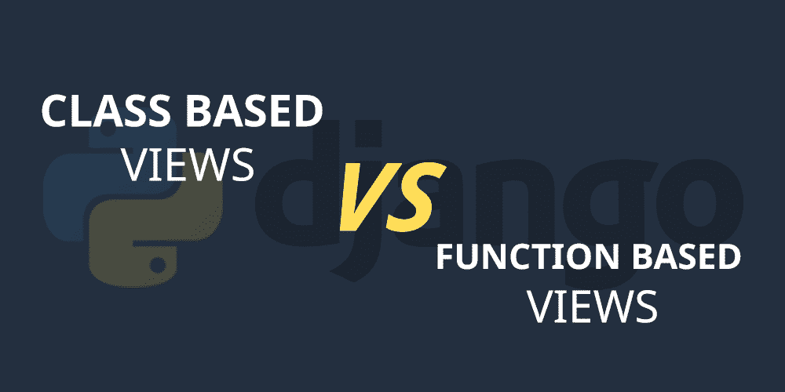

# 基于类的视图和基于函数的视图——在 Django 中使用哪个更好？

> 原文:[https://www . geesforgeks . org/基于类-基于函数-视图-哪个更适合在 django 中使用/](https://www.geeksforgeeks.org/class-based-vs-function-based-views-which-one-is-better-to-use-in-django/)

**Django**……我们都知道这个 python 框架在全世界的受欢迎程度。这个框架让开发人员的生活变得更加轻松。开发人员在 Django 构建一个完整的 web 应用程序变得更加容易。如果你是一个有经验的 Django 开发人员，那么你肯定知道这个项目的流程。事情如何在姜戈的样板文件中运行，数据如何呈现给用户。



Django 致力于 MVT 概念我们主要致力于其中的两种类型的视图…基于类的视图和基于函数的视图。如果你是 Django 框架的新手，那么你肯定会使用基于函数的视图。

最初，[**【Django】**](https://www.geeksforgeeks.org/django-tutorial/)以基于函数的视图开始，但后来 Django 增加了基于类的视图的概念，以避免样板文件中代码的冗余。在 Django 中使用哪个更好是开发人员之间的争论…基于类的视图还是基于函数的视图？今天在这个博客中，我们将深入讨论这个话题，以了解这两种观点的利弊。

你可以用这两种方法来完成你的任务。有些任务可以最好地使用基于内容的虚拟仪器来实现，有些任务可以在基于内容的虚拟仪器中实现。Django 视图主要有三个要求…

*   它们是可调用的。您可以使用基于函数或基于类的方法编写视图。在使用 CBVs 时，您继承了 as_view()方法，该方法使用 dispatch()方法来调用适合的方法，具体取决于 HTTP 动词(get、post)等。
*   作为第一个位置参数，Django 视图应该接受 HttpRequest。
*   它应该返回 HttpResponse 对象，或者应该引发异常。

现在让我们比较一下这两种观点，看看它们的优缺点。

### **1。基于功能的视图**

基于函数的视图对初学者来说很好。与基于类的视图相比，它非常容易理解。最初，当您想要关注核心基础时，使用基于函数的视图有利于理解它。让我们讨论一下它的利弊。

**优点:**

*   易于阅读、理解和实施。
*   显式代码流
*   装饰者的直接用法。
*   对专业功能有好处。

cons:t1]

*   代码冗余且难以扩展
*   条件分支将用于处理 HTTP 方法。

正如我们所讨论的，基于函数的视图很容易理解，但是由于大型 Django 项目中的代码冗余，您会在视图中发现类似的函数。你会发现类似的代码被不必要地重复。

这是一个基于函数的视图的例子…

## 蟒蛇 3

```
def example_create_view(request, pk):
  template_name = 'form.html'
  form_class = FormExample

  form = form_class

  if request.method == 'POST':
    form = form_class(request.POST)
    if form.is_valid():
      form.save()
      return HttpResponseRedirect(reverse('list-view'))

  return render(request, template_name, {'form': form})
```