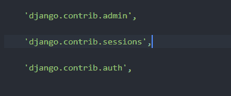
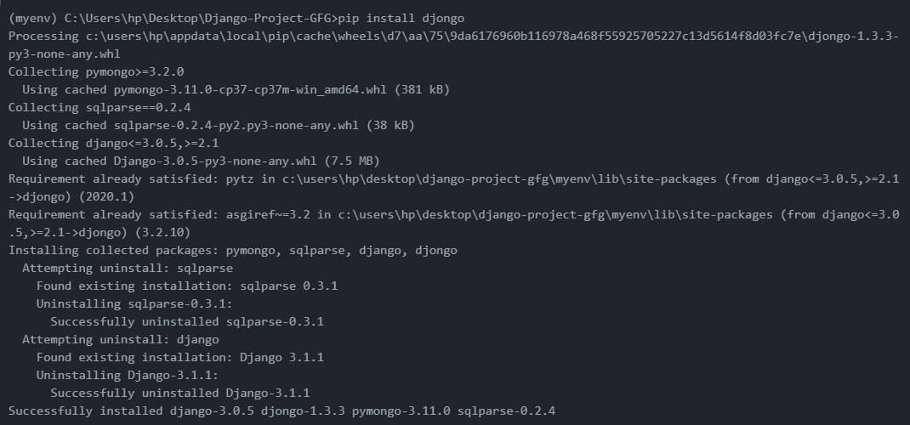
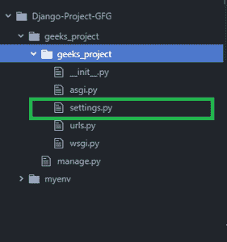
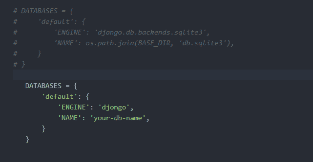

# 将 Django 项目连接到 MongoDB

> 原文:[https://www . geesforgeks . org/connect-django-project-to-MongoDB/](https://www.geeksforgeeks.org/connect-django-project-to-mongodb/)

Djongo 是一个 SQL 到 mongodb 的查询传输器。使用 djongo，我们可以使用 MongoDB 作为我们的 Django 项目的后端数据库。我们甚至不需要改变 Django ORM。最棒的是，我们只需添加一行代码就可以用 MongoDB 设置 Django。不需要更改序列化程序、视图或任何其他模块。

**正式文件–**[https://pypi.org/project/djongo/](https://pypi.org/project/djongo/)

**Working–**
Djongo 将一个 SQL 查询字符串翻译成 MongoDB 查询文档。因此，不需要更改模型、序列化程序、视图或任何 Django 特性。Djongo 支持所有 django contrib 库，这使得它成为一个易于使用的连接器。



**要求–**

1.Python 3.6 或更高版本。

2.MongoDB 3.4 或更高版本。(如果使用嵌套查询，则需要 MongoDB 3.6 或更高版本。)

**特征:**

*   **重用 Django 模型/ORM–**
    由于 Django 模型与 Djongo 兼容，我们可以使用重用它们。
*   **完整性检查**
    Djongo 允许在保存到数据库之前进行完整性检查，如缺失值。
    对于 eg-如果我们在 EmbeddedField 中设置 null=False，blank=False，则不会存储缺失值


*   **验证器**
    我们可以应用像 URLValidator、EmailValidator、RegexValidator 等验证检查。在每个字段保存到数据库之前。


用法:

**第一步:设置虚拟环境**

```py
virtualenv myenv
myenv\Scripts\activate
```

 

**第二步:安装 Django**

```py
pip install django
```


**第三步:安装 Djongo**

```py
pip install djongo
```



**第四步:启动姜戈项目**

```py
django-admin startproject geeks_project
```


您的项目结构如下所示:



**第五步:更改设置. py 文件**

现在，打开**设置. py** 文件。注释掉或删除以前的 SQL 数据库配置，并在**设置中添加以下代码**

```py
   DATABASES = {
      'default': {
          'ENGINE': 'djongo',
          'NAME': 'your-database-name',
      }
  }
```



就这样。现在，您可以使用 Mongodb 作为 django 项目的后端数据库，而无需更改单个 django 模型！