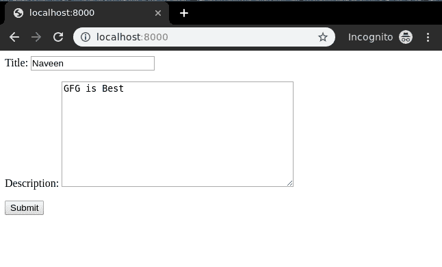

# 创建视图–基于功能的视图姜戈

> 原文:[https://www . geesforgeks . org/create-view-function-based-view-django/](https://www.geeksforgeeks.org/create-view-function-based-views-django/)

创建视图是指在数据库中创建表实例的视图(逻辑)。这就像从用户那里获取输入，并将其存储在指定的表中。Django 为创建视图提供了非常普通的支持，但是让我们检查一下它是如何通过基于函数的视图手动完成的。本文围绕创建视图展开，其中涉及到 Django 表单、Django 模型等概念。
对于创建视图，我们需要一个带有一些模型和表单的项目，用于创建该模型的实例。

## 姜戈创建视图-基于函数的视图

使用示例说明**如何创建和使用创建视图**。考虑一个名为`geeksforgeeks`的项目，它有一个名为`geeks`的应用程序。

> 请参考以下文章，查看如何在 Django 中创建项目和应用程序。
> 
> *   [如何利用姜戈的 MVT 创建基础项目？](https://www.geeksforgeeks.org/how-to-create-a-basic-project-using-mvt-in-django/)
> *   [如何在姜戈创建 App？](https://www.geeksforgeeks.org/how-to-create-an-app-in-django/)

在你有一个项目和一个应用程序后，让我们创建一个模型，我们将通过我们的视图创建实例。在`geeks/models.py`中，

```
# import the standard Django Model
# from built-in library
from django.db import models

# declare a new model with a name "GeeksModel"
class GeeksModel(models.Model):

    # fields of the model
    title = models.CharField(max_length = 200)
    description = models.TextField()

    # renames the instances of the model
    # with their title name
    def __str__(self):
        return self.title
```

创建这个模型后，我们需要运行两个命令来为其创建数据库。

```
Python manage.py makemigrations
Python manage.py migrate

```

现在我们将为此模型创建一个 Django 模型表单。有关模型表单-[姜戈模型表单-从模型](https://geeksforgeeks.org/django-modelform-create-form-from-models/)创建表单的更多信息，请参考本文。在极客文件夹中创建一个文件`forms.py`，

```
from django import forms
from .models import GeeksModel

# creating a form
class GeeksForm(forms.ModelForm):

    # create meta class
    class Meta:
        # specify model to be used
        model = GeeksModel

        # specify fields to be used
        fields = [
            "title",
            "description",
        ]
```

现在我们已经为后端做好了一切准备。让我们为其创建一个视图和模板。在`geeks/views.py`中，

```
from django.shortcuts import render

# relative import of forms
from .models import GeeksModel
from .forms import GeeksForm

def create_view(request):
    # dictionary for initial data with 
    # field names as keys
    context ={}

    # add the dictionary during initialization
    form = GeeksForm(request.POST or None)
    if form.is_valid():
        form.save()

    context['form']= form
    return render(request, "create_view.html", context)
```

在`templates/create_view.html`创建模板，

```
<form method="POST" enctype="multipart/form-data">

    <!-- Security token -->
    

    <!-- Using the formset -->
    {{ form.as_p }}

    <input type="submit" value="Submit">
</form>
```

我们来看看[上有什么 http://localhost:8000/](http://localhost:8000/)


现在我们试着以这种形式输入数据，


答对了。！创建视图正在工作，我们可以使用通过管理面板创建的实例来验证它。

这样可以在姜戈为模型创建创建视图。