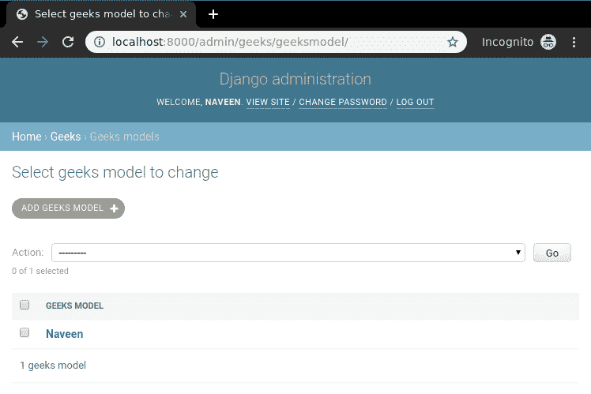

# 创建视图–基于类的视图姜戈

> 原文:[https://www . geesforgeks . org/create view-基于类-view-django/](https://www.geeksforgeeks.org/createview-class-based-views-django/)

创建视图是指在数据库中创建表实例的视图(逻辑)。我们已经在[创建视图–基于函数的视图姜戈](https://www.geeksforgeeks.org/create-view-function-based-views-django/)中讨论了创建视图的基础。基于类的视图提供了一种将视图实现为 Python 对象而不是函数的替代方法。它们不会取代基于函数的视图，但与基于函数的视图相比有一定的差异和优势:

*   与特定 HTTP 方法(GET、POST 等)相关的代码的组织。)可以通过单独的方法而不是条件分支来解决。
*   面向对象的技术，如 mixins(多重继承)可以用来将代码分解成可重用的组件。

基于类的视图比基于函数的视图管理起来更简单有效。一个有大量代码行的基于函数的视图可以被转换成只有很少代码行的基于类的视图。这就是面向对象编程产生影响的地方。

## 姜戈创建视图-基于类的视图

使用示例说明**如何创建和使用创建视图**。考虑一个名为`geeksforgeeks`的项目，它有一个名为`geeks`的应用程序。

> 请参考以下文章，查看如何在 Django 中创建项目和应用程序。
> 
> *   [如何利用姜戈的 MVT 创建基础项目？](https://www.geeksforgeeks.org/how-to-create-a-basic-project-using-mvt-in-django/)
> *   [如何在姜戈创建 App？](https://www.geeksforgeeks.org/how-to-create-an-app-in-django/)

在你有一个项目和一个应用程序后，让我们创建一个模型，我们将通过我们的视图创建实例。在`geeks/models.py`中，

```
# import the standard Django Model
# from built-in library
from django.db import models

# declare a new model with a name "GeeksModel"
class GeeksModel(models.Model):

    # fields of the model
    title = models.CharField(max_length = 200)
    description = models.TextField()

    # renames the instances of the model
    # with their title name
    def __str__(self):
        return self.title
```

创建这个模型后，我们需要运行两个命令来为其创建数据库。

```
Python manage.py makemigrations
Python manage.py migrate

```

基于类的视图自动设置从 A 到 z 的所有内容。只需指定要为哪个模型和字段创建创建视图。然后基于类的 CreateView 会自动尝试在`app_name/modelname_form.html`中找到一个模板。在我们的例子中是`geeks/templates/geeks/geeksmodel_form.html`。让我们创建基于类的视图。在`geeks/views.py`中，

```
from django.views.generic.edit import CreateView
from .models import GeeksModel

class GeeksCreate(CreateView):

    # specify the model for create view
    model = GeeksModel

    # specify the fields to be displayed

    fields = ['title', 'description']
```

现在创建一个 url 路径来映射视图。在极客/URL . py 中，

```
from django.urls import path

# importing views from views..py
from .views import GeeksCreate
urlpatterns = [
    path('', GeeksCreate.as_view() ),
]
```

在`templates/geeks/geeksmodel_form.html`创建模板，

```
<form method="POST" enctype="multipart/form-data">

    <!-- Security token -->
    

    <!-- Using the formset -->
    {{ form.as_p }}

    <input type="submit" value="Submit">
</form>
```

我们来看看[上有什么 http://localhost:8000/](http://localhost:8000/)


现在我们试着以这种形式输入数据，


答对了。！创建视图正在工作，我们可以使用通过管理面板创建的实例来验证它。

这样可以在姜戈为模型创建创建视图。