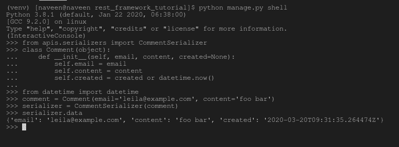

# 创建和使用序列化程序–姜戈 REST 框架

> 原文:[https://www . geesforgeks . org/creating-and-use-serializer-django-rest-framework/](https://www.geeksforgeeks.org/creating-and-using-serializers-django-rest-framework/)

在 Django REST 框架中，序列化的概念就是将数据库数据转换成 javascript 可以使用的数据类型。序列化程序允许将复杂的数据(如查询和模型实例)转换为本机 Python 数据类型，然后可以轻松地将其呈现为 JSON、XML 或其他内容类型。序列化程序还提供反序列化，允许在首先验证传入数据后，将解析的数据转换回复杂类型。REST 框架中的序列化程序的工作方式与 Django 的 Form 和 ModelForm 类非常相似。

> 查看如何设置 Django Rest 框架并创建 API 访问–[如何使用 Django RESt 框架创建基本 API？](https://geeksforgeeks.org/how-to-create-a-basic-api-using-django-rest-framework/)

#### 创建基本序列化程序

要创建基本的序列化程序，需要从 rest_framework 导入序列化程序类，并为序列化程序定义字段，就像在 Django 中创建表单或模型一样。

**例**

## 蟒蛇 3

```py
# import serializer from rest_framework
from rest_framework import serializers

# create a serializer
class CommentSerializer(serializers.Serializer):
    # initialize fields
    email = serializers.EmailField()
    content = serializers.CharField(max_length = 200)
    created = serializers.DateTimeField()
```

通过这种方式，可以根据所需字段为任何特定实体或对象声明序列化程序。序列化程序可用于序列化和反序列化数据。

#### 使用序列化程序序列化数据

现在可以使用 CommentSerializer 来序列化注释或注释列表。同样，使用序列化程序类看起来很像使用表单类。让我们首先创建一个 comment 类来创建一个我们的序列化程序可以理解的 Comment 类型的对象。

## 蟒蛇 3

```py
# import datetime object
from datetime import datetime

# create a class
class Comment(object):
    def __init__(self, email, content, created = None):
        self.email = email
        self.content = content
        self.created = created or datetime.now()
# create a object
comment = Comment(email ='leila@example.com', content ='foo bar')
```

现在我们的对象已经准备好了，让我们试着序列化这个注释对象。运行以下命令，

```py
Python manage.py shell
```

现在运行以下代码

```py
# import comment serializer
>>> from apis.serializers import CommentSerializer

# import datetime for date and time
>>> from datetime import datetime

# create a object
>>> class Comment(object):
...     def __init__(self, email, content, created=None):
...         self.email = email
...         self.content = content
...         self.created = created or datetime.now()
... 

# create a comment object
>>> comment = Comment(email='leila@example.com', content='foo bar')

# serialize the data
>>> serializer = CommentSerializer(comment)

# print serialized data
>>> serializer.data
```

现在让我们检查这个的输出，



我们可以使用 Python 的内置函数或 rest 框架的解析器将这些数据转换为 JSON 或 XML 格式。

## 蟒蛇 3

```py
# import JSON Renderer
from rest_framework.renderers import JSONRenderer

# convert data to JSON
json = JSONRenderer().render(serializer.data)
```

#### 使用序列化程序反序列化数据

反序列化类似于序列化。它意味着将数据从 JSON 格式转换为给定的数据类型。首先，我们将一个流解析成 Python 原生数据类型…(定义要反序列化到哪个数据类型…)。)
首先我们需要将这个 json 数据转换回序列化器可以理解的数据进行反序列化，

## 蟒蛇 3

```py
import io
from rest_framework.parsers import JSONParser

stream = io.BytesIO(json)
data = JSONParser().parse(stream)
```

现在让我们将数据反序列化回其原始状态

## 蟒蛇 3

```py
serializer = CommentSerializer(data = data)
serializer.is_valid()
# True
serializer.validated_data
```

让我们检查输出，以及数据是否已被反序列化–

