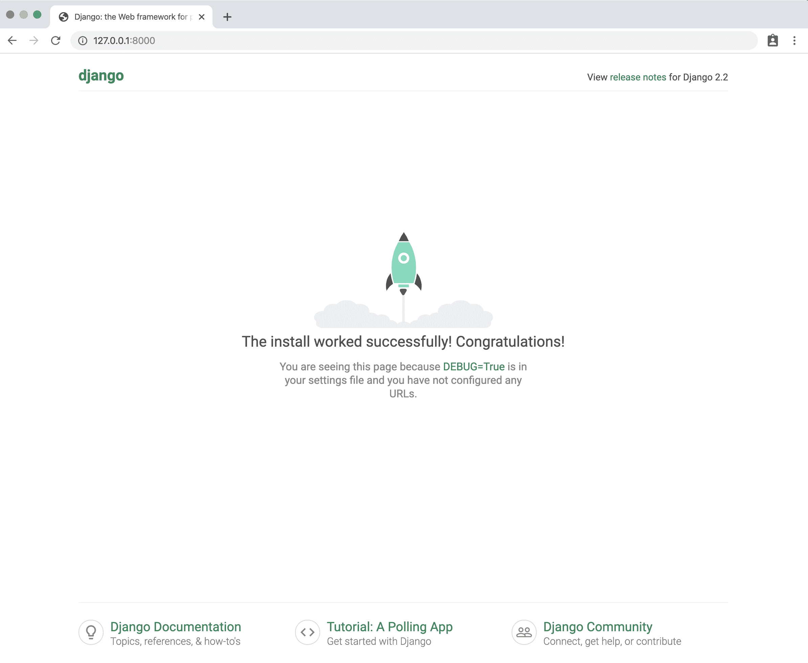

# 在姜戈创建自定义用户模型 API 扩展抽象用户

> 原文:[https://www . geesforgeks . org/creating-custom-user-model-API-extending-abstract user-in-django/](https://www.geeksforgeeks.org/creating-custom-user-model-api-extending-abstractuser-in-django/)

每个新的 Django 项目都应该使用定制的用户模型。官方的 Django 文档说它是“强烈推荐的”，但我会更进一步，毫不犹豫地说:你完全疯了，没有提前使用定制的用户模型。

**为什么在 Django 需要自定义用户模型？**

当您使用自定义用户模型开始项目时，请停下来考虑这是否是您项目的正确选择。将所有与用户相关的信息保存在一个模型中，不需要额外的或更复杂的数据库查询来检索相关的模型。另一方面，在与您的自定义用户模型有关系的模型中存储特定于应用程序的用户信息可能更合适。这使得每个应用程序都可以指定自己的用户数据要求，而不会与其他应用程序的假设相冲突或打破假设。这也意味着您将保持您的用户模型尽可能简单，专注于身份验证，并遵循 Django 期望定制用户模型满足的最低要求。

因此，我认为我们在 django 需要一个定制用户模型的原因很清楚，在本文中，我们将学习如何在 django 创建定制用户模型及其 api，现在，让我们从编码部分开始。

**设置–**

*   为我们的代码创建并导航到一个名为 users 的专用目录

*   创建一个名为 login 的新 Django 项目

*   创建新的应用程序用户

*   启动本地 web 服务器

**命令–**

```py
$ cd ~/Desktop
$ mkdir code && cd code
$ pipenv install django
$ pipenv shell
$ django-admin startproject login
$ python manage.py startapp api
$ pipenv install rest_framework

```

现在，在 settings.py 中添加以下代码，

```py
INSTALLED_APPS = [
    'django.contrib.admin',
   'django.contrib.auth',
   'django.contrib.contenttypes',
   'django.contrib.sessions',
   'django.contrib.messages',
   'django.contrib.staticfiles',
   # Add these lines to to your
   # installed apps section in settings. py
   'rest_framework',
   'rest_framework.authtoken',
   'api',
   'rest_auth'
]
AUTH_USER_MODEL ='api.urls'
REST_FRAMEWORK = {
   'DEFAULT_PERMISSION_CLASSES': (
       'rest_framework.permissions.IsAuthenticated',
   ),
   'DEFAULT_AUTHENTICATION_CLASSES': (
       'rest_framework_jwt.authentication.JSONWebTokenAuthentication',
       'rest_framework.authentication.SessionAuthentication',
       'rest_framework.authentication.BasicAuthentication',
   ),
}
```

之后，我们需要创建一个定制的用户模型。为此，请更改您的 models.py 文件，如下所示。在这里，我们扩展了抽象用户，并将身份验证凭据更改为电子邮件。我们还在自定义用户中添加了一些额外的字段

```py
from django.db import models
from django.contrib.auth.models import AbstractUser
from django.utils.translation import ugettext_lazy as _
from django.conf import settings
from datetime import date
class User(AbstractUser):
   username = models.CharField(max_length = 50, blank = True, null = True, unique = True)
   email = models.EmailField(_('email address'), unique = True)
   native_name = models.CharField(max_length = 5)
   phone_no = models.CharField(max_length = 10)
   USERNAME_FIELD = 'email'
   REQUIRED_FIELDS = ['username', 'first_name', 'last_name']
   def __str__(self):
       return "{}".format(self.email)
```

之后，我们还需要将这些更改保存到管理面板中。将此代码添加到管理副本中

```py
from django.contrib import admin
from django.utils.translation import ugettext_lazy as _
from django.contrib.auth.admin import UserAdmin as BaseUserAdmin
from django.contrib.auth import get_user_model
from django.contrib.auth.admin import UserAdmin
from .models import User
class UserAdmin(BaseUserAdmin):
   form = UserChangeForm
   fieldsets = (
       (None, {'fields': ('email', 'password', )}),
       (_('Personal info'), {'fields': ('first_name', 'last_name')}),
       (_('Permissions'), {'fields': ('is_active', 'is_staff', 'is_superuser',
                                      'groups', 'user_permissions')}),
       (_('Important dates'), {'fields': ('last_login', 'date_joined')}),
         (_('user_info'), {'fields': ('native_name', 'phone_no')}),
   )
   add_fieldsets = (
       (None, {
           'classes': ('wide', ),
           'fields': ('email', 'password1', 'password2'),
       }),
   )
   list_display = ['email', 'first_name', 'last_name', 'is_staff', 'native_name', 'phone_no']
   search_fields = ('email', 'first_name', 'last_name')
   ordering = ('email', )
admin.site.register(User, UserAdmin)
```

现在在你的应用程序中创建一个 serializers.py 文件。将以下代码添加到序列化程序中。巴拉圭

```py
rom rest_framework import serializers
from api.models import  User
class UserSerializer(serializers.ModelSerializer):
   class Meta:
       model = User
       fields = "__all__"
```

现在在你的应用程序中创建一个 API/URL . py 文件，并添加以下行

```py
from django.contrib import admin
from django.urls import path
from django.conf.urls import include
urlpatterns = [
   path('auth/', include('rest_auth.urls')),
]
```

现在将以下代码添加到项目的登录/URL . py 中

```py
from django.contrib import admin
from django.urls import path

urlpatterns = [
   path('admin/', admin.site.urls),
   path(" ", include("api.urls"))
]
```

我们都设置了自定义用户模型。现在将这些更改保存到您的项目中，并通过 CLI 进行迁移

```py
$ python manage.py makemigrations users
$ python manage.py migrate

```

现在创建一个超级用户

```py
$ python manage.py createsuperuser
Email address: test@test.com
Password:
Password (again):
Superuser created successfully.

```

现在使用运行服务器。

```py
$ python manage.py runserver

```

并浏览网址。您可以在管理面板中检查您的自定义用户

**输出–**