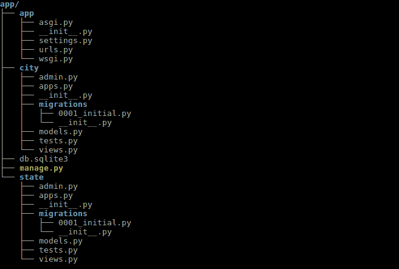
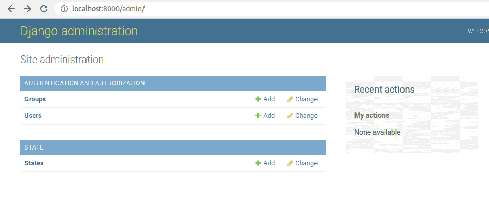
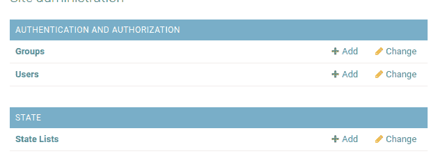
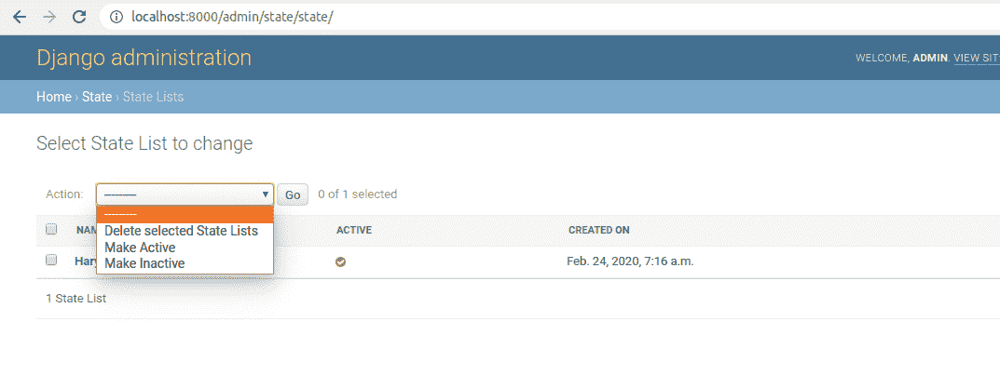
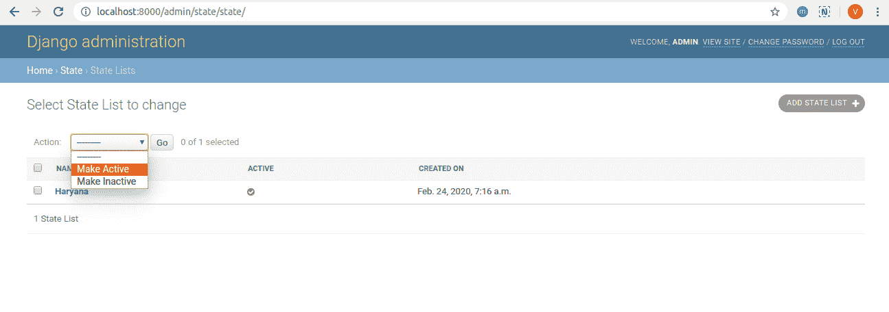

# 自定义姜戈管理界面

> 原文:[https://www . geesforgeks . org/customize-django-admin-interface/](https://www.geeksforgeeks.org/customize-django-admin-interface/)

默认情况下，Django admin 是一个高响应性的 GUI，它提供了各种功能和一个全面的 CRUD 应用程序来帮助开发人员和用户。此外，可以定制 Django admin 来满足您的需求，例如在表的主页上显示字段等。在本文中，我们将讨论如何增强 Django-admin 界面。

项目结构类似:


让我们创建一个名为 **state** 的应用程序，它有一个同名的模型(state)。当我们向 admin.py 注册应用程序时，它显示如下。

**state/model.py**

```py
from django.db import models
from django.utils import timezone

class State(models.Model):
    name = models.CharField(max_length = 50)
    is_active = models.IntegerField(default = 1,
                                   blank = True,
                                    null = True,
                                    help_text ='1->Active, 0->Inactive', 
                                    choices =(
                                    (1, 'Active'), (0, 'Inactive')
                                    ))
    created_on = models.DateTimeField(default = timezone.now)
    updated_on = models.DateTimeField(default = timezone.now,
                                    null = True, 
                                    blank = True
                                    )
    def __str__(self):
        return self.name

    class Meta:
        db_table = 'state'
```

**状态/管理 py:**

```py
from django.contrib import admin
from .models import State

admin.site.register(State)
```

在 django 管理界面

查看，现在让我们根据可用选项‘自定义 django 管理’。

#### 自定义姜戈管理界面

**1。更改模型名称:**
如果你想更改这里所述的模型名称，那么打开 model.py 文件，在 meta 部分添加 verbose_name 属性。

**状态/型号. py**

```py
from django.db import models
from django.utils import timezone

class State(models.Model):
    name = models.CharField(max_length = 50)
    is_active = models.IntegerField(default = 1,
                                   blank = True,
                                    null = True,
                                    help_text ='1->Active, 0->Inactive', 
                                    choices =(
                                    (1, 'Active'), (0, 'Inactive')
                                    ))
    created_on = models.DateTimeField(default = timezone.now)
    updated_on = models.DateTimeField(default = timezone.now,
                                    null = True, 
                                    blank = True
                                    )
    def __str__(self):
        return self.name
    class Meta:
        db_table = 'state'
        # Add verbose name
        verbose_name = 'State List'
```

**输出:**


**2。默认情况下，django admin 在列表中只显示对象名。**


可以显示模型中的多个字段数据。在 admin.py 文件中添加一些代码行。

**状态/管理 py:**

```py
from django.contrib import admin
from .models import State

class StateAdmin(admin.ModelAdmin):
    list_display = ('name', 'active', 'created_on')

    def active(self, obj):
        return obj.is_active == 1

    active.boolean = True

admin.site.register(State, StateAdmin)
```

**输出:**


**3。默认情况下，只有一个选项是删除选项。**
您可以在操作下拉列表中添加更多选项:

**状态/管理 py:**

```py
from django.contrib import admin
from django.contrib import messages
from .models import State

class StateAdmin(admin.ModelAdmin):
    list_display = ('name', 'active', 'created_on')

    def active(self, obj):
        return obj.is_active == 1

    active.boolean = True

    def make_active(modeladmin, request, queryset):
        queryset.update(is_active = 1)
        messages.success(request, "Selected Record(s) Marked as Active Successfully !!")

    def make_inactive(modeladmin, request, queryset):
        queryset.update(is_active = 0)
        messages.success(request, "Selected Record(s) Marked as Inactive Successfully !!")

    admin.site.add_action(make_active, "Make Active")
    admin.site.add_action(make_inactive, "Make Inactive")

admin.site.register(State, StateAdmin)
```

**输出:**


**4。禁用删除选项:**

**状态/管理 py:**

```py
from django.contrib import admin
from django.contrib import messages
from .models import State

class StateAdmin(admin.ModelAdmin):
    list_display = ('name', 'active', 'created_on')

    def active(self, obj):
        return obj.is_active == 1

    active.boolean = True

    def make_active(modeladmin, request, queryset):
        queryset.update(is_active = 1)
        messages.success(request, "Selected Record(s) Marked as Active Successfully !!")

    def make_inactive(modeladmin, request, queryset):
        queryset.update(is_active = 0)
        messages.success(request, "Selected Record(s) Marked as Inactive Successfully !!")

    admin.site.add_action(make_active, "Make Active")
    admin.site.add_action(make_inactive, "Make Inactive")

    def has_delete_permission(self, request, obj = None):
        return False

admin.site.register(State, StateAdmin)
```

**输出:**


**5。移除添加选项:**

**状态/管理 py:**

```py
from django.contrib import admin
from .models import State

class StateAdmin(admin.ModelAdmin):
    list_display = ('name', 'active', 'created_on')

    def active(self, obj):
        return obj.is_active == 1

    active.boolean = True

    def has_add_permission(self, request):
        return False

admin.site.register(State, StateAdmin)
```

