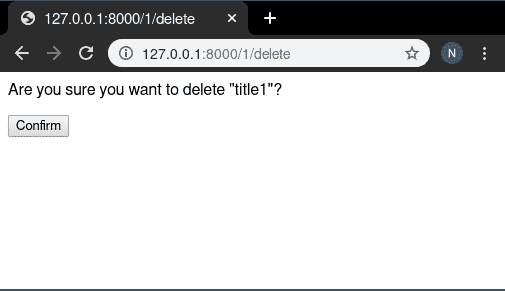
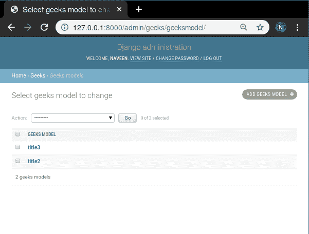

# 删除视图–基于类的视图姜戈

> 原文:[https://www . geesforgeks . org/delete view-基于类的视图-django/](https://www.geeksforgeeks.org/deleteview-class-based-views-django/)

删除视图是指从数据库中删除表的特定实例的视图(逻辑)。它用于删除数据库中的条目，例如，删除 geeksforgeeks 上的一篇文章。我们已经在[删除视图–基于函数的视图姜戈](https://www.geeksforgeeks.org/delete-view-function-based-views-django/)中讨论了删除视图的基础。基于类的视图提供了一种将视图实现为 Python 对象而不是函数的替代方法。它们不取代基于函数的视图，但与基于函数的视图相比有一定的区别和优势:

*   与特定 HTTP 方法(GET、POST 等)相关的代码的组织。)可以通过单独的方法而不是条件分支来解决。
*   面向对象的技术，如 mixins(多重继承)可以用来将代码分解成可重用的组件。

基于类的视图比基于函数的视图管理起来更简单有效。一个有大量代码行的基于函数的视图可以被转换成只有很少代码行的基于类的视图。这就是面向对象编程产生影响的地方。

## 姜戈删除视图——基于类的视图

使用示例说明**如何创建和使用删除视图**。考虑一个名为 geeksforgeeks 的项目，它有一个名为 geeks 的应用程序。

> 请参考以下文章，查看如何在 Django 中创建项目和应用程序。
> 
> *   [如何利用姜戈的 MVT 创建基础项目？](https://www.geeksforgeeks.org/how-to-create-a-basic-project-using-mvt-in-django/)
> *   [如何在姜戈创建 App？](https://www.geeksforgeeks.org/how-to-create-an-app-in-django/)

在你有一个项目和一个应用程序后，让我们创建一个模型，我们将通过我们的视图创建实例。在极客/模特. py 中，

## 蟒蛇 3

```
# import the standard Django Model
# from built-in library
from django.db import models

# declare a new model with a name "GeeksModel"
class GeeksModel(models.Model):

    # fields of the model
    title = models.CharField(max_length = 200)
    description = models.TextField()

    # renames the instances of the model
    # with their title name
    def __str__(self):
        return self.title
```

创建这个模型后，我们需要运行两个命令来为其创建数据库。

```
Python manage.py makemigrations
Python manage.py migrate
```

现在让我们使用 shell 创建这个模型的一些实例，运行 form bash，

```
Python manage.py shell
```

输入以下命令

```
>>> from geeks.models import GeeksModel
>>> GeeksModel.objects.create(
                       title="title1",
                       description="description1").save()
>>> GeeksModel.objects.create(
                       title="title2",
                       description="description2").save()
>>> GeeksModel.objects.create(
                       title="title2",
                       description="description2").save()
```

现在我们已经为后端做好了一切准备。验证已从[http://localhost:8000/admin/geeks/geeks model/](http://localhost:8000/admin/geeks/geeksmodel/)
创建实例


基于类的视图自动设置从 A 到 z 的所有内容。只需要指定为哪个模型创建删除视图，然后基于类的删除视图将自动尝试在 app _ name/model name _confirm_delete.html 中找到一个模板。在我们的例子中，它是极客/模板/极客/极客模型 _ confirm _ delete . html。让我们创建基于类的视图。极客/观点. py 中，

## 蟒蛇 3

```
# import generic UpdateView
from django.views.generic.edit import DeleteView

# Relative import of GeeksModel
from .models import GeeksModel

class GeeksDeleteView(DeleteView):
    # specify the model you want to use
    model = GeeksModel

    # can specify success url
    # url to redirect after successfully
    # deleting object
    success_url ="/"
```

现在创建一个 url 路径来映射视图。在极客/URL . py 中，

## 蟒蛇 3

```
from django.urls import path

# importing views from views..py
from .views import GeeksDeleteView
urlpatterns = [
    # <pk> is identification for id field,
    # slug can also be used
    path('<pk>/delete/', GeeksDeleteView.as_view()),
]
```

在模板/极客/极客模型 _ 确认 _ 删除. html 中创建模板，

## 超文本标记语言

```
<form method="post">

<p>Are you sure you want to delete "{{ object }}"?</p>

    <input type="submit" value="Confirm">
</form>
```

我们来看看[上有什么 http://localhost:8000/1/delete](http://localhost:8000/1/delete)



点击确认，对象将重定向到视图中定义的 success_url。让我们检查一下**标题 1** 是否从数据库中删除。

