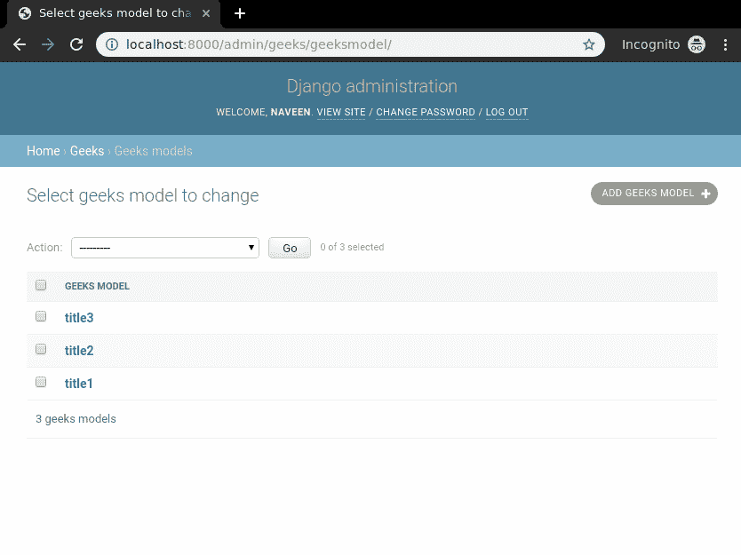

# 详细视图–基于功能的视图姜戈

> 原文:[https://www . geesforgeks . org/detail-view-function-based-view-django/](https://www.geeksforgeeks.org/detail-view-function-based-views-django/)

详细视图是指显示数据库中某个表的特定实例以及所有必要详细信息的视图(逻辑)。它用于在单个页面或视图上显示多种类型的数据，例如用户的个人资料。Django 为细节视图提供了非常普通的支持，但是让我们检查一下它是如何通过基于函数的视图手动完成的。本文围绕细节视图展开，涉及到[姜戈表格](https://www.geeksforgeeks.org/django-forms/)、[姜戈模型](https://www.geeksforgeeks.org/django-models/)等概念。
对于详细视图，我们需要一个项目与一些模型和多个实例将被显示。

## 姜戈详细视图-基于功能的视图

使用示例说明如何创建和使用详细视图。考虑一个名为 geeksforgeeks 的项目，它有一个名为 geeks 的应用程序。

> 请参考以下文章，查看如何在 Django 中创建项目和应用程序。
> 
> *   [如何利用姜戈的 MVT 创建基础项目？](https://www.geeksforgeeks.org/how-to-create-a-basic-project-using-mvt-in-django/)
> *   [如何在姜戈创建 App？](https://www.geeksforgeeks.org/how-to-create-an-app-in-django/)

在你有一个项目和一个应用程序后，让我们创建一个模型，我们将通过我们的视图创建实例。在极客/模特. py 中，

## 蟒蛇 3

```py
# import the standard Django Model
# from built-in library
from django.db import models

# declare a new model with a name "GeeksModel"
class GeeksModel(models.Model):

    # fields of the model
    title = models.CharField(max_length = 200)
    description = models.TextField()

    # renames the instances of the model
    # with their title name
    def __str__(self):
        return self.title
```

创建这个模型后，我们需要运行两个命令来为其创建数据库。

```py
Python manage.py makemigrations
Python manage.py migrate
```

现在让我们使用 shell 创建这个模型的一些实例，运行 form bash，

```py
Python manage.py shell
```

输入以下命令

```py
>>> from geeks.models import GeeksModel
>>> GeeksModel.objects.create(
                       title="title1",
                       description="description1").save()
>>> GeeksModel.objects.create(
                       title="title2",
                       description="description2").save()
>>> GeeksModel.objects.create(
                       title="title3",
                       description="description3").save()
```

现在我们已经为后端做好了一切准备。验证实例是否已从[http://localhost:8000/admin/geeks/geeks model/](http://localhost:8000/admin/geeks/geeksmodel/)
创建



对于 detail_view，需要一些标识来获得模型的特定实例。通常是唯一主键，如 **id** 。要指定这个标识，我们需要在网址中定义它

## 蟒蛇 3

```py
from django.urls import path

# importing views from views..py
from .views import detail_view

urlpatterns = [
    path('<id>', detail_view ),
]
```

让我们为其创建一个视图和模板。极客/观点. py 中，

## 蟒蛇 3

```py
from django.shortcuts import render

# relative import of forms
from .models import GeeksModel

# pass id attribute from urls
def detail_view(request, id):
    # dictionary for initial data with
    # field names as keys
    context ={}

    # add the dictionary during initialization
    context["data"] = GeeksModel.objects.get(id = id)

    return render(request, "detail_view.html", context)
```

在模板/Detail_view.html 中创建模板，

## 超文本标记语言

```py
<div class="main">

    <!-- Specify fields to be displayed -->
    {{ data.title }}<br/>
    {{ data.description }}<br/>

</div>
```

我们来看看[http://localhost:8000/1](http://localhost:8000/1)T2 有什么


宾果游戏..！！细节视图工作正常。还可以根据多种形式所需的使用类型显示选定的字段。通常，用于定义详图的不是 id，而是嵌条。要了解更多关于蛞蝓和蛞蝓场的信息，请访问–[在姜戈模型](https://www.geeksforgeeks.org/add-the-slug-field-inside-django-model/)中添加蛞蝓场