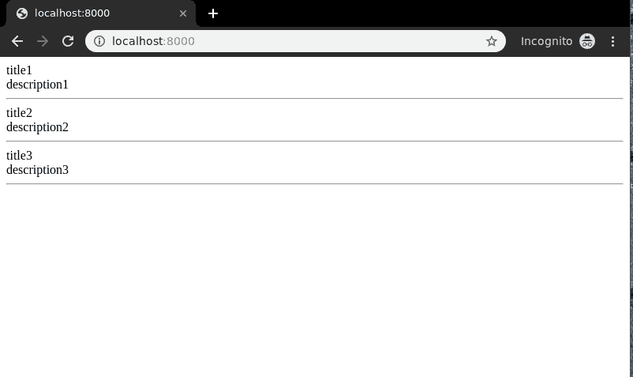
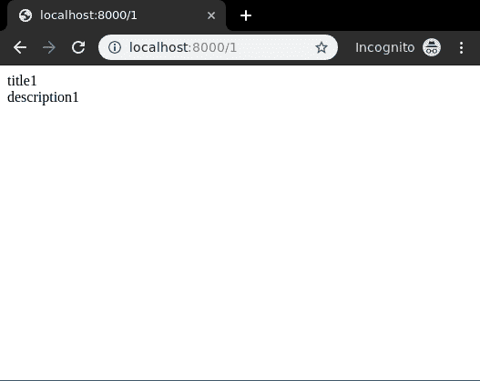
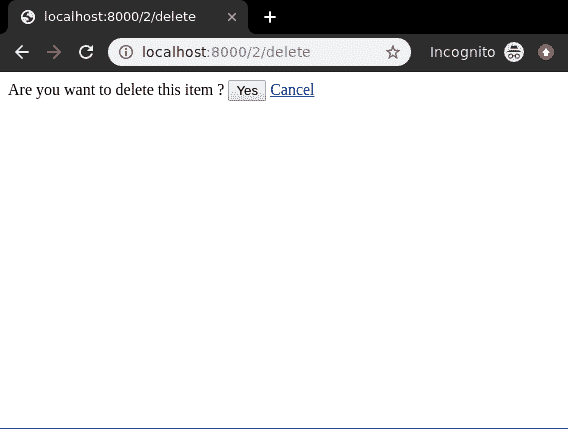

# 基于 Django CRUD(创建、检索、更新、删除)功能的视图

> 原文:[https://www . geesforgeks . org/django-crud-create-retrieve-update-delete-function-based-view/](https://www.geeksforgeeks.org/django-crud-create-retrieve-update-delete-function-based-views/)

Django 是一个基于 Python 的 web 框架，它允许您快速创建 web 应用程序，而没有其他框架通常会遇到的所有安装或依赖问题。Django 基于 MVT(模型视图模板)架构，围绕 CRUD(创建、检索、更新、删除)操作展开。CRUD 可以最好地解释为一种构建 Django web 应用程序的方法。一般来说，CRUD 意味着对数据库中的表执行创建、检索、更新和删除操作。让我们讨论一下 CRUD 实际上是什么意思，


**创建**–在数据库的表格中创建或添加新条目。
**检索**–以列表形式读取、检索、搜索或查看现有条目(列表视图)或详细检索特定条目(详细视图)
**更新**–更新或编辑数据库中表格中的现有条目
**删除**–删除、停用或移除数据库中表格中的现有条目

## 基于函数的视图

使用示例说明如何创建和使用 CRUD 视图。考虑一个名为 geeksforgeeks 的项目，它有一个名为 geeks 的应用程序。

> 请参考以下文章，查看如何在 Django 中创建项目和应用程序。
> 
> *   [如何利用姜戈的 MVT 创建基础项目？](https://www.geeksforgeeks.org/how-to-create-a-basic-project-using-mvt-in-django/)
> *   [如何在姜戈创建 App？](https://www.geeksforgeeks.org/how-to-create-an-app-in-django/)

在你有一个项目和一个应用程序后，让我们创建一个模型，我们将通过我们的视图创建实例。在极客/模特. py 中，

## 蟒蛇 3

```
# import the standard Django Model
# from built-in library
from django.db import models

# declare a new model with a name "GeeksModel"
class GeeksModel(models.Model):

    # fields of the model
    title = models.CharField(max_length = 200)
    description = models.TextField()

    # renames the instances of the model
    # with their title name
    def __str__(self):
        return self.title
```

创建这个模型后，我们需要运行两个命令来为其创建数据库。

```
Python manage.py makemigrations
Python manage.py migrate
```

现在我们将为此模型创建一个 Django 模型表单。有关模型表单–[姜戈模型表单–](https://geeksforgeeks.org/django-modelform-create-form-from-models/)从模型创建表单的更多信息，请参考本文。在极客文件夹
中创建一个 forms.py 文件

## 蟒蛇 3

```
from django import forms
from .models import GeeksModel

# creating a form
class GeeksForm(forms.ModelForm):

    # create meta class
    class Meta:
        # specify model to be used
        model = GeeksModel

        # specify fields to be used
        fields = [
            "title",
            "description",
        ]
```

### 创建视图

创建视图是指在数据库中创建表实例的视图(逻辑)。这就像从用户那里获取输入，并将其存储在指定的表中。
在极客/观点. py 中，

## 蟒蛇 3

```
from django.shortcuts import render

# relative import of forms
from .models import GeeksModel
from .forms import GeeksForm

def create_view(request):
    # dictionary for initial data with
    # field names as keys
    context ={}

    # add the dictionary during initialization
    form = GeeksForm(request.POST or None)
    if form.is_valid():
        form.save()

    context['form']= form
    return render(request, "create_view.html", context)
```

在 templates/create_view.html 中创建模板，

## 超文本标记语言

```
<form method="POST" enctype="multipart/form-data">

    <!-- Security token -->
    

    <!-- Using the formset -->
    {{ form.as_p }}

    <input type="submit" value="Submit">
</form>
```

现在访问[http://localhost:8000/](http://localhost:8000/)


要检查基于功能的创建视图的完整实现，请访问[创建视图–基于功能的视图姜戈](https://www.geeksforgeeks.org/create-view-function-based-views-django/)。

### 检索视图

检索视图基本上分为两种视图:详细视图和列表视图。

#### 列表视图

列表视图指的是以特定顺序列出数据库中某个表的所有或特定实例的视图(逻辑)。它用于在单个页面或视图上显示多种类型的数据，例如，电子商务页面上的产品。
在极客/观点. py 中，

## 蟒蛇 3

```
from django.shortcuts import render

# relative import of forms
from .models import GeeksModel

def list_view(request):
    # dictionary for initial data with
    # field names as keys
    context ={}

    # add the dictionary during initialization
    context["dataset"] = GeeksModel.objects.all()

    return render(request, "list_view.html", context)
```

在 templates/list_view.html 中创建模板，

## 超文本标记语言

```
<div class="main">

    .

    {{ data.title }}<br/>
    {{ data.description }}<br/>
    <hr/>

    

</div>
```

现在访问[http://localhost:8000/](http://localhost:8000/)



要检查基于功能的列表视图的完整实现，请访问[列表视图–基于功能的视图姜戈](https://www.geeksforgeeks.org/list-view-function-based-views-django/)

#### 详细视图

详细视图是指显示数据库中某个表的特定实例以及所有必要详细信息的视图(逻辑)。它用于在单个页面或视图上显示多种类型的数据，例如用户的个人资料。
在极客/观点. py 中，

## 蟒蛇 3

```
from django.urls import path

# importing views from views..py
from .views import detail_view

urlpatterns = [
    path('<id>', detail_view ),
]
```

让我们为其创建一个视图和模板。极客/观点. py 中，

## 蟒蛇 3

```
from django.shortcuts import render

# relative import of forms
from .models import GeeksModel

# pass id attribute from urls
def detail_view(request, id):
    # dictionary for initial data with
    # field names as keys
    context ={}

    # add the dictionary during initialization
    context["data"] = GeeksModel.objects.get(id = id)

    return render(request, "detail_view.html", context)
```

在模板/Detail_view.html 中创建模板，

## 超文本标记语言

```
<div class="main">

    <!-- Specify fields to be displayed -->
    {{ data.title }}<br/>
    {{ data.description }}<br/>

</div>
```

我们来看看[http://localhost:8000/1](http://localhost:8000/1)T2 有什么



要检查基于功能的详细视图的完整实现，请访问[详细视图–基于功能的视图姜戈](https://www.geeksforgeeks.org/detail-view-function-based-views-django/)

### 更新视图

更新视图是指用一些额外的细节从数据库中更新表的特定实例的视图(逻辑)。它用于更新数据库中的条目，例如，更新 geeksforgeeks 上的一篇文章。
在极客/观点. py 中，

## 蟒蛇 3

```
from django.shortcuts import (get_object_or_404,
                              render,
                              HttpResponseRedirect)

# relative import of forms
from .models import GeeksModel
from .forms import GeeksForm

# after updating it will redirect to detail_View
def detail_view(request, id):
    # dictionary for initial data with
    # field names as keys
    context ={}

    # add the dictionary during initialization
    context["data"] = GeeksModel.objects.get(id = id)

    return render(request, "detail_view.html", context)

# update view for details
def update_view(request, id):
    # dictionary for initial data with
    # field names as keys
    context ={}

    # fetch the object related to passed id
    obj = get_object_or_404(GeeksModel, id = id)

    # pass the object as instance in form
    form = GeeksForm(request.POST or None, instance = obj)

    # save the data from the form and
    # redirect to detail_view
    if form.is_valid():
        form.save()
        return HttpResponseRedirect("/"+id)

    # add form dictionary to context
    context["form"] = form

    return render(request, "update_view.html", context)
```

现在在模板文件夹
中创建以下模板

## 超文本标记语言

```
<div class="main">
    <!-- Create a Form -->
    <form method="POST">
        <!-- Security token by Django -->
        

        <!-- form as paragraph -->
        {{ form.as_p }}

        <input type="submit" value="Update">
    </form>

</div>
```

在极客/模板/detail_view.html 中，

## 超文本标记语言

```
<div class="main">
    <!-- Display attributes of instance -->
    {{ data.title }} <br/>
    {{ data.description }}
</div>
```

我们来看看是否一切正常，访问[http://localhost:8000/1/更新](http://localhost:8000/1/update)。


要检查基于功能的更新视图的完整实现，请访问[更新视图-基于功能的视图姜戈](https://www.geeksforgeeks.org/update-view-function-based-views-django/)

### 删除视图

删除视图是指从数据库中删除表的特定实例的视图(逻辑)。它用于删除数据库中的条目，例如，删除 geeksforgeeks 上的一篇文章。
极客/观点. py

## 蟒蛇 3

```
from django.shortcuts import (get_object_or_404,
                              render,
                              HttpResponseRedirect)

from .models import GeeksModel

# delete view for details
def delete_view(request, id):
    # dictionary for initial data with
    # field names as keys
    context ={}

    # fetch the object related to passed id
    obj = get_object_or_404(GeeksModel, id = id)

    if request.method =="POST":
        # delete object
        obj.delete()
        # after deleting redirect to
        # home page
        return HttpResponseRedirect("/")

    return render(request, "delete_view.html", context)
```

现在一个 url 映射到这个视图，带有一个 id 的正则表达式，在极客/URL . py
中为

## 蟒蛇 3

```
from django.urls import path

# importing views from views..py
from .views import delete_view
urlpatterns = [
    path('<id>/delete', delete_view ),
]
```

删除视图模板包括一个确认用户是否要删除实例的简单表单。在极客/模板/delete_view.html 中，

## 超文本标记语言

```
<div class="main">
    <!-- Create a Form -->
    <form method="POST">
        <!-- Security token by Django -->
        
        Are you want to delete this item ?
        <input type="submit" value="Yes" />
        <a href="/">Cancel </a>
    </form>
</div>
```

一切准备就绪，现在让我们检查它是否工作，访问[http://localhost:8000/2/delete](http://localhost:8000/2/delete)



要检查基于功能的删除视图的完整实现，请访问[删除视图-基于功能的视图姜戈](https://www.geeksforgeeks.org/delete-view-function-based-views-django/)