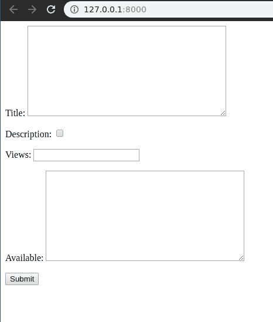
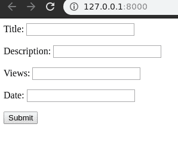
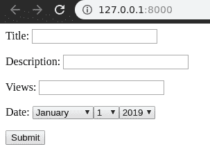

# 姜戈表单域自定义小部件

> 原文:[https://www . geesforgeks . org/django-form-field-custom-widgets/](https://www.geeksforgeeks.org/django-form-field-custom-widgets/)

小部件是 Django 对 HTML 输入元素的表示。小部件处理 HTML 的呈现，以及从对应于小部件的 GET/POST 字典中提取数据。每当您在表单上指定一个字段时，Django 都会使用一个默认的小部件，该部件适合要显示的数据类型。要查找哪个小部件用于哪个字段，请参见关于[内置字段类](https://docs.djangoproject.com/en/3.0/ref/forms/fields/#built-in-fields)的文档。这篇文章围绕小部件的高级使用来修改表单结构和输入类型。

### 表单域中的默认小部件

每个字段都有一个预定义的小部件，例如 **IntegerField** 有一个默认的小部件 **NumberInput** 。让我们借助我们的基础项目 geeksforgeeks 来演示一下。

> 请参考以下文章，查看如何在 Django 中创建项目和应用程序。
> 
> *   [如何利用姜戈的 MVT 创建基础项目？](https://www.geeksforgeeks.org/how-to-create-a-basic-project-using-mvt-in-django/)
> *   [如何在姜戈创建 App？](https://www.geeksforgeeks.org/how-to-create-an-app-in-django/)

现在让我们在“极客/表单. py”中创建一个演示表单，

```py
from django import forms

// creating a django form
class GeeksForm(forms.Form):
    title = forms.CharField()
    description = forms.CharField()
    views = forms.IntegerField()
    available = forms.BooleanField()
```

现在要呈现这个表单，我们需要创建视图和模板，用于向用户显示表单。在极客/视图. py 中，创建一个视图

```py
from django.shortcuts import render
from .forms import GeeksForm

# creating a home view
def home_view(request):
    context = {}
    form = GeeksForm(request.POST or None)
    context['form'] = form
    return render(request, "home.html", context)
```

在模板/home.html 中，

```py
<form method="POST">
    
    {{ form.as_p }}
    <input type="submit" value="Submit">
</form>
```

现在让我们通过运行

```py
Python manage.py runserver
```

访问[http://127 . 0 . 0 . 1:8000/](http://127.0.0.1:8000/)


如上面的截图所示，IntegerField、BooleanField 等有不同类型的输入字段。您可以使用以下方法对此进行修改。

### 自定义 Django 表单域小部件

出于各种目的，可以覆盖每个字段的默认小部件。部件列表可以在这里看到–[部件|姜戈文档](https://docs.djangoproject.com/en/3.0/ref/forms/widgets/)。要覆盖默认小部件，我们需要显式定义要分配给字段的小部件。
对`geeks/forms.py`进行如下修改:

```py
from django import forms

class GeeksForm(forms.Form):
    title = forms.CharField(widget = forms.Textarea)
    description = forms.CharField(widget = forms.CheckboxInput)
    views = forms.IntegerField(widget = forms.TextInput)
    available = forms.BooleanField(widget = forms.Textarea)
```

现在访问 [http://127.0.0.1:8000/](http://127.0.0.1:8000/) 、

这样我们就可以使用`widget`属性将任何小部件分配给任何字段。**注意**–对字段的验证仍然保持不变，例如，即使一个整数字段与字符字段相同，它也只接受整数输入。

### 使用小部件自定义日期字段

窗口小部件在表单域中有很大的用途，尤其是在使用选择类型的窗口小部件时，人们希望限制用户输入的类型和数量。让我们通过修改日期字段来演示这一点。把表格当成，

```py
from django import forms

class GeeksForm(forms.Form):
    title = forms.CharField()
    description = forms.CharField()
    views = forms.IntegerField()
    date = forms.DateField()
```

默认情况下，日期字段作为小部件文本输入。可以看做


现在，让我们更改小部件，以便用户更好、更方便地输入日期。将[选择日期窗口小部件](https://docs.djangoproject.com/en/3.0/ref/forms/widgets/#selectdatewidget)添加到`forms.py`中的日期字段，

```py
from django import forms

class GeeksForm(forms.Form):
    title = forms.CharField()
    description = forms.CharField()
    views = forms.IntegerField()
    date = forms.DateField(widget = forms.SelectDateWidget)
```

现在，在应用程序的前端，日期的输入可以被视为非常容易和有帮助的。这样，我们可以使用多个小部件来修改输入字段。
