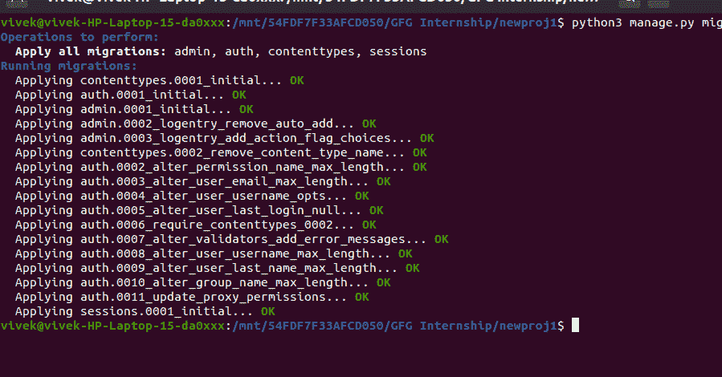
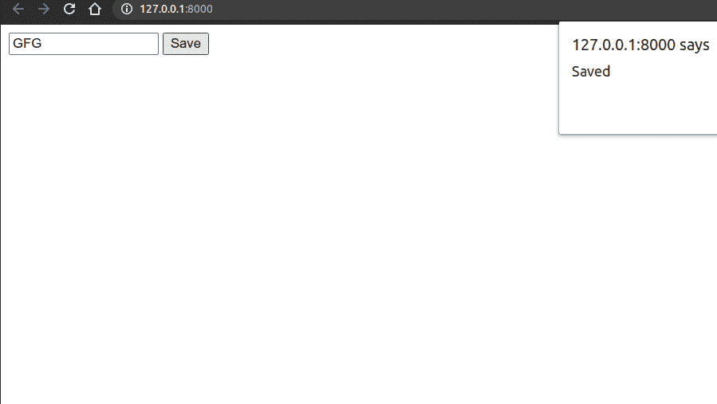
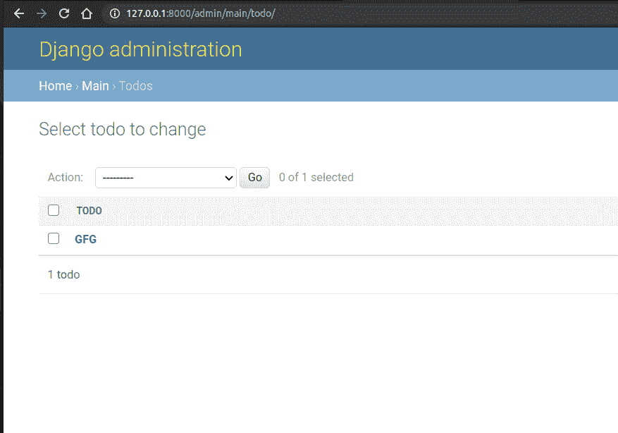

# 无需重新加载页面的姜戈表单提交

> 原文:[https://www . geesforgeks . org/django-form-submission-不带页面-reload/](https://www.geeksforgeeks.org/django-form-submission-without-page-reload/)

Django 是一个高级 Python Web 框架，它鼓励快速开发和干净、实用的设计。它由经验丰富的开发人员构建，解决了许多网络开发的麻烦，因此您可以专注于编写应用程序，而无需重新发明轮子。这是免费的开源软件。

在本文中，我们将在 django 中看到表单提交，而无需使用 Jquery 和 Ajax 重新加载页面

要安装 django，请打开 cmd 或终端，并写下以下命令

```
pip3 install django
```

然后创建新项目

```
django-admin startproject newproj
```

```
cd newproj
```

然后创建新的应用程序

Windows 操作系统

```
python manage.py startapp main
```

人的本质

```
python3 manage.py startapp main
```

在**设置中添加你的应用名称**


在应用内创建新目录，并将其命名为**模板**，在此基础上创建另一个目录，并将其命名为**主**(您的应用名称)

运行此命令进行迁移

```
python manage.py migrate
```



在模型中创建新模型

**车型. py**

## 蟒蛇 3

```
from django.db import models

# Create your models here.
class Todo(models.Model):
    task = models.CharField(max_length=200)

    def __str__(self):
        return f"{self.task}"
```

```
python manage.py makemigrations
```

```
python manage.py migrate
```

**admin.py**

## 蟒蛇 3

```
from django.contrib import admin
from .models import *
# Register your models here.

admin.site.register(Todo)
```

在**模板**目录内新建文件，并命名为**form.html**

## 超文本标记语言

```
<!DOCTYPE html>
<html>
<head>
    <title>Todo List</title>
</head>
<body>
    <form method="post" id="task-form">
        
        <input type="text" placeholder="Enter Task" name="task" id="task" required>
        <button type="submit">Save</button>
    </form>

    <script src="https://code.jquery.com/jquery-3.5.1.js" 
          integrity="sha256-QWo7LDvxbWT2tbbQ97B53yJnYU3WhH/C8ycbRAkjPDc=" 
            crossorigin="anonymous"></script>

    <script type="text/javascript">
    $(document).on('submit','#task-form',function(e){
        e.preventDefault();
        $.ajax({
            type:'POST',
            url:'',
            data:
            {
                task:$("#task").val(),
                csrfmiddlewaretoken:$('input[name=csrfmiddlewaretoken]').val()
            },
            success:function(){
                  alert('Saved');
                    }
            })
        });
    </script>

</body>
</html>
```

在**视图中创建新视图。复制**以处理获取和发布请求。

## 蟒蛇 3

```
from django.shortcuts import render
from .models import Todo
# Create your views here.
def home(request):
    if request.method == 'POST':
        task=request.POST.get('task')
        print(task)
        new = Todo(task=task)
        new.save()
    return render(request,"main/form.html")
```

在你的应用程序中创建一个新文件，并命名为**URL . py**

## 蟒蛇 3

```
from django.urls import path
from .views import *

urlpatterns = [
    path('',home,name="home"),
]
```

在项目 URL 中添加 main.urls

**my project/URLs . py**

## 蟒蛇 3

```
from django.contrib import admin
from django.urls import path,include

urlpatterns = [
    path('admin/', admin.site.urls),
    path('',include("main.urls"))
]
```

要运行应用程序写命令

```
python manage.py runserver
```

**输出**



**管理页面**

