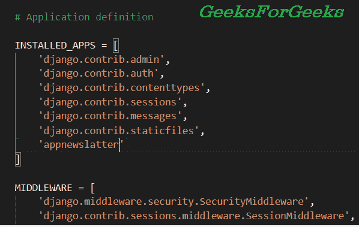

# Django–如何在单个表单中添加多个提交按钮？

> 原文:[https://www . geesforgeks . org/django-如何添加-多提交-单表单按钮/](https://www.geeksforgeeks.org/django-how-to-add-multiple-submit-button-in-single-form/)

**先决条件:**

*   [蟒蛇](https://www.geeksforgeeks.org/download-and-install-python-3-latest-version/)
*   [Pip](https://www.geeksforgeeks.org/how-to-install-pip-on-windows/)
*   [姜戈](https://www.geeksforgeeks.org/django-introduction-and-installation/)

当我们使用 HTML 表单提交数据时，它会在动作属性中定义的特定 URL 将数据发送到服务器。要用单个 HTML 表单执行不同的操作，我们只需要在表单中添加多个提交按钮。例如，如果您浏览简讯应用程序的代码，您会发现订阅和取消订阅按钮在一个 HTML 表单中，但两者执行不同的操作。

在本教程中，我们将使用 Django 制作一个时事通讯应用程序。我们将在一个单一的 HTML 表单中添加订阅和取消订阅按钮。此外，我们将根据用户点击订阅或取消订阅按钮，在我们的数据库中添加或删除用户的电子邮件地址。

要创建简单的时事通讯 Django 应用程序，请按照以下步骤操作。

## **创建一个新的姜戈项目**

要开始一个新的 Django 项目，您的本地计算机应该满足上面给出的先决条件。用户可以使用下面的命令启动一个新项目。

```py
django-admin startproject newslatter
```

接下来，转到项目目录。

```py
cd newslatter
```

## **启动简讯应用**

要在简讯项目中启动新应用程序，请在项目目录中运行以下命令。

```py
django-admin startapp appnewslatter
```

现在，在时事通讯项目 settings.py 的 installed_apps 部分中添加“appnewslatter”。

```py
path: newslatter/settings.py
```



接下来，编辑简讯文件夹内的*URL . py*，并添加以下代码。*T3】*

```py
Path: newslatter/urls.py
```

・T 0️ 文件名：urls.py・T 1️

## 蟒蛇 3

```py
from django.contrib import admin
from django.urls import path, include

urlpatterns = [
    path('admin/', admin.site.urls),

    #including URLS of appnewslatter app
    path("", include('appnewslatter.urls')),
]
```