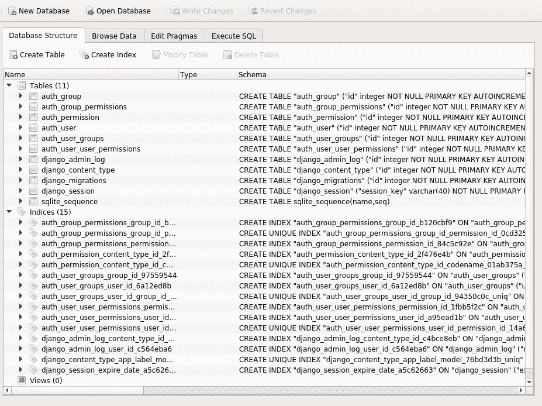

# Django manage.py 迁移命令| Python

> 原文:[https://www . geesforgeks . org/django-manage-py-migrate-command-python/](https://www.geeksforgeeks.org/django-manage-py-migrate-command-python/)

根据文档，迁移是 Django 传播您对模型所做更改的方式(添加字段、删除模型等)。)到您的数据库模式中。它们主要是自动设计的，但是您需要知道何时进行迁移，何时运行迁移，以及可能遇到的常见问题。

对于 Django 项目，通过以下命令运行 migrate。

```
 Python manage.py migrate 
```

#### Django python manage.py 迁移命令

migrate 执行数据库文件中的那些 SQL 命令。因此，执行迁移后，所有已安装应用程序的表都将在数据库文件中创建。

您可以通过安装 SQLite 浏览器并打开 db.sqlite3 来确认这一点，在执行 migrate 命令后，您可以看到所有的表都出现在数据库文件中。



例如，如果我们制作一个模型类-

```
from django.db import models

class Person(models.Model):
    first_name = models.CharField(max_length = 30)
    last_name = models.CharField(max_length = 30)
```

使用 makemigrations 后，相应的 sql 命令将是

```
CREATE TABLE myapp_person (
"id" serial NOT NULL PRIMARY KEY,
"first_name" varchar(30) NOT NULL,
"last_name" varchar(30) NOT NULL
);

```

使用上面的命令，当我们使用 migrate 时，将在数据库中创建表。
迁移命令将在下一篇文章中介绍。
现在表单终端运行以下命令将在数据库中为此模型创建表格

```
 Python manage.py migrate
```

现在，如果我们检查数据库，会创建一个名为 geeks_geeksmodel 的表，

