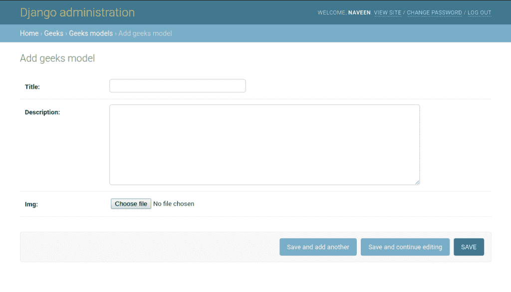
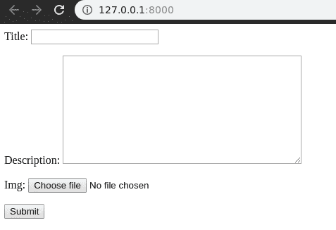
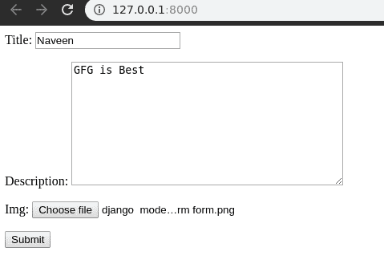

# 姜戈模型表单–从模型创建表单

> 原文:[https://www . geesforgeks . org/django-model form-create-form-from-models/](https://www.geeksforgeeks.org/django-modelform-create-form-from-models/)

**Django ModelForm** 是一个用于直接将模型转换为 Django 表单的类。如果您正在构建一个数据库驱动的应用程序，很有可能您将拥有与 Django 模型紧密对应的表单。例如，用户注册模型和表单将具有相同质量和数量的模型字段和表单字段。因此，我们可以直接使用 ModelForm，而不是创建冗余代码来首先创建表单，然后将其映射到视图中的模型。它将模型的名称作为参数，并将其转换为 Django 表单。不仅如此，ModelForm 还提供了许多方法和功能，可以自动化整个过程，并有助于消除代码冗余。

### 如何将模型转换成 Django 表单？

为了解释项目的工作，我们将使用项目 **geeksforgeeks** ，创建一个模型并将其映射到 Django 表单。

> 请参考以下文章，查看如何在 Django 中创建项目和应用程序。
> 
> *   [如何利用姜戈的 MVT 创建基础项目？](https://www.geeksforgeeks.org/how-to-create-a-basic-project-using-mvt-in-django/)
> *   [如何在姜戈创建 App？](https://www.geeksforgeeks.org/how-to-create-an-app-in-django/)

现在当我们准备好项目后，在`geeks/models.py`中创建一个模型，

```py
# import the standard Django Model
# from built-in library
from django.db import models

# declare a new model with a name "GeeksModel"
class GeeksModel(models.Model):
        # fields of the model
    title = models.CharField(max_length = 200)
    description = models.TextField()
    last_modified = models.DateTimeField(auto_now_add = True)
    img = models.ImageField(upload_to = "images/")

        # renames the instances of the model
        # with their title name
    def __str__(self):
        return self.title
```

现在，运行以下命令来创建模型，

```py
Python manage.py makemigrations
Python manage.py migrate

```

我们可以在[http://127 . 0 . 0 . 1:8000/admin/geeks/geeks model/add/](http://127.0.0.1:8000/admin/geeks/geeksmodel/add/)、
查看模型创建成功

要直接为此模型创建表单，请进入`geeks/forms.py`并输入以下代码:

```py
# import form class from django
from django import forms

# import GeeksModel from models.py
from .models import GeeksModel

# create a ModelForm
class GeeksForm(forms.ModelForm):
    # specify the name of model to use
    class Meta:
        model = GeeksModel
        fields = "__all__"
```

这种形式采用两个参数**字段**或**排除**。

*   **字段–**强烈建议您使用“字段”属性显式设置表单中应编辑的所有字段。如果不这样做，当表单意外地允许用户设置某些字段时，尤其是当新字段添加到模型中时，很容易导致安全问题。根据表单的呈现方式，问题甚至可能在网页上不可见。将字段属性设置为特殊值 **'__all__'** ，以指示应使用模型中的所有字段。
*   **排除–**将模型表单内部元类的排除属性设置为要从表单中排除的字段列表。
    例如:

    ```py
    class PartialAuthorForm(ModelForm):
        class Meta:
            model = Author
            exclude = ['title']

    ```

最后，为了完成我们的 MVT 结构，创建一个视图来呈现表单，并将其直接保存到数据库中。在**极客/观点. py，**

```py
from django.shortcuts import render
from .forms import GeeksForm

def home_view(request):
    context ={}

    # create object of form
    form = GeeksForm(request.POST or None, request.FILES or None)

    # check if form data is valid
    if form.is_valid():
        # save the form data to model
        form.save()

    context['form']= form
    return render(request, "home.html", context)
```

一切就绪，现在访问 [http://127.0.0.1:8000/](http://127.0.0.1:8000/) 、
、
现在可以看到每个模型字段都映射到一个表单字段中，并相应显示。本文稍后将讨论字段映射。因此，现在让我们尝试将数据输入表单，并检查它是否保存到数据库中。

点击提交，宾果表格自动保存到数据库。我们可以在[http://localhost:8000/admin/geeks/geeks model/](http://localhost:8000/admin/geeks/geeksmodel/)进行验证。


### 字段类型

生成的表单类将按照字段属性中指定的顺序，为每个指定的模型字段提供一个表单字段。每个模型字段都有相应的默认表单字段。例如，模型上的字符域表示为窗体上的字符域。多对多字段模型被表示为多选择字段。以下是转换的完整列表:

| 模型字段 | 表单域 |
| --- | --- |
| 自动场 | 未在表单中表示 |
| 大自动场 | 未在表单中表示 |
| begintegerfield | IntegerField，min_value 设置为-9223372036854775808，max_value 设置为 9223372036854775807。 |
| BinaryField | 如果模型字段上的“可编辑”设置为“真”，则不在表单中表示。 |
| BooleanField | BooleanField，如果 null=True，则为 NullBooleanField。 |
| carfield | 最大长度设置为模型字段的最大长度，空值设置为无的字符字段(如果空=真)。 |
| 戴达菲尔德 | 戴达菲尔德 |
| 日期时间字段 | 日期时间字段 |
| 十进制字段 | 十进制字段 |
| 工期字段 | 工期字段 |
| 电子邮件字段 | 电子邮件字段 |
| 文件字段 | 文件字段 |
| 文件路径字段 | 文件路径字段 |
| 浮动字段 | 浮动字段 |
| 外键 | 模型选择字段 |
| ImageField(图像字段) | ImageField(图像字段) |
| -你是什么意思 | -你是什么意思 |
| IPAddressField | IPAddressField |
| GenericIPAddressField | GenericIPAddressField |
| ManyToManyField | 模型多重选择字段 |
| NullBooleanField | NullBooleanField |
| PositiveIntegerField | -你是什么意思 |
| PositiveSmallIntegerField | -你是什么意思 |
| 斯拉格菲尔德 | 斯拉格菲尔德 |
| 小自动字段 | 未在表单中表示 |
| TextField 对象 | 带有 widget=forms 的 CharField。文本区 |
| 时间字段 | 时间字段 |
| URLField 先生 | URLField 先生 |