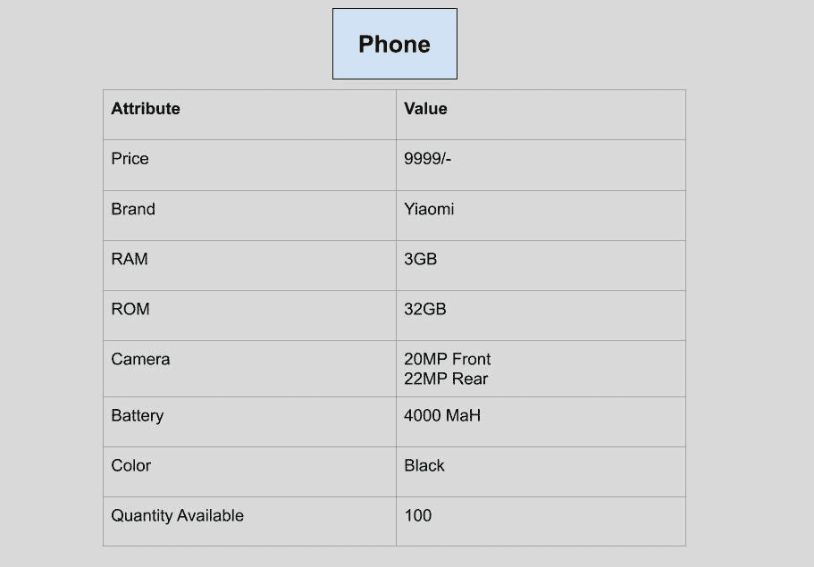
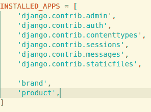

# 姜戈车型|套装–1

> 原文:[https://www.geeksforgeeks.org/django-models-set-1/](https://www.geeksforgeeks.org/django-models-set-1/)

**先决条件:** [姜戈创建应用程序](https://www.geeksforgeeks.org/django-creating-apps-set-2/)

### 模型–

根据[姜戈模型](https://docs.djangoproject.com/en/2.2/topics/db/models/)，模型是关于你的数据的单一的、确定的信息来源。它包含您存储的数据的基本字段和行为。通常，每个模型映射到一个数据库表。

基础知识:

*   每个模型都是一个 Python 类，它子类化 django.db.models.Model。
*   模型的每个属性代表一个数据库字段。
*   有了所有这些，Django 为您提供了一个自动生成的数据库访问 API。

Django 模型用作定义字段及其类型的结构，这些字段及其类型将保存在数据库中。无论我们想在数据库中做什么改变，想把它们永久存储在数据库中，都是使用 Django Models 完成的。数据库中一部手机的表格可以想象为:


### 使用 Django 在数据库中创建表–

我们需要创建一个名为**产品**的新应用程序，这样我们就可以定义上面提供的图像中描述的手机的所有属性。打开您的终端并运行以下命令:

```
python manage.py startapp product
```

现在，我们的目录将是:

创建完 app 后，别忘了在**下的`geeks_site/settings.py`中提一下**。



另外，通过在**产品/admin.py** 中添加以下代码，向管理员注册。通过向管理员注册，您可以确保站点管理员知道数据库的新表模式已经准备好。

```

from django.contrib import admin

# Register your models here.
from product.models import Phone

admin.site.register(Phone)
```

现在，导航至**产品/型号。您将看到一个包含以下行的文件:**

```

from django.db import models

# Create your models here.
```

我们使用 python 类来定义模型，这些模型继承了在 **django.db.models** 包中定义的名为 **Model** 的父类。

向该文件中添加以下代码行:

```

from django.db import models

# Create your models here.
class Phone(models.Model):
    Price = models.IntegerField()
    RAM = models.IntegerField()
    ROM = models.IntegerField()
    Front_camera = models.IntegerField()
    Rear_camera = models.IntegerField()
    Battery = models.IntegerField()
    Screen_size = models.DecimalField(max_digits = 2, decimal_places = 1)
    Color = models.CharField(max_length = 120)
    Quantity = models.IntegerField()
```