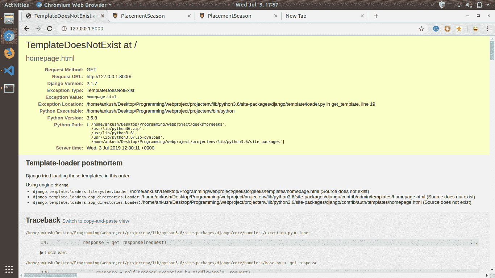

# 姜戈模板|套装–2

> 原文:[https://www.geeksforgeeks.org/django-templates-set-2/](https://www.geeksforgeeks.org/django-templates-set-2/)

先决条件:[姜戈模板|集-1](https://www.geeksforgeeks.org/django-templates-set-1/) 、[姜戈视图](https://www.geeksforgeeks.org/views-in-django-python/)。

导航至`brand/views.py`并将以下代码添加至`brand/views.py`

```py
from django.shortcuts import render
from django.http import HttpResponse

# Create your views here.
def ViewDemo(request):
    return HttpResponse("<h1>Hello World. Welcome to views.py.</h1>")

def homepage(request):
    return render(request, 'homepage.html')
```

#### HttpResponse–

**HttpResponse** 是 django 提供的 buitlin 实用函数，用于将 HttpResponse 返回给传入的请求。我们可以在 HttpResponse 函数中编写一个完整的 HTML 代码，但是代码的可读性会很低，调试起来会更困难。用 HTML 页面会比把完整的 HTML 代码写入 HttpResponse 函数更好。这就是**渲染**功能发挥作用的地方。

#### 渲染–

**渲染**是 Django 提供的内置实用程序，用于渲染 HTML 页面并向其中输入动态内容。**渲染**功能通常采用三个输入参数。

1.  第一个参数是**请求**参数，该参数由我们的函数接收。
2.  第二个参数是一个网页的网址，它将在调用当前函数时显示在屏幕上。
3.  第三个参数是可选的，但非常重要，它使我们的 HTML 页面成为动态的，它是一个字典，作为键值对发送到 HTML 页面。

在我们的主页功能中，我们使用了没有第三个参数的渲染功能。在运行服务器之前，通过添加以下代码行，确保您已经在`geeks_site/settings.py`中配置了 url。

```py
from brand.views import ViewDemo, homepage
urlpatterns = [
    path('', homepage),
    path('admin/', admin.site.urls),
    path('hello-world/', ViewDemo),
]

```

如果现在运行 **`python manage.py runserver`** 命令，会得到如下错误页面:

该错误明确表示我们尝试查看的 HTML 页面不存在。所以我们的下一步是在我们的`templates`目录中添加一个名为**homepage.html**的 HTML 页面。

#### 模板/主页. html–

```py
<!DOCTYPE html>
<html lang="en">
<head>
    <meta charset="UTF-8">
    <meta name="viewport" content="width=device-width, initial-scale=1.0">
    <meta http-equiv="X-UA-Compatible" content="ie=edge">
    <title>Homepage</title>
</head>
<body>
    <h1>Welcome to Geeksforgeeks.</h1>
</body>
</html>
```

刷新页面，输出显示在屏幕上。
