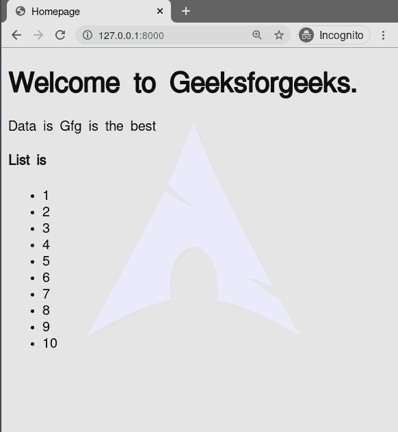

# 姜戈模板

> 原文:[https://www.geeksforgeeks.org/django-templates/](https://www.geeksforgeeks.org/django-templates/)

模板是[姜戈 MVT 结构](https://www.geeksforgeeks.org/django-project-mvt-structure/)的第三个也是最重要的部分。Django 中的模板基本上是用. html 文件中的 HTML、CSS 和 Javascript 编写的。Django 框架高效地处理和生成最终用户可见的动态 HTML 网页。Django 的主要功能是后端，因此，为了提供前端并为我们的网站提供布局，我们使用模板。根据我们的需要，有两种方法可以将模板添加到我们的网站上。
我们可以使用一个单一的模板目录，它将遍布整个项目。
对于我们项目的每个 app，我们可以创建不同的模板目录。

对于我们当前的项目，为了简单起见，我们将创建一个单一的模板目录，它将分布在整个项目中。应用级模板通常用于大型项目，或者我们希望为网页的每个组件提供不同的布局。

#### 配置

Django 模板可以在 app_name/settings.py 中配置，

## 蟒蛇 3

```py
TEMPLATES = [
    {
        # Template backend to be used, For example Jinja
        'BACKEND': 'django.template.backends.django.DjangoTemplates',
        # Directories for templates
        'DIRS': [],
        'APP_DIRS': True,

        # options to configure
        'OPTIONS': {
            'context_processors': [
                'django.template.context_processors.debug',
                'django.template.context_processors.request',
                'django.contrib.auth.context_processors.auth',
                'django.contrib.messages.context_processors.messages',
            ],
        },
    },
]
```

#### 使用姜戈模板

用一个示例项目说明如何在姜戈使用模板。模板不仅显示静态数据，还显示通过上下文字典连接到应用程序的不同数据库的数据。考虑一个名为 geeksforgeeks 的项目，它有一个名为 geeks 的应用程序。

> 请参考以下文章，查看如何在 Django 中创建项目和应用程序。
> 
> *   [如何利用姜戈的 MVT 创建基础项目？](https://www.geeksforgeeks.org/how-to-create-a-basic-project-using-mvt-in-django/)
> *   [如何在姜戈创建 App？](https://www.geeksforgeeks.org/how-to-create-an-app-in-django/)

要渲染一个模板，需要一个视图和一个映射到该视图的网址。让我们从极客/视图中创建一个视图开始。

## 蟒蛇 3

```py
# import Http Response from django
from django.shortcuts import render

# create a function
def geeks_view(request):
    # create a dictionary to pass
    # data to the template
    context ={
        "data":"Gfg is the best",
        "list":[1, 2, 3, 4, 5, 6, 7, 8, 9, 10]
    }
    # return response with template and context
    return render(request, "geeks.html", context)
```

现在我们需要映射一个 URL 来呈现这个视图，

## 蟒蛇 3

```py
from django.urls import path

# importing views from views..py
from .views import geeks_view

urlpatterns = [
    path('', geeks_view),
]
```

最后在 templates/geeks.html 中创建一个模板，

## 超文本标记语言

```py
<!DOCTYPE html>
<html lang="en">
<head>
    <meta charset="UTF-8">
    <meta name="viewport" content="width=device-width, initial-scale=1.0">
    <meta http-equiv="X-UA-Compatible" content="ie=edge">
    <title>Homepage</title>
</head>
<body>
    <h1>Welcome to Geeksforgeeks.</h1>

<p> Data  is {{  data }}</p>

    <h4>List is </h4>
    <ul>
    
    <li>{{ i }}</li>
    
</body>
</html>
```

让我们检查它是否工作，



## 姜戈模板语言

这是 Django Templates 提供的最重要的设施之一。Django 模板是使用 Django 模板语言标记的文本文档或 Python 字符串。模板引擎可以识别和解释一些构造。主要的是变量和标签。正如我们在上面的例子中使用的循环，我们使用它作为一个标签。同样，我们可以使用各种其他条件，如 if、else、if-else、empty 等。Django 模板语言的主要特征是变量、标签、过滤器和注释。

#### 变量

变量从上下文中输出一个值，这是一个类似 dict 的对象，将键映射到值。我们从视图中发送的上下文对象可以在模板中使用 Django Template 的变量来访问。

句法

```py
{{ variable_name }}
```

示例
变量被{{ and }}包围，如下所示:

```py
My first name is {{ first_name }}. My last name is {{ last_name }}. 
```

使用{'first_name': 'Naveen '，' last_name': 'Arora'}的上下文，此模板呈现为:

```py
My first name is Naveen. My last name is Arora.
```

要了解更多关于 Django 模板变量的信息，请访问–[变量–](https://www.geeksforgeeks.org/variables-django-templates/)Django 模板

#### 标签

标签在渲染过程中提供任意逻辑。例如，标签可以输出内容，用作控制结构，例如“if”语句或“For”循环，从数据库中抓取内容，甚至允许访问其他模板标签。

句法

```py

```

例子

标签由包围，如下所示:

```py

```

大多数标签接受参数，例如:

```py


```

<figure class="table">

|   | 常用标签 |   |
| --- | --- | --- |
| comment | [循环](https://www.geeksforgeeks.org/cycle-django-template-tags/) | [延伸](https://www.geeksforgeeks.org/extends-django-template-tags/) |
| [如果](https://www.geeksforgeeks.org/if-django-template-tags/) | [为循环](https://www.geeksforgeeks.org/for-loop-django-template-tags/) | [为…空循环](https://www.geeksforgeeks.org/for-empty-loop-django-template-tags/) |
| [布尔运算符](https://geeksforgeeks.org/boolean-operators-django-template-tags/) | 第一名 | [包括](https://geeksforgeeks.org/include-django-template-tags/) |
| [lorem](https://www.geeksforgeeks.org/lorem-django-template-tags/) | [现在](https://www.geeksforgeeks.org/now-django-template-tags/) | [url](https://www.geeksforgeeks.org/url-django-template-tags/) |

</figure>

#### 过滤

Django 模板引擎提供了用于转换变量值和标签参数的过滤器。我们已经讨论了主要的姜戈模板标签。标签不能修改变量值，而过滤器可以用来增加变量值或根据自己的需要修改它。

句法

```py
{{ variable_name | filter_name }}
```

过滤器可以是“链式的”一个滤波器的输出应用于下一个滤波器。{{ text|escape|linebreaks }}是一个常见的习惯用法，用于转义文本内容，然后将换行符转换为

标记。

例子

```py
{{ value | length }}
```

如果值为 **['a '，' b '，' c '，' d']** ，则输出为 **4** 。

<figure class="table">

|   | 主要模板过滤器 |   |
| --- | --- | --- |
| [添加](https://www.geeksforgeeks.org/django-template-filters/#add) | [加力](https://www.geeksforgeeks.org/django-template-filters/#addslashes) | capfirst |
| [中心](https://www.geeksforgeeks.org/django-template-filters/#center) | [切](https://www.geeksforgeeks.org/django-template-filters/#cut) | [日期](https://www.geeksforgeeks.org/django-template-filters/#date) |
| [默认](https://www.geeksforgeeks.org/django-template-filters/#default) | 词典 | [可拆分](https://www.geeksforgeeks.org/django-template-filters/#divisibleby) |
| [逃生](https://www.geeksforgeeks.org/django-template-filters/#escape) | [档案资料](https://www.geeksforgeeks.org/django-template-filters/#filesizeformat)除以[格式](https://www.geeksforgeeks.org/django-template-filters/#filesizeformat) | [第一](https://www.geeksforgeeks.org/django-template-filters/#first) |
| [加入](https://www.geeksforgeeks.org/django-template-filters/#join) | [最后](https://www.geeksforgeeks.org/django-template-filters/#last) | [长度](https://www.geeksforgeeks.org/django-template-filters/#length) |
| 行号 | [降低](https://www.geeksforgeeks.org/django-template-filters/#lower) | [制作 _ 列表](https://www.geeksforgeeks.org/django-template-filters/#make_list) |
| [随机](https://www.geeksforgeeks.org/django-template-filters/#random) | [切片](https://www.geeksforgeeks.org/django-template-filters/#slice) | [斯鲁吉](https://www.geeksforgeeks.org/django-template-filters/#slugify) |
| [时间](https://www.geeksforgeeks.org/django-template-filters/#time) | [时间火花](https://www.geeksforgeeks.org/django-template-filters/#timesince) | [标题](https://www.geeksforgeeks.org/django-template-filters/#title) |
| [无序列表](https://www.geeksforgeeks.org/django-template-filters/#unordered_list) | [上部](https://www.geeksforgeeks.org/django-template-filters/#upper) | [wordcount](https://www.geeksforgeeks.org/django-template-filters/#wordcount) |

</figure>

#### 评论

模板忽略和之间的所有内容。可以在第一个标签中插入可选的注释。例如，这在注释代码以记录代码被禁用的原因时非常有用。

句法

```py


```

示例:

```py

    Commented out text with {{ create_date|date:"c" }}

```

要了解更多关于在模板中使用注释的信息，请访问[注释–姜戈模板标签](https://www.geeksforgeeks.org/comment-django-template-tags/)

#### 模板继承

Django 模板引擎最强大也是最复杂的部分是模板继承。模板继承允许您构建一个包含站点所有公共元素的基础“框架”模板，并定义子模板可以覆盖的块。extends 标签用于 Django 中模板的继承。人们需要一遍又一遍地重复同样的代码。使用扩展，我们可以继承模板和变量。

句法

```py
 
```

示例:
假设如下目录结构:

```py
dir1/
    template.html
    base2.html
    my/
        base3.html
base1.html
```

在 template.html，以下路径是有效的:

## 超文本标记语言

```py



```

要了解模板继承和扩展的更多信息，请访问[扩展–姜戈模板标签](https://www.geeksforgeeks.org/extends-django-template-tags/)