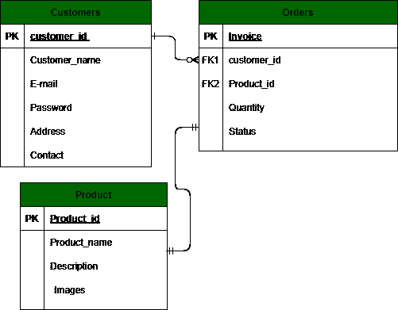
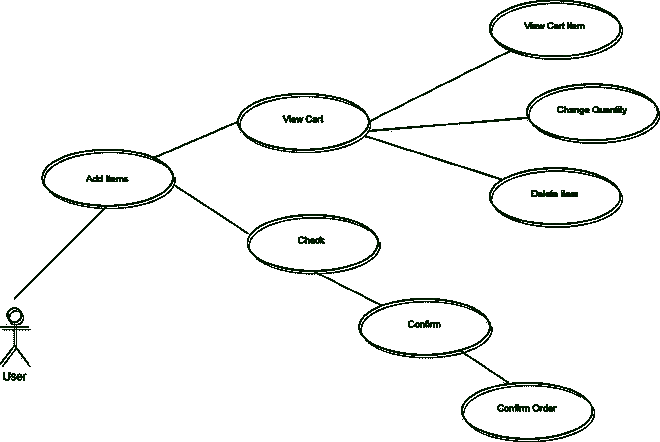
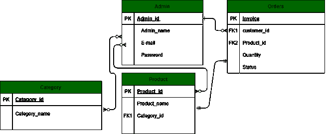
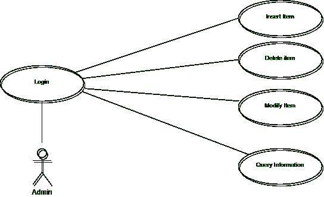
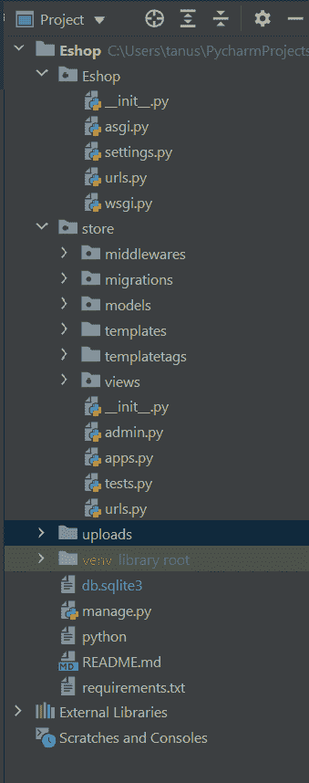
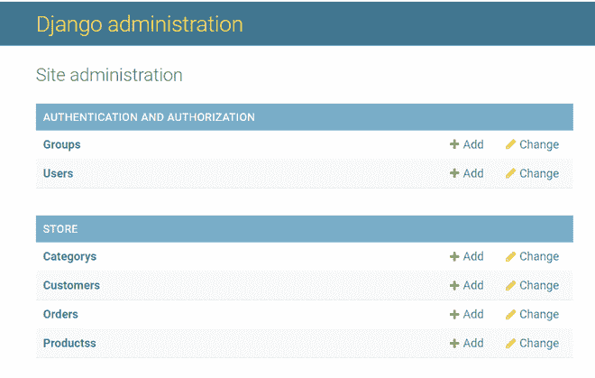
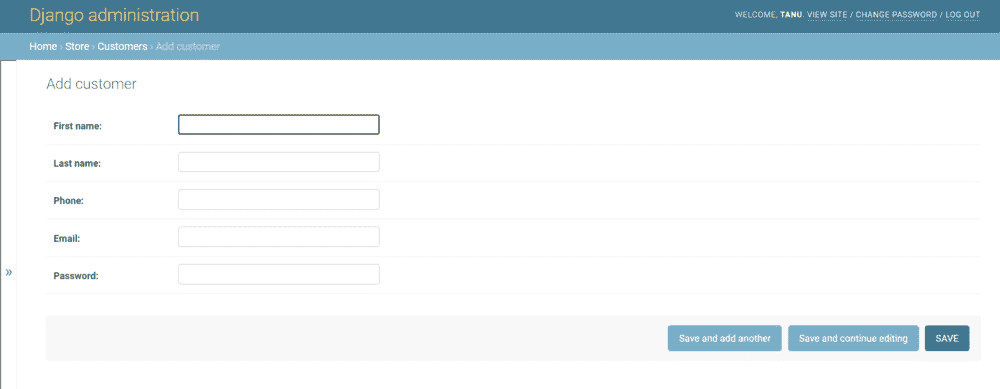
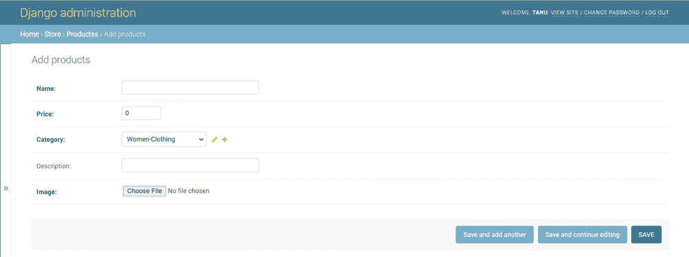
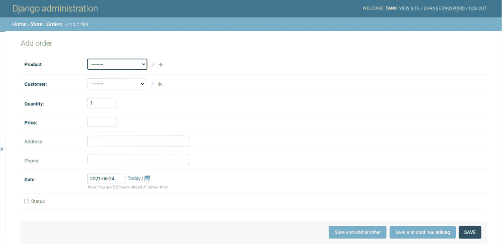

# 使用 Django 的电商网站

> 原文:[https://www . geesforgeks . org/电商-网站-使用-django/](https://www.geeksforgeeks.org/e-commerce-website-using-django/)

该项目涉及开发一个虚拟网站**“电子商务网站”**。它为用户提供了商店中可供购买的各种产品的列表。为了方便网上购物，向用户提供了购物车。选择商品后，将发送给订单确认流程。该系统是使用 Python 的网络框架 Django 实现的。开发一个电子商务网站，需要学习和了解很多技术。

**范围**:项目范围将仅限于电商网站的部分功能。它将显示产品，客户可以选择目录和选择产品，并可以从购物车中删除产品，指定每个项目的数量。选定的项目将被收集在购物车中。结账时，卡片上的项目将作为订单呈现。客户可以支付购物车中的商品来完成订单。这个项目有很大的发展空间。该项目还通过使用登录标识和密码来提供安全性，因此没有未经授权的用户可以访问您的帐户。只有拥有适当访问权限的授权人员才能访问软件。

### **项目使用的技术:**

Django 框架和默认情况下随 Django 附带的 SQLite 数据库。

### **构建项目所需的技能:**

Python 知识和 Django 框架基础。

### ER 和用例图

**客户界面:**

1.  顾客购买产品
2.  客户更改数量
3.  客户将物品添加到购物车
4.  客户视图购物车
5.  客户退房
6.  客户发送订单



客户电流变图



客户用例图

[**管理界面**](https://www.geeksforgeeks.org/python-django-admin-interface/) **:**

1.  管理员登录
2.  管理员插入项目
3.  管理员删除项目
4.  管理员修改项目



管理员的电子病历图



管理员用例图

### 逐步实施:

*   创建普通项目:打开 IDE，选择**文件- >新建项目，创建一个普通项目。**
*   安装 Django:接下来，我们将从终端安装 Django 模块。我们将使用 PyCharm 集成终端来完成这项任务。也可以通过运行***python-m pip install django***命令，在 windows 上使用 cmd 安装模块
*   检查已安装的 Django 版本:要检查已安装的 Django 版本，可以运行如下所示的***python-m Django-version***命令。
*   创建 django 项目:当我们执行***Django-admin start Project***命令时，它会在我们已经在这里创建的普通项目中创建一个 Django 项目。***django-admin start project 项目名称。***
*   查看 Python3 版本:***python 3–版本***
*   运行默认的 Django 网络服务器:- Django 内部提供了一个默认的网络服务器，我们可以在这里启动我们的应用程序。***python manage . py runserver***命令在终端 ***执行。*** 默认情况下，服务器运行在端口 8000 上。在突出显示的网址访问网络服务器。


使用文本编辑器打开项目文件夹。目录结构应该如下所示:



项目结构

现在在**设置中添加电商网站的店铺 app，py** 。


#### urls.py

该文件包含网站使用的所有网址模式

## 蟒蛇 3

```py
from django.contrib import admin
from django.urls import path, include
from django.conf.urls.static import static
from . import settings

urlpatterns = [
    path('admin/', admin.site.urls),
    path('', include('store.urls'))
] + static(settings.MEDIA_URL, document_root=settings.MEDIA_ROOT)
```

### [车型](https://www.geeksforgeeks.org/django-models/)

下面的截图显示了我们需要创建的所需模型。这些模型是将存储在 SQLite 数据库中的表。



让我们看看每个模型和每个模型所需的字段。

#### category.py

## 蟒蛇 3

```py
from django.db import models

class Category(models.Model):
    name = models.CharField(max_length=50)

    @staticmethod
    def get_all_categories():
        return Category.objects.all()

    def __str__(self):
        return self.name
```


#### customer.py

## 蟒蛇 3

```py
from django.db import models

class Customer(models.Model):
    first_name = models.CharField(max_length=50)
    last_name = models.CharField(max_length=50)
    phone = models.CharField(max_length=10)
    email = models.EmailField()
    password = models.CharField(max_length=100)

    # to save the data
    def register(self):
        self.save()

    @staticmethod
    def get_customer_by_email(email):
        try:
            return Customer.objects.get(email=email)
        except:
            return False

    def isExists(self):
        if Customer.objects.filter(email=self.email):
            return True

        return False
```



#### products.py

## 蟒蛇 3

```py
from django.db import models
from .category import Category

class Products(models.Model):
    name = models.CharField(max_length=60)
    price = models.IntegerField(default=0)
    category = models.ForeignKey(Category, on_delete=models.CASCADE, default=1)
    description = models.CharField(
        max_length=250, default='', blank=True, null=True)
    image = models.ImageField(upload_to='uploads/products/')

    @staticmethod
    def get_products_by_id(ids):
        return Products.objects.filter(id__in=ids)

    @staticmethod
    def get_all_products():
        return Products.objects.all()

    @staticmethod
    def get_all_products_by_categoryid(category_id):
        if category_id:
            return Products.objects.filter(category=category_id)
        else:
            return Products.get_all_products()
```



#### Orders.py

## 计算机编程语言

```py
from django.db import models
from .product import Products
from .customer import Customer
import datetime

class Order(models.Model):
    product = models.ForeignKey(Products,
                                on_delete=models.CASCADE)
    customer = models.ForeignKey(Customer,
                                 on_delete=models.CASCADE)
    quantity = models.IntegerField(default=1)
    price = models.IntegerField()
    address = models.CharField(max_length=50, default='', blank=True)
    phone = models.CharField(max_length=50, default='', blank=True)
    date = models.DateField(default=datetime.datetime.today)
    status = models.BooleanField(default=False)

    def placeOrder(self):
        self.save()

    @staticmethod
    def get_orders_by_customer(customer_id):
        return Order.objects.filter(customer=customer_id).order_by('-date')
```



### [视图](https://www.geeksforgeeks.org/views-in-django-python/):

在视图中，我们创建了一个名为 *home.py，login.py，registration . py，cart.py，checkout.py，orders.py* 的视图，它接受一个请求并呈现一个 HTML 作为响应。在模板中创建一个*home.html、login.html、signup.html、cart.html、checkout.html、orders.html*。并将视图映射到 store\urls.py 文件夹。

## 蟒蛇 3

```py
from django.contrib import admin
from django.urls import path
from .views.home import Index, store
from .views.signup import Signup
from .views.login import Login, logout
from .views.cart import Cart
from .views.checkout import CheckOut
from .views.orders import OrderView
from .middlewares.auth import auth_middleware

urlpatterns = [
    path('', Index.as_view(), name='homepage'),
    path('store', store, name='store'),

    path('signup', Signup.as_view(), name='signup'),
    path('login', Login.as_view(), name='login'),
    path('logout', logout, name='logout'),
    path('cart', auth_middleware(Cart.as_view()), name='cart'),
    path('check-out', CheckOut.as_view(), name='checkout'),
    path('orders', auth_middleware(OrderView.as_view()), name='orders'),

]
```

下面的文件显示了网站每个功能的视图。

#### home.py

## 蟒蛇 3

```py
from django.shortcuts import render, redirect, HttpResponseRedirect
from store.models.product import Products
from store.models.category import Category
from django.views import View

# Create your views here.
class Index(View):

    def post(self, request):
        product = request.POST.get('product')
        remove = request.POST.get('remove')
        cart = request.session.get('cart')
        if cart:
            quantity = cart.get(product)
            if quantity:
                if remove:
                    if quantity <= 1:
                        cart.pop(product)
                    else:
                        cart[product] = quantity-1
                else:
                    cart[product] = quantity+1

            else:
                cart[product] = 1
        else:
            cart = {}
            cart[product] = 1

        request.session['cart'] = cart
        print('cart', request.session['cart'])
        return redirect('homepage')

    def get(self, request):
        # print()
        return HttpResponseRedirect(f'/store{request.get_full_path()[1:]}')

def store(request):
    cart = request.session.get('cart')
    if not cart:
        request.session['cart'] = {}
    products = None
    categories = Category.get_all_categories()
    categoryID = request.GET.get('category')
    if categoryID:
        products = Products.get_all_products_by_categoryid(categoryID)
    else:
        products = Products.get_all_products()

    data = {}
    data['products'] = products
    data['categories'] = categories

    print('you are : ', request.session.get('email'))
    return render(request, 'index.html', data)
```

#### login.py

## 蟒蛇 3

```py
from django.shortcuts import render, redirect, HttpResponseRedirect
from django.contrib.auth.hashers import check_password
from store.models.customer import Customer
from django.views import View

class Login(View):
    return_url = None

    def get(self, request):
        Login.return_url = request.GET.get('return_url')
        return render(request, 'login.html')

    def post(self, request):
        email = request.POST.get('email')
        password = request.POST.get('password')
        customer = Customer.get_customer_by_email(email)
        error_message = None
        if customer:
            flag = check_password(password, customer.password)
            if flag:
                request.session['customer'] = customer.id

                if Login.return_url:
                    return HttpResponseRedirect(Login.return_url)
                else:
                    Login.return_url = None
                    return redirect('homepage')
            else:
                error_message = 'Invalid !!'
        else:
            error_message = 'Invalid !!'

        print(email, password)
        return render(request, 'login.html', {'error': error_message})

def logout(request):
    request.session.clear()
    return redirect('login')
```

#### signup.py

## 蟒蛇 3

```py
from django.shortcuts import render, redirect
from django.contrib.auth.hashers import make_password
from store.models.customer import Customer
from django.views import View

class Signup (View):
    def get(self, request):
        return render(request, 'signup.html')

    def post(self, request):
        postData = request.POST
        first_name = postData.get('firstname')
        last_name = postData.get('lastname')
        phone = postData.get('phone')
        email = postData.get('email')
        password = postData.get('password')
        # validation
        value = {
            'first_name': first_name,
            'last_name': last_name,
            'phone': phone,
            'email': email
        }
        error_message = None

        customer = Customer(first_name=first_name,
                            last_name=last_name,
                            phone=phone,
                            email=email,
                            password=password)
        error_message = self.validateCustomer(customer)

        if not error_message:
            print(first_name, last_name, phone, email, password)
            customer.password = make_password(customer.password)
            customer.register()
            return redirect('homepage')
        else:
            data = {
                'error': error_message,
                'values': value
            }
            return render(request, 'signup.html', data)

    def validateCustomer(self, customer):
        error_message = None
        if (not customer.first_name):
            error_message = "Please Enter your First Name !!"
        elif len(customer.first_name) < 3:
            error_message = 'First Name must be 3 char long or more'
        elif not customer.last_name:
            error_message = 'Please Enter your Last Name'
        elif len(customer.last_name) < 3:
            error_message = 'Last Name must be 3 char long or more'
        elif not customer.phone:
            error_message = 'Enter your Phone Number'
        elif len(customer.phone) < 10:
            error_message = 'Phone Number must be 10 char Long'
        elif len(customer.password) < 5:
            error_message = 'Password must be 5 char long'
        elif len(customer.email) < 5:
            error_message = 'Email must be 5 char long'
        elif customer.isExists():
            error_message = 'Email Address Already Registered..'
        # saving

        return error_message
```

#### cart.py

## 蟒蛇 3

```py
from django.db import models
from .product import Products
from .customer import Customer
import datetime

class Order(models.Model):
    product = models.ForeignKey(Products,
                                on_delete=models.CASCADE)
    customer = models.ForeignKey(Customer,
                                 on_delete=models.CASCADE)
    quantity = models.IntegerField(default=1)
    price = models.IntegerField()
    address = models.CharField(max_length=50, default='', blank=True)
    phone = models.CharField(max_length=50, default='', blank=True)
    date = models.DateField(default=datetime.datetime.today)
    status = models.BooleanField(default=False)

    def placeOrder(self):
        self.save()

    @staticmethod
    def get_orders_by_customer(customer_id):
        return Order.objects.filter(customer=customer_id).order_by('-date')
```

#### checkout.py

## 蟒蛇 3

```py
from django.shortcuts import render, redirect

from django.contrib.auth.hashers import check_password
from store.models.customer import Customer
from django.views import View

from store.models.product import Products
from store.models.orders import Order

class CheckOut(View):
    def post(self, request):
        address = request.POST.get('address')
        phone = request.POST.get('phone')
        customer = request.session.get('customer')
        cart = request.session.get('cart')
        products = Products.get_products_by_id(list(cart.keys()))
        print(address, phone, customer, cart, products)

        for product in products:
            print(cart.get(str(product.id)))
            order = Order(customer=Customer(id=customer),
                          product=product,
                          price=product.price,
                          address=address,
                          phone=phone,
                          quantity=cart.get(str(product.id)))
            order.save()
        request.session['cart'] = {}

        return redirect('cart')
```

#### orders.py

## 蟒蛇 3

```py
from django.shortcuts import render, redirect
from django.contrib.auth.hashers import check_password
from store.models.customer import Customer
from django.views import View
from store.models.product import Products
from store.models.orders import Order
from store.middlewares.auth import auth_middleware

class OrderView(View):

    def get(self, request):
        customer = request.session.get('customer')
        orders = Order.get_orders_by_customer(customer)
        print(orders)
        return render(request, 'orders.html', {'orders': orders})
```

### 输出

<video class="wp-video-shortcode" id="video-629771-1" width="640" height="360" preload="metadata" controls=""><source type="video/mp4" src="https://media.geeksforgeeks.org/wp-content/uploads/20210624145327/gfg.mp4?_=1">[https://media.geeksforgeeks.org/wp-content/uploads/20210624145327/gfg.mp4](https://media.geeksforgeeks.org/wp-content/uploads/20210624145327/gfg.mp4)</video>

该项目已经包含了许多功能。主要受益者既有客户，也有需要更长时间才能在网上表现的管理员。此外，将来还可以识别和合并其他功能。了解需求并将其调整到计算机化系统以适应额外的功能需要更多的时间和精力。

[GitHub 链接到项目](https://github.com/TanuShree952838/Eshop)[](https://github.com/TanuShree952838/E-commerceWebsite)