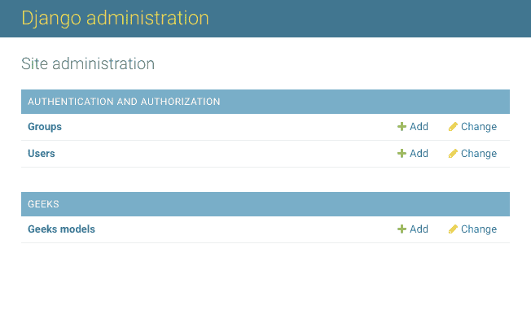

# 文件场–姜戈模型

> 原文:[https://www.geeksforgeeks.org/filefield-django-models/](https://www.geeksforgeeks.org/filefield-django-models/)

文件字段是**文件上传字段**。在上传文件之前，需要指定许多设置，以便安全地保存文件，并可以方便地检索。该字段的默认表单部件是 [ClearableFileInput](https://docs.djangoproject.com/en/2.2/ref/forms/widgets/#django.forms.ClearableFileInput) 。

**语法**

```
field_name = models.FileField(upload_to=None, max_length=254, **options)
```

**文件字段有一个可选参数:**

```
FileField.upload_to
```

该属性提供了一种设置上传目录和文件名的方式，可以通过两种方式进行设置。在这两种情况下，该值都被传递给 [Storage.save()](https://docs.djangoproject.com/en/2.2/ref/files/storage/#django.core.files.storage.Storage.save) 方法。如果指定一个字符串值，它可能包含 [strftime()](https://docs.python.org/3/library/time.html#time.strftime) 格式，该格式将被文件上传的日期/时间替换(这样上传的文件就不会填满给定的目录)。例如:

```
class MyModel(models.Model):

    # file will be uploaded to MEDIA_ROOT / uploads
    upload = models.FileField(upload_to ='uploads/')

    # or...
    # file will be saved to MEDIA_ROOT / uploads / 2015 / 01 / 30
    upload = models.FileField(upload_to ='uploads/% Y/% m/% d/')
```

如果您使用默认的[文件系统存储](https://docs.djangoproject.com/en/2.2/ref/files/storage/#django.core.files.storage.FileSystemStorage)，字符串值将被附加到您的 **`MEDIA_ROOT`** 路径，以形成本地文件系统上存储上传文件的位置。如果您使用不同的存储，请查看该存储的文档，了解它如何处理`upload_to`。

`**upload_to**`也可以是可调用的，比如函数。这将被调用来获取上传路径，包括文件名。这个可调用函数必须接受两个参数，并返回一个 Unix 风格的路径(带有正斜杠)以传递给存储系统。这两个论点是:

| 争吵 | 描述 |
| --- | --- |
| 情况 | 定义文件字段的模型实例。更具体地说，这是附加当前文件的特定实例。 |
| 文件名 | 最初给文件的文件名。在确定最终目的地路径时，可以考虑也可以不考虑这一点 |

例如:

```
def user_directory_path(instance, filename):

    # file will be uploaded to MEDIA_ROOT / user_<id>/<filename>
    return 'user_{0}/{1}'.format(instance.user.id, filename)

class MyModel(models.Model):
    upload = models.FileField(upload_to = user_directory_path)
```

## 姜戈模型文件字段解释

使用示例说明文件字段。考虑一个名为`geeksforgeeks`的项目，它有一个名为`geeks`的应用程序。

> 请参考以下文章，查看如何在 Django 中创建项目和应用程序。
> 
> *   [如何利用姜戈的 MVT 创建基础项目？](https://www.geeksforgeeks.org/how-to-create-a-basic-project-using-mvt-in-django/)
> *   [如何在姜戈创建 App？](https://www.geeksforgeeks.org/how-to-create-an-app-in-django/)

将以下代码输入**极客** app 的`models.py`文件。

```
from django.db import models
from django.db.models import Model
# Create your models here.

class GeeksModel(Model):
    geeks_field = models.FileField()
```

将极客应用添加到`INSTALLED_APPS`

```
# Application definition

INSTALLED_APPS = [
    'django.contrib.admin',
    'django.contrib.auth',
    'django.contrib.contenttypes',
    'django.contrib.sessions',
    'django.contrib.messages',
    'django.contrib.staticfiles',
    'geeks',
]
```

现在当我们从终端运行`makemigrations`命令时，

```
Python manage.py makemigrations
```

将在`geeks`目录中创建一个名为“迁移”的新文件夹，文件名为`0001_initial.py`

```
# Generated by Django 2.2.5 on 2019-09-25 06:00

from django.db import migrations, models

class Migration(migrations.Migration):

    initial = True

    dependencies = [
    ]

    operations = [
        migrations.CreateModel(
            name ='GeeksModel',
            fields =[
                ('id', 
                  models.AutoField(
                  auto_created = True,
                  primary_key = True,
                  serialize = False, 
                  verbose_name ='ID'
                )),
                ('geeks_field', models.FileField()),
            ],
        ),
    ]
```

现在快跑，

```
Python manage.py migrate
```

因此，当您在项目上运行迁移时，会创建一个 `geeks_field` **文件域**。它是数据库中存储任何类型文件的字段。

## 如何使用 FileField？

文件字段用于将文件存储到数据库中。人们可以在文件字段中输入任何类型的文件。让我们尝试在上面创建的模型中存储一个图像。

*   要开始创建模型实例，请使用以下命令创建一个管理员帐户。

    ```
    Python manage.py createsuperuser
    ```

*   Enter a username, email and a secure password. Then in your browser enter the following URL.

    ```
    http://localhost:8000/admin/
    ```

    

*   转到**极客模型**前添加。
    
*   选择要上传的文件，然后单击保存。现在让我们在管理服务器中检查它。我们已经创建了一个极客模型的实例。
    

## 字段选项

字段选项是为每个字段提供的参数，用于对特定字段应用某些约束或赋予特定特征。例如，向文件字段添加参数`null = True`将使其能够在关系数据库中存储该表的空值。
以下是文件字段可以使用的字段选项和属性。

| 字段选项 | 描述 |
| --- | --- |
| [零](https://www.geeksforgeeks.org/nulltrue-django-built-in-field-validation/) | 如果**为真**，姜戈会在数据库中将空值存储为**空值**。默认为**假**。 |
| [空白](https://www.geeksforgeeks.org/blanktrue-django-built-in-field-validation/) | 如果**为真**，则该字段允许为空。默认为**假**。 |
| 数据库 _ 列 | 用于此字段的数据库列的名称。如果没有给出，Django 将使用字段的名称。 |
| [默认](https://www.geeksforgeeks.org/default-django-built-in-field-validation/) | 该字段的默认值。这可以是一个值或一个可调用对象。如果可调用，它将在每次创建新对象时被调用。 |
| [帮助 _ 文字](https://www.geeksforgeeks.org/help_text-django-built-in-field-validation/) | 要与表单小部件一起显示的额外“帮助”文本。即使您的字段没有在表单上使用，它对文档也很有用。 |
| [主键](https://www.geeksforgeeks.org/primary_key-django-built-in-field-validation/) | 如果为真，则该字段是模型的主键。 |
| [可编辑](https://www.geeksforgeeks.org/editablefalse-django-built-in-field-validation/) | 如果**为假**，该字段将不会显示在管理或任何其他模型表单中。在模型验证期间也会跳过它们。默认为**真**。 |
| [错误信息](https://www.geeksforgeeks.org/error_messages-django-built-in-field-validation/) | error_messages 参数允许您覆盖该字段将引发的默认消息。传入一个字典，其关键字与您想要覆盖的错误消息相匹配。 |
| [帮助 _ 文字](https://www.geeksforgeeks.org/help_text-django-built-in-field-validation/) | 要与表单小部件一起显示的额外“帮助”文本。即使您的字段没有在表单上使用，它对文档也很有用。 |
| [verbose_name](https://www.geeksforgeeks.org/verbose_name-django-built-in-field-validation/) | 该字段的可读名称。如果没有给出详细名称，Django 将使用字段的属性名称自动创建它，将下划线转换为空格。 |
| [验证器](https://www.geeksforgeeks.org/custom-field-validations-in-django-models/) | 为此字段运行的验证程序列表。更多信息参见[验证器文档](https://docs.djangoproject.com/en/2.2/ref/validators/)。 |
| [独特](https://www.geeksforgeeks.org/uniquetrue-django-built-in-field-validation/) | 如果为真，则该字段在整个表中必须是唯一的。 |