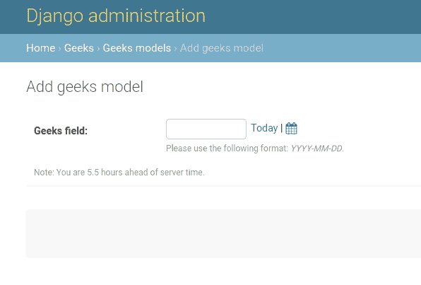

# 帮助 _ 文本–姜戈内置字段验证

> 原文:[https://www . geesforgeks . org/help _ text-django-内置字段-验证/](https://www.geeksforgeeks.org/help_text-django-built-in-field-validation/)

Django 模型中的内置字段验证是预定义给所有 Django 字段的验证。每个字段都有来自姜戈[验证器](https://docs.djangoproject.com/en/2.2/ref/validators/)的内置验证。还可以添加更多的内置字段验证，以应用或删除特定字段的某些约束。
`**help_text**`属性用于在管理界面或模型表单中显示“帮助”文本以及表单中的字段。即使您的字段没有在表单上使用，它对文档也很有用。例如，您可以在日期字段的`help_text`中定义要作为输入的日期模式。

**语法-**

```
field_name = models.Field(help_text = "text")
```

## Django 内置字段验证`help_text`解释

使用示例说明**帮助 _ 文本**。考虑一个名为`geeksforgeeks`的项目，它有一个名为`geeks`的应用程序。

> 请参考以下文章，查看如何在 Django 中创建项目和应用程序。
> 
> *   [如何利用姜戈的 MVT 创建基础项目？](https://www.geeksforgeeks.org/how-to-create-a-basic-project-using-mvt-in-django/)
> *   [如何在姜戈创建 App？](https://www.geeksforgeeks.org/how-to-create-an-app-in-django/)

将以下代码输入**极客** app 的`models.py`文件。我们将使用日期字段来尝试帮助文本。

```
from django.db import models
from django.db.models import Model
# Create your models here.

class GeeksModel(Model):
    geeks_field = models.DateField(
                    help_text = "Please use the following format: <em>YYYY-MM-DD</em>."
                    )
```

在 Django 上运行 makemigrations 和 migration 并呈现上述模型之后，让我们检查一下 Django 管理界面中的字段是否发生了什么。

你可以在字段底部看到额外添加的文本。这是因为您可以在模型表单中修改显示在字段下方的文本。

#### `help_text`高级概念–

=> **怎么办，help_text 即使多次尝试也不显示？**
在模板中放入`{{ form.as_p }}`(或者仅仅是`{{ form }}`)应该会显示 help_text，而不需要额外的代码，前提是您的上下文中有表单，或者如果您正在使用单个字段，您可以使用`{{ form.field.help_text }}`来访问特定字段的帮助文本。

#### 更多内置字段验证

| 字段选项 | 描述 |
| --- | --- |
| [零](https://www.geeksforgeeks.org/nulltrue-django-built-in-field-validation/) | 如果**为真**，姜戈会在数据库中将空值存储为**空值**。默认为**假**。 |
| [空白](https://www.geeksforgeeks.org/blanktrue-django-built-in-field-validation/) | 如果**为真**，则该字段允许为空。默认为**假**。 |
| 数据库 _ 列 | 用于此字段的数据库列的名称。如果没有给出，Django 将使用字段的名称。 |
| [默认](https://www.geeksforgeeks.org/default-django-built-in-field-validation/) | 该字段的默认值。这可以是一个值或一个可调用对象。如果可调用，它将在每次创建新对象时被调用。 |
| [帮助 _ 文字](https://www.geeksforgeeks.org/help_text-django-built-in-field-validation/) | 要与表单小部件一起显示的额外“帮助”文本。即使您的字段没有在表单上使用，它对文档也很有用。 |
| [主键](https://www.geeksforgeeks.org/primary_key-django-built-in-field-validation/) | 如果为真，则该字段是模型的主键。 |
| [可编辑](https://www.geeksforgeeks.org/editablefalse-django-built-in-field-validation/) | 如果**为假**，该字段将不会显示在管理或任何其他模型表单中。在模型验证期间也会跳过它们。默认为**真**。 |
| [错误信息](https://www.geeksforgeeks.org/error_messages-django-built-in-field-validation/) | error_messages 参数允许您覆盖该字段将引发的默认消息。传入一个字典，其关键字与您想要覆盖的错误消息相匹配。 |
| [帮助 _ 文字](https://www.geeksforgeeks.org/help_text-django-built-in-field-validation/) | 要与表单小部件一起显示的额外“帮助”文本。即使您的字段没有在表单上使用，它对文档也很有用。 |
| [verbose_name](https://www.geeksforgeeks.org/verbose_name-django-built-in-field-validation/) | 该字段的可读名称。如果没有给出详细名称，Django 将使用字段的属性名称自动创建它，将下划线转换为空格。 |
| [验证器](https://www.geeksforgeeks.org/custom-field-validations-in-django-models/) | 为此字段运行的验证程序列表。更多信息参见[验证器文档](https://docs.djangoproject.com/en/2.2/ref/validators/)。 |
| [独特](https://www.geeksforgeeks.org/uniquetrue-django-built-in-field-validation/) | 如果为真，则该字段在整个表中必须是唯一的。 |