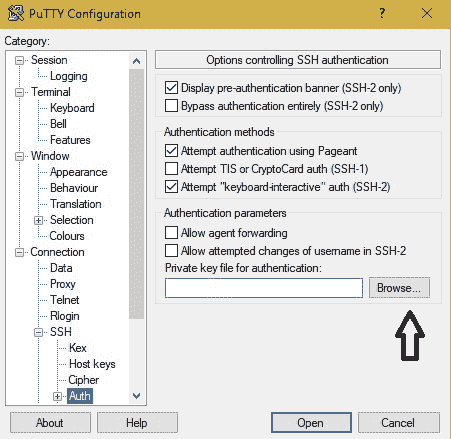
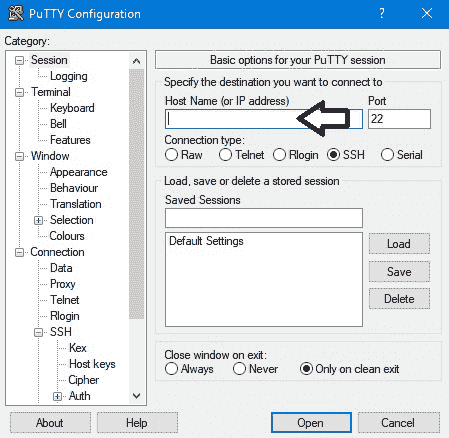

# 在 CentOS VPS 上托管您的 Django 网站

> 原文:[https://www . geesforgeks . org/hosting-your-django-网站-on-a-centos-vps/](https://www.geeksforgeeks.org/hosting-your-django-website-on-a-centos-vps/)

如果在部署时没有采取适当的步骤，在实时服务器上托管任何网站/web 应用程序有时会变得很困难。主要有 3 种不同类型的主机:

1.  **<u>共享托管</u>**–通常用于流量有限的小(单页)网站。
2.  **<u>VPS 托管</u>**–VPS(虚拟专用服务器)托管用于内容量好、流量中高的网站。
3.  <u>–这种托管一般用于内容多、流量高的大型商业网站。</u>

<u>在本文中，我们将主要讨论虚拟专用网主机。</u>

## <u>VPS</u>

<u>虚拟专用服务器是许多用户使用的单一物理机。世界上某个地方配备了虚拟化的物理服务器作为单独的专用系统为用户服务，供他们使用。它将可用资源分配给不同的用户，对于每个用户来说，似乎他们使用的是一台单独的专用机器。</u>

### <u>托管前需要牢记的要点:</u>

*   <u>确保服务器操作系统已更新，并且它使用的所有其他软件都是最新的。</u>
*   <u>检查本地环境包和库的版本是否与虚拟专用网上的相同。</u>
*   <u>如果版本不同，请确保卸载现有版本，并在服务器上安装所需的相同版本。</u>
*   <u>选择一个运行在虚拟专用网操作系统上的服务器来为您的网站文件提供服务。(在本文中，我们将使用 Nginx)。</u>
*   <u>始终检查您的主机提供商是否为其客户提供了良好的支持。</u>

## <u>根访问和 SSH</u>

<u>当您购买虚拟专用网络时，您将获得根登录凭据。有一些主机提供商有内置终端，可以使用根访问。在这种情况下，一般不需要 SSH。</u>

<u>SSH(安全外壳)是一个命令行界面，用于管理您的虚拟专用网络。它帮助您安全地连接到您的 VPS 外壳。如果没有启用 SSH 访问，您可能需要联系主机提供商。如果启用，您可以继续。</u>

### <u>油灰</u>

<u>这是一个免费的开源终端模拟器，可以帮助你从本地系统使用 SSH 访问你的虚拟专用网的外壳。使用官方网站在本地系统上下载 PuTTY:[https://www.putty.org/](https://www.putty.org/)</u>

<u>对于使用 PuTTY，首先需要有公钥和私钥对。这些密钥对可以使用 PuTTYgen 生成，也可以使用托管接口(比如 WHM)创建。创建公钥-私钥对后，您可以将相同的私钥下载到本地系统，打开 PuTTY 后，您可以通过以下方式上传私钥文件:连接-> SSH ->授权，如下图所示:</u>

<u>

浏览私钥文件，并将其上传到 PuTTY 中进行授权，以便进行 SSH 访问</u> 

<u>上传后，进入会话选项卡，输入服务器的 IP 地址，如下图所示:</u>

<u></u>

<u>然后单击打开，您将被重定向到一个终端，您的服务器可以通过 ssh 访问。从那个终端你可以管理你的服务器。该终端几乎与您的 VPS 机器上使用的终端相同。</u>

<u>**注意**:使用 ssh 连接到你的服务器的方式有很多。上面提到的只是一种方法。</u>

## <u>准备部署</u>

<u>通过在您的本地环境中验证所有必需的包和库的版本来安装它们。也下载运行你的网站所需的软件。</u>

*   <u>启用 EPEL 存储库</u>

```py
 $ sudo yum install epel-release
```

*   <u>安装所需的软件包</u>

```py
 $ sudo yum install <package/depedency_name> 
```

<u>现在，您可以通过 PuTTY 使用安全拷贝(scp)将您的网站文件从本地系统传输到您的 VPS，或者您可以在 github 上创建您的网站的存储库，并从那里将其克隆到您的 VPS 中。</u>

<u>我建议把你的网站文件上传到目录/var/www/ <my-website>。</my-website></u>

<u>对于一个 Django 网站来说，创建一个虚拟环境现在是必须的，因为它使您能够在同一台机器上运行不同的项目，而不会相互冲突依赖关系和版本。因此，首先创建一个环境，激活它，并确保在环境中为您的网站安装所有依赖项。</u>

<u>**注**:本文假设您的本地主机上已经准备好了一个网站进行托管，因此我们将不再进行创建新网站的步骤。</u>

<u>安装完依赖项并移动网站文件后，您需要在您的虚拟专用网上创建一个数据库服务器。这里我们将使用 PostgreSQL。</u>

## <u>在虚拟专用网上设置网站数据库</u>

*   <u>使用 psql 为网站创建您的数据库和新角色(数据库用户)，并相应地更新您的 settings.py 文件。</u>
*   <u>在 ssh 终端上运行以下命令，为数据库创建迁移:</u>

```py
 (project_env) $ python manage.py makemigrations 
```

*   <u>确保所有迁移都已正确创建，并且在创建迁移时不会出错。现在迁移数据库:</u>

```py
 (project_env) $ python manage.py migrate 
```

## <u>重置本地系统上的迁移历史记录</u>

*   <u>使用命令查看当前迁移:</u>

```py
 (local_project_env) $ python manage.py showmigrations 
```

*   <u>重复此步骤，清除网站/项目中所有应用程序的迁移历史记录:</u>

<u>(**注**:这里我的-app 应该换成你的 app 名。)</u>

```py
 (local_project_env) $ python manage.py migrate --fake my-app zero 
```

*   <u>通过导航到每个应用的迁移文件夹并删除该文件夹中除 __init__ 以外的所有内容，删除实际的迁移文件。py 文件。注意不要删除 __init__。py 文件。</u>
*   <u>创建初始迁移并伪造它们:</u>

```py
 (local_project_env) $ python manage.py makemigrations
  (local_project_env) $ python manage.py migrate --fake-initial 
```

## <u>将现有数据库迁移到虚拟专用网上的 PostgreSQL</u>

*   <u>将现有数据转储到本地系统:</u>

```py
 (local_project_env) $ python manage.py dumpdata > dump.json 
```

*   <u>使用 github 或安全拷贝(scp)将 dump.json 文件从本地系统移动到 VPS。</u>
*   <u>运行 python shell 并删除 contentype 数据:</u>

<u>(**注意**:在服务器终端(ssh)上运行以下命令)</u>

```py
 (project_env) $ python manage.py shell 
   >>> from django.contrib.contenttypes.models import ContentType
   >>> ContentType.objects.all().delete()
   >>> quit 
```

*   <u>将 dump.json 文件加载到数据库中:</u>

```py
 (project_env) $ python manage.py loaddata dump.json
```