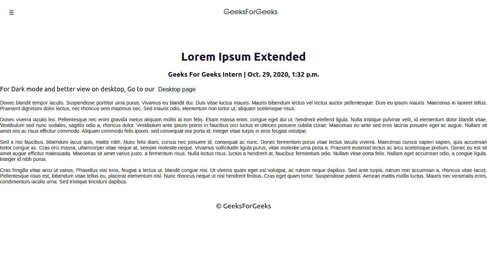
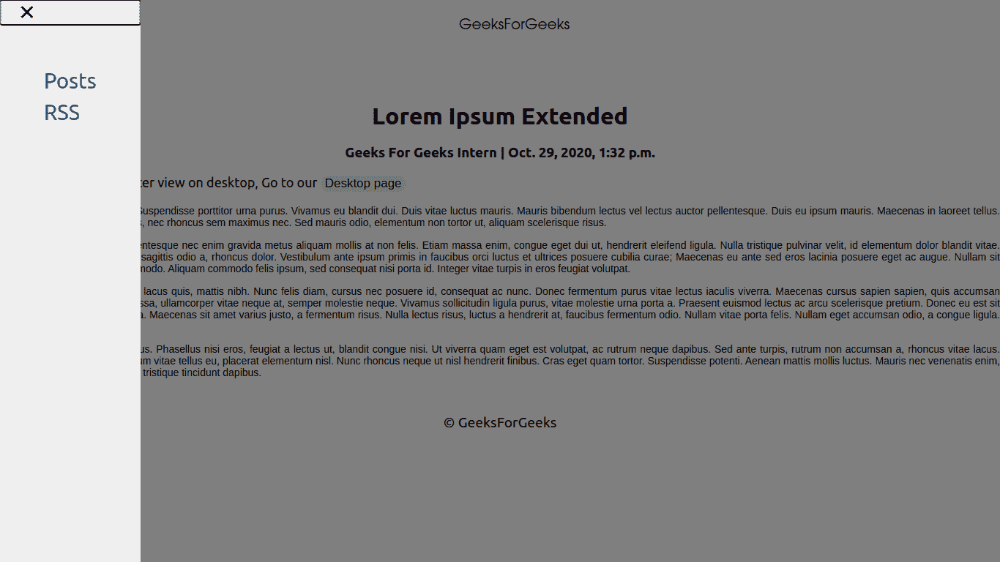

# 如何给 Django 项目添加 AMP？

> 原文:[https://www . geesforgeks . org/how-add-amp-to-django-project/](https://www.geeksforgeeks.org/how-to-add-amp-to-django-project/)

博客主要需要内容，但这并不意味着你的博客会在谷歌搜索之上。为此你需要速度，安全性，用户基础，首先搜索引擎需要知道你的博客存在。我们将为速度增加放大器。本文是姜戈博客内容管理系统项目的延续。在此查看–[与 Django](https://www.geeksforgeeks.org/building-blog-cms-content-management-system-with-django/) 一起构建博客内容管理系统

### 安培

AMP(加速移动页面)是由 AMP 开源项目开发的开源 HTML 框架。它最初是由谷歌创建的，是 Facebook 即时文章和苹果新闻的竞争对手。AMP 针对移动网络浏览进行了优化，旨在帮助网页更快加载。它们受限于 JavaScript。

### 创建放大器模板–

我们将在博客模板文件夹中创建一个应用程序模板，并用. amp.html 扩展名保存它

## 超文本标记语言

```py

<!doctype html>
<html amp lang="en">
  <head>
    <meta charset="utf-8">
    <title>{{ object.title }}</title>
    <meta name="description" content="{{ object.metades}}" />
    <meta property="og:title" content="{{ object.title }}">
<meta property="og:site_name" content="GeeksForGeeks">
<meta property="og:url" content="">
<meta property="og:description" content="{{ object.metades }}">
<meta property="og:type" content="article">
    <meta name="viewport" content="width=device-width, minimum-scale=1, initial-scale=1">
    <link rel="preload" as="script" href="https://cdn.ampproject.org/v0.js">
    <script async src="https://cdn.ampproject.org/v0.js"></script>
    <script async custom-element="amp-analytics" src="https://cdn.ampproject.org/v0/amp-analytics-0.1.js"></script>
    <script async custom-element="amp-auto-ads" src="https://cdn.ampproject.org/v0/amp-auto-ads-0.1.js"></script>
    <script async custom-element="amp-sidebar" src="https://cdn.ampproject.org/v0/amp-sidebar-0.1.js"></script>
    <style amp-custom>
    body { font-family: 'Raleway', sans-serif; }
    footer { text-align: center;
      height: 29px;
      font-size: 1.2em;
    }
    #banner {
    font-size: 1em;
    width: 100%;
    text-align: center; }
button {
    font-size: 17px;
    text-decoration: none;
    border: none;
    border-radius: 29px;}
#amp_page { font-size: 18px; }
.headerbar {
  height: 70px;
  top: 0;
  width: 100%;
  display: flex;
  align-items: center;
}
.site-name {
  font-size:20px;
  font-family: monospace;
  margin: auto;
}
#banner {
  margin-top: 70px;
  text-align: center;
}
.hamburger {
  padding-left: 25px;
}
.sidebar {
  font-size: 29px;
  padding: 60px;
  margin: 0;
}
.sidebar > li {
  list-style: none;
  margin-bottom:10px;
}
.sidebar li a {
  text-decoration: none;
  font-family: sans-serif;
}
.close-sidebar {
  font-size: 1.8em;
  padding-left: 25px;
}
#storycontent {text-align: center; }
.storyimages { min-width: 100%;
margin: 0 auto; }
   </style>
    <style amp-boilerplate>body{-webkit-animation:-amp-start 8s steps(1, end) 0s 1 normal both;-moz-animation:-amp-start 8s steps(1, end) 0s 1 normal both;-ms-animation:-amp-start 8s steps(1, end) 0s 1 normal both;animation:-amp-start 8s steps(1, end) 0s 1 normal both}@-webkit-keyframes -amp-start{from{visibility:hidden}to{visibility:visible}}@-moz-keyframes -amp-start{from{visibility:hidden}to{visibility:visible}}@-ms-keyframes -amp-start{from{visibility:hidden}to{visibility:visible}}@-o-keyframes -amp-start{from{visibility:hidden}to{visibility:visible}}@keyframes -amp-start{from{visibility:hidden}to{visibility:visible}}</style><noscript><style amp-boilerplate>body{-webkit-animation:none;-moz-animation:none;-ms-animation:none;animation:none}</style></noscript>
    <link rel="canonical" href="">
    <link rel="manifest" href="/manifest.json">
    <script type="application/ld+json">
{
  "@context": "https://schema.org/",
  "@type": "Article",
  "headline": "{{ object.title }}",
  "description": "{{ object.metades }}",
  "mainEntityOfPage": {
    "@type": "WebPage",
    "@id": ""
},
  "author": {
    "@type": "Person",
    "name": "{{ object.author.first_name }} {{ object.author.last_name }}"
  },
  "publisher": {
    "@type": "Organization",
    "name": "GeeksForGeeks",
  },
  "datePublished": "{{ object.created_on }}",
  "dateModified": "{{ object.created_on }}",
  "mentions": "{{ object.source }}"
}
</script>
  </head>
  <body>
<header class="headerbar">
  <div role="button" on="tap:sidebar1.toggle" tabindex="0" class="hamburger">☰</div>
  <div class="site-name">GeeksForGeeks</div>
</header>
<amp-sidebar id="sidebar1" layout="nodisplay" side="left">
  <div role="button" aria-label="close sidebar" on="tap:sidebar1.toggle" tabindex="0" class="close-sidebar">✕</div>
  <ul class="sidebar">
       <li><a href="">Posts</a></li>
       <li><a href="">RSS</a></li>
       </ul></amp-sidebar>
<div class="container text-center" id="banner"><h1>{{ object.title }}</h1></div>
<div class="container"><h3 style="text-align: center;">{{ object.author.first_name }} {{ object.author.last_name }} | {{ object.created_on }}</h3>
<p id="amp_page">For Dark mode and better view on desktop, Go to our <span><a href=""><button class="btn btn-outline-primary">Desktop page</button></a></span></p>

        <p id="storycontent">{{ object.content | ampimg | safe }}</p>

       </div>
    <footer>© GeeksForGeeks</footer>
  </body>
</html>
```

### 在放大器中处理图像–

由于即使有图像，amp 也是有限的，我们对 amp 和非 amp 页面使用相同的图像来克服这些问题，我们将创建另一个文件，帮助我们在需要时更改 AMP 的图像。转到博客应用目录并创建 templatetags 目录。在 templatetags 目录中，创建一个空的 __init__。py 文件。将下面的代码粘贴到 ampimg.py 文件中，我们就完成了

## 蟒蛇 3

```py
import re
from django import template

register = template.Library()

@register.filter(name ="ampimg")
def ampimg(content):
    img_pattern = r'(]+>)'
    img_tags = re.findall(img_pattern, content)
    img_src_pattern = r'src ="([^"]+)"'
    for img in img_tags:
        try:
            img_src = re.findall(img_src_pattern, img)[0]
        except Exception as NoImgSrc:
            img_src = None
        if img_src:
            amp_img = "<amp-img class =\"storyimages\" src =\"{0}\" width =\"360\" height =\"320\" layout =\"responsive\" alt =\"storyimage\">".format(img_src)
            content = content.replace(img, amp_img)
    return content
```

### 为放大器创建视图–

现在转到您的 app views.py 文件并添加以下模板

## 蟒蛇 3

```py
# importing models and libraries
from django.shortcuts import render
from .models import posts
from django.views import generic
from django.views.decorators.http import require_GET
from django.http import HttpResponse

# class based view for each post in amp template
class postdetailamp(generic.DetailView):
    model = posts
    template_name = "page.amp.html"
```

### 为放大器添加路由

现在我们将路由我们的 AMP 页面，以便它是可访问的，转到你的应用程序的 urls.py 文件，并添加路由

## 蟒蛇 3

```py
urlpatterns = [
  .....
# amp route
    path('amp/<slug:slug>/', views.postdetailamp.as_view(), name ='post_detail_amp'),
  .....
]
```

**样本放大器发布页面**



示例帖子页面

**可扩展菜单**



可扩展的侧面菜单

**手机页面示例**


示例移动页面