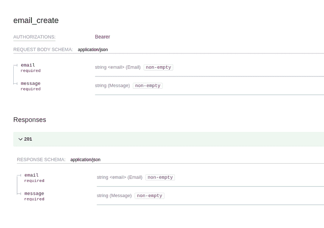
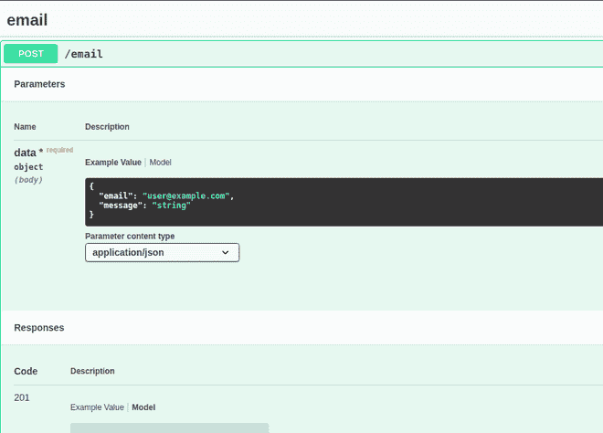

# 如何在 Django REST 框架中自动创建 API 文档？

> 原文:[https://www . geesforgeks . org/how-automatic-create-API-documentation-in-django-rest-framework/](https://www.geeksforgeeks.org/how-to-automatically-create-api-documentation-in-django-rest-framework/)

**先决条件–**

编写文档对开发人员来说可能相当令人生畏，老实说，没有人喜欢写长的解释，我个人不喜欢，但是众所周知，文档和编写一个正常运行的代码一样重要。所以，有一种非常简单的自动生成文档的方法，等等，不仅仅是文档，我还将向您展示如何创建一个在线游乐场来测试 API。

我不知道你怎么样，但是对我来说，姜戈是网络开发的未来框架，所以我将向你展示如何在姜戈做到这一点。因此，在我们开始之前，您需要安装 **Django** 和 **Django REST 框架**。我想你已经有了。接下来，你需要安装 **drf-yasg** 。为此，只需在终端中键入以下内容。

```py
pip install drf-yasg
```

现在，让我们从步骤开始。

首先，创建一个新的 Django 项目。我想你已经知道怎么做了。

接下来，转到**设置. py** 并将 **drf_yasg** 添加到 **INSTALLED_APPS**

```py
INSTALLED_APPS = [
   ...
   'drf_yasg',
   ...
]
```

然后，进入**URL . py**并添加 **drf_yasg** 的驱动代码

## 蟒蛇 3

```py
from rest_framework import permissions
from drf_yasg.views import get_schema_view
from drf_yasg import openapi

...

schema_view = get_schema_view(
   openapi.Info(
      title="Dummy API",
      default_version='v1',
      description="Dummy description",
      terms_of_service="https://www.google.com/policies/terms/",
      contact=openapi.Contact(email="contact@dummy.local"),
      license=openapi.License(name="BSD License"),
   ),
   public=True,
   permission_classes=(permissions.AllowAny,),
)

urlpatterns = [
   url(r'^playground/{content}apos;, schema_view.with_ui('swagger', cache_timeout=0), name='schema-swagger-ui'),
   url(r'^docs/{content}apos;, schema_view.with_ui('redoc', cache_timeout=0), name='schema-redoc'),
   ...
]
```

现在，如果您简单地运行服务器并转到 [localhost:8000/docs](8000/docs) ，您可以看到文档，如果您转到[localhost:8000/操场](8000/playground)，但是等待文档显示什么，我们还没有创建任何路线来显示文档。所以，让我们快速创建一个新的应用程序，并为其添加一条路线。

首先，创建一个名为**演示**的应用。我假设你已经知道创建和添加一个应用到 Django 设置和 URL。

接下来，转到**demo/view . py**并添加以下代码。

## 蟒蛇 3

```py
from drf_yasg.utils import swagger_auto_schema
from rest_framework import status, permissions, serializers
from rest_framework.response import Response
from rest_framework.views import APIView

class ContactForm(serializers.Serializer):
      # simple serializer for emails
    email = serializers.EmailField()
    message = serializers.CharField()

# simple endpoint to take the serializer data
class SendEmail(APIView):
      # permission class set to be unauthenticated
    permission_classes = (permissions.AllowAny,)
    # this is where the drf-yasg gets invoked
    @swagger_auto_schema(request_body=ContactForm)
    def post(self, request):
          # serializer object
        serializer = ContactForm(data=request.data)
        # checking for errors
        if serializer.is_valid():
            json = serializer.data
            return Response(
                data={"status": "OK", "message": json},
                status=status.HTTP_201_CREATED,
            )
        return Response(serializer.errors, status=status.HTTP_400_BAD_REQUEST)
```

之后，将此 **APIView** 添加到**URL . py**到**/电子邮件**端点。就这样。现在，如果您只需在端口 **8000** 上的 **localhost** 上运行服务器，转到 **localhost:8000/docs** ，您应该会看到文档，操场可以在**localhost:8000/操场**上查看。应该看起来像这样。



文件（documents 的简写）



操场