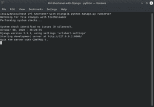
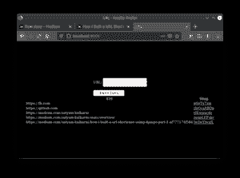

# 如何用 Django 构建一个 URL Shortener？

> 原文:[https://www . geesforgeks . org/how-to-build-a-URL-short ener-with-django/](https://www.geeksforgeeks.org/how-to-build-a-url-shortener-with-django/)

建立一个网址浏览器，是磨练你技能的最佳初学者项目之一。在本文中，我们已经分享了使用 Django 框架构建一个 URL 缩短器的步骤。欲了解更多关于姜戈的信息，请访问–[姜戈教程](https://www.geeksforgeeks.org/django-tutorial/)

### 设置

在开始我们的项目之前，我们需要做一些准备工作。我们将在我们的项目中使用虚拟环境。

```py
pip install virtualenv
virtualenv urlShort
source urlShort/bin/activate

```

以上命令将创建、激活名为*的虚拟环境*。

### 安装重要软件包

我们需要在手之前安装一些软件包，

```py
pip install django

```

### 从我们的项目开始

首先，我们需要创建我们的项目，

```py
django-admin startproject urlShort
cd urlShort

```

上面的命令，创建一个姜戈项目，然后光盘到该目录。之后，我们还需要在我们的项目中创建一个应用程序。应用程序是一种容器，我们将在其中存储我们的代码。一个项目可以有多个应用程序，它们可以相互连接

```py
python manage.py startapp url

```

上面的命令在我们的项目中创建一个名为网址的应用程序。我们现在的文件结构将是——

```py
urlShort
├── manage.py
├── url
│ ├── admin.py
│ ├── apps.py
│ ├── __init__.py
│ ├── migrations
│ │ └── __init__.py
│ ├── models.py
│ ├── tests.py
│ └── views.py
└── urlShort
 ├── asgi.py
 ├── __init__.py
 ├── __pycache__
 │ ├── __init__.cpython-37.pyc
 │ └── settings.cpython-37.pyc
 ├── settings.py
 ├── urls.py
 └── wsgi.py

```

### 检查是否一切正常…

您可以通过在命令行中键入以下命令来检查是否一切正常。但是 cd 进入主文件夹，这里是 urlShort。

```py
python manage.py runserver

```

*runserver* 会运行一个本地服务器，我们的网站会加载到这个服务器上。移动到 url

```py
https://localhost:8000

```

保持控制台窗口打开。

## 如何构建一个网址快捷器项目？

开始编码时，请系好安全带。首先我们来玩*view . py*。*view . py*基本上是用来连接我们的数据库，api 和我们的 Frontend。打开*视图并键入*

```py
from django.http import HttpResponse

def index(request):
    return HttpResponse("Hello World")
```

保存它并打开 localhost，检查它是否更改。它不会改变，因为我们没有把它映射到任何路线。基本上，如果你在*view . py*里面写了什么函数，它不起作用，但是我们需要把它映射到*URL . p*y 里面，所以，在 *url* 文件夹里面创建一个*URL . py*。

```py
from django.urls import path
from . import views
app_name = "url"
urlpatterns = [
    path("", views.index, name="home")
]
```

别忘了在*设置中的 *INSTALLED_APPS* 中添加您的*应用程序–“*URL*”**

### 创建姜戈模型–

首先，我们需要一个数据库来存储我们的缩短网址。为此，我们需要在模型中为我们的数据库表创建一个模式

*车型. py*

```py
from django.db import models
class UrlData(models.Model):
    url = models.CharField(max_length=200)
    slug = models.CharField(max_length=15)
def __str__(self):
        return f"Short Url for: {self.url} is {self.slug}"

```

上面的代码在我们的数据库中创建了一个表*URL 数据*，其中包含列 *url* 、 *slug* 。我们将使用网址列存储原始网址，使用*段符*存储 10 个字符串，用于缩短网址。

***例如***

```py
*Original URL* — https://medium.com/satyam-kulkarni/
*Shorten Form* — https://localhost:8000/sEqlKdsIUL
```

网址的最大长度是 200 个字符，鼻涕虫的最大长度是 15(考虑到我们网站的地址)。在为我们的网站创建模型之后，让我们创建一些表单来接受用户的输入。

### 创建表单

在我们的姜戈应用文件夹中创建一个*表单。*

fo *rms.py*

```py
from django import forms
class Url(forms.Form):
    url = forms.CharField(label="URL")

```

我们只需从*姜戈*导入*表单*，并创建一个类 *Url* ，我们将在*视图*中使用它。 *py* 并在我们的 HTML 中渲染。*网址*表单只有一个*网址*字段来输入原始网址。

### 创建视图

现在，我们将使用*视图*创建我们的应用程序的界面。 *py* 。让我们在函数中划分这一部分。

***urlshot()***—这个函数就是我们的*主算法*工作的地方。在用户提交表单后，它从表单中获取一个*网址*，然后生成一个随机段，并与原始网址一起存储在数据库中。也是渲染*索引*的功能。 *html* (我们应用的入口点)

*views.py urlShort()*

```py
def urlShort(request):
    if request.method == 'POST':
        form = Url(request.POST)
        if form.is_valid():
            slug = ''.join(random.choice(string.ascii_letters)
                           for x in range(10))
            url = form.cleaned_data["url"]
            new_url = UrlData(url=url, slug=slug)
            new_url.save()
            request.user.urlshort.add(new_url)
            return redirect('/')
    else:
        form = Url()
    data = UrlData.objects.all()
    context = {
        'form': form,
        'data': data
    }
    return render(request, 'index.html', context)

```

***urlRedirect()*** —此功能跟踪鼻涕虫到原始 URL，并将其重定向到原始 URL。

*views . py URL 重定向()*

```py
def urlRedirect(request, slugs):
    data = UrlData.objects.get(slug=slugs)
    return redirect(data.url)

```

### 创建路线

在运行这个应用之前，我们需要在应用的*URL . py*中指定 URL 路径

・T 0️ urls.py ・T 1️

```py
from django.urls import path
from . import views
app_name = "url"
urlpatterns = [
    path("", views.urlShort, name="home"),
    path("u/<str:slugs>", views.urlRedirect, name="redirect")
]

```

### 运行项目

在主项目目录中打开控制台。

```py
python manage.py runserver

```



### 最终项目输出–

