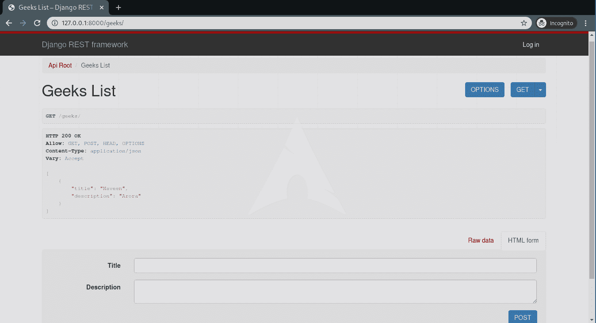

# 如何使用 Django Rest 框架创建一个基本的 API？

> 原文:[https://www . geeksforgeeks . org/如何创建-基本-API-使用-django-rest-framework/](https://www.geeksforgeeks.org/how-to-create-a-basic-api-using-django-rest-framework/)

Django REST 框架是默认 Django 框架的包装器，主要用于创建各种类型的 API。在通过 REST 框架创建应用编程接口之前，有三个阶段:将模型的数据转换为 JSON/XML 格式(序列化)，将这些数据呈现给视图，创建映射到视图集的网址。
本文围绕如何使用 Django REST 框架创建基本的 API 展开。假设您熟悉姜戈基础知识-[姜戈教程](https://www.geeksforgeeks.org/django-tutorial/)。另外，安装[姜戈休息框架](https://geeksforgeeks.org/django-rest-framework-installation/)。假设您已经与 Django 一起创建了一个名为 ***geeksforgeeks*** 的项目，让我们启动 Django REST 框架。

> ### 步伐
> 
> *   [将休息框架添加到已安装 _ 应用程序](#add_rest_framework)
> *   [Create app and model](#create-app)
> *   [Serialize](#serialization)
> *   [Create a view set](#create-viewset)
> *   [URL defining API](#define-urls)
> *   [Run the server and check the API](#runserver)

#### 将 rest_framework 添加到 INSTALLED_APPS

要在您的项目中初始化 REST Framework，请转到 settings.py，并在 INSTALLED_APPS 中添加底部的**“REST _ Framework”**。

## 蟒蛇 3

```
# Application definition

INSTALLED_APPS = [
    'django.contrib.admin',
    'django.contrib.auth',
    'django.contrib.contenttypes',
    'django.contrib.sessions',
    'django.contrib.messages',
    'django.contrib.staticfiles',
    'rest_framework',
]
```

#### 创建应用程序和模型

现在，让我们使用命令
创建一个应用程序

```
python manage.py startapp apis
```

名为 API 的文件夹现在应该已经注册了。让我们将这个应用添加到 **INSTALLED_APPS** 中，urls.py 也是。
中，settings.py，

## 蟒蛇 3

```
# Application definition

INSTALLED_APPS = [
    'django.contrib.admin',
    'django.contrib.auth',
    'django.contrib.contenttypes',
    'django.contrib.sessions',
    'django.contrib.messages',
    'django.contrib.staticfiles',
    'rest_framework',
    'apis',
]
```

现在，在 URLs . py . In**geeks forgeeks . URLs . py**
中添加 apis urls

## 蟒蛇 3

```
from django.contrib import admin
# include necessary libraries
from django.urls import path, include

urlpatterns = [
    path('admin/', admin.site.urls),
    # add apis urls
    path('', include("apis.urls"))
]
```

**创建一个模型**
为了演示，创建和使用一个 API，让我们创建一个名为“极客模型”的模型。在 API/models . py
中

## 蟒蛇 3

```
from django.db import models

class GeeksModel(models.Model):
    title = models.CharField(max_length = 200)
    description = models.TextField()

    def __str__(self):
        return self.title
```

现在我们的应用程序已经准备好了，让我们序列化数据并从中创建视图。

#### 序列化

序列化程序允许将复杂的数据(如查询和模型实例)转换为本机 Python 数据类型，然后可以轻松地将其呈现为 JSON、XML 或其他内容类型。序列化程序还提供反序列化，允许在首先验证传入数据后，将解析的数据转换回复杂类型。让我们开始创建一个序列化程序，在文件 API/serializer . py 中，

## 蟒蛇 3

```
# import serializer from rest_framework
from rest_framework import serializers

# import model from models.py
from .models import GeeksModel

# Create a model serializer
class GeeksSerializer(serializers.HyperlinkedModelSerializer):
    # specify model and fields
    class Meta:
        model = GeeksModel
        fields = ('title', 'description')
```

#### 创建视图集

为了将数据呈现到前端，并处理来自用户的请求，我们需要创建一个视图。在 Django REST 框架中，我们称这些为视图集，所以让我们在 API/view . py 中创建一个视图，

## 蟒蛇 3

```
# import viewsets
from rest_framework import viewsets

# import local data
from .serializers import GeeksSerializer
from .models import GeeksModel

# create a viewset
class GeeksViewSet(viewsets.ModelViewSet):
    # define queryset
    queryset = GeeksModel.objects.all()

    # specify serializer to be used
    serializer_class = GeeksSerializer
```

#### 定义应用编程接口的网址

指定要访问的 API 的 url 路径，在 API/URL . py 中，

## 蟒蛇 3

```
# basic URL Configurations
from django.urls import include, path
# import routers
from rest_framework import routers

# import everything from views
from .views import *

# define the router
router = routers.DefaultRouter()

# define the router path and viewset to be used
router.register(r'geeks', GeeksViewSet)

# specify URL Path for rest_framework
urlpatterns = [
    path('', include(router.urls)),
    path('api-auth/', include('rest_framework.urls'))
]
```

一切准备就绪后，让我们运行一些命令来激活服务器。

#### 运行服务器并检查应用编程接口

运行以下命令创建数据库，并运行服务器，

```
python manage.py makemigrations
python manage.py migrate
python manage.py runserver
```

现在访问[http://127 . 0 . 0 . 1:8000/极客/](http://127.0.0.1:8000/geeks/) 、



要查看项目代码，[点击此处](https://github.com/naveenkrnl/rest_framework_tutorial)