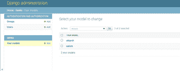

# 如何在 Django 中创建自定义模板标签？

> 原文:[https://www . geesforgeks . org/how-create-custom-template-tags-in-django/](https://www.geeksforgeeks.org/how-to-create-custom-template-tags-in-django/)

Django 提供了各种内置模板标签，例如或。但是，Django 也允许您创建自己的模板标签来执行自定义操作。自定义模板标签的强大之处在于，您可以处理任何数据，并将其添加到任何模板中，而无需考虑执行的视图。您可以执行查询测试或处理任何数据以在模板中显示结果。

指定自定义模板标签最常见的地方是在 Django 应用程序中。如果它们与一个现有的应用程序相关，将它们捆绑在一起是有意义的；否则，它们可以添加到新的应用程序中。

Django 提供了以下助手函数，允许您以简单的方式创建自己的模板标签:

*   **simple_tag** :处理数据并返回一个字符串
*   **inclution _ tag**:处理数据并返回渲染模板
*   **赋值标签**:处理数据并在上下文中设置一个变量

**说明:**

如何使用示例创建自定义模板标签的图示。考虑一个名为 geeksforgeeks 的项目，它有一个名为 geeks 的应用程序。

> 请参考以下文章，查看如何在 Django 中创建项目和应用程序。
> 
> [如何利用姜戈的 MVT 创建基础项目？](https://www.geeksforgeeks.org/how-to-create-a-basic-project-using-mvt-in-django/)
> 
> [如何在姜戈创建 App？](https://www.geeksforgeeks.org/how-to-create-an-app-in-django/)

在 django 应用程序(geeks app)目录中，创建一个新目录，将其命名为 templatetags，并添加一个空的 __init__。py 文件，以确保目录被视为 Python 包。在同一个文件夹中创建另一个文件，并将其命名为 custom_tags.py。模块文件的名称是您稍后加载标签时将使用的名称，因此请注意选择一个不会与另一个应用程序中的自定义标签和过滤器冲突的名称。django 应用程序的文件结构应该如下所示:

```
geeks/
      __init__.py
      models.py
      ...
      templatetags/
          __init__.py
          custom_tags.py
```

在您的模板中，您将使用以下内容:

```

```

在 templatetags 包中放入多少模块没有限制。请记住,语句将为给定的 Python 模块名称加载标记，而不是应用程序的名称。

要成为有效的标记库，模块(custom_tags.py)必须包含一个名为 register 的模块级变量，该变量是一个模板库实例，所有的标记都在该实例中注册。因此，在模块顶部附近，放置以下内容:

```
from django import template

register = template.Library()
```

在 models.py 中添加以下代码:

## 蟒蛇 3

```
from django.db import models

# Create your models here.
class YourModel(models.Model):
    first_name = models.CharField(max_length=30)
    last_name = models.CharField(max_length=30)
    def __str__(self):
        return self.first_name
```

创建这个模型后，我们需要运行两个命令来为其创建数据库。

```
Python manage.py makemigrations

Python manage.py migrate
```

我们将从创建一个简单的标记开始，以检索我们的模型中名为 YourModel 的对象总数。编辑刚刚创建的 custom_tags.py 文件，并添加以下代码:

## 蟒蛇 3

```
from django import template
register = template.Library()

from .models import YourModel

@register.simple_tag
def any_function():
      return YourModel.objects.count()
```

在名为 geeksforgeeks 的项目的 urls.py flle 中添加以下代码

## 蟒蛇 3

```
from django.contrib import admin
from django.urls import path
from django.views.generic.base import TemplateView

urlpatterns = [
    path('admin/', admin.site.urls),
    path('',TemplateView.as_view(template_name="Intro.html"),name="intro")
]
```

在应用程序目录(极客)中创建名为 templates 的文件夹，并创建名为 Intro.py 的文件，然后添加以下代码:

## 超文本标记语言

```

<!DOCTYPE html>
<html lang="en" dir="ltr">
  <head>
    <meta charset="utf-8">
    <title>Intro</title>
  </head>
  <body>
     Persons in your model
  </body>
</html>
```

现在快跑，

```
python manage.py runserver
```

让我们看看 http://localhost:8000/–

**输出–**


**数据库中的姜戈模型条目–**

