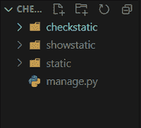
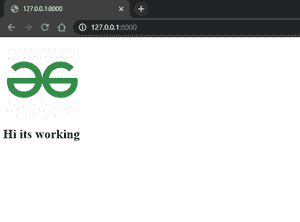

# 如何在 Django 中加载和使用静态文件？

> 原文:[https://www . geesforgeks . org/如何加载和使用静态文件-in-django/](https://www.geeksforgeeks.org/how-to-load-and-use-static-files-in-django/)

静态文件，如图像、CSS 或 JS 文件，通常通过生产网站中的不同应用程序加载，以避免从同一服务器加载多个内容。本文围绕如何在 Django 中设置静态应用程序以及如何从该应用程序中设置服务器静态文件展开。

### 如何在 Django 创建静态 App？

让我们先创建一个新项目，首先创建一个虚拟环境。如果您还没有下载软件包，请下载它

```py
pip install virtualenv
virtualenv geeks
geeks\Scripts\Activate
```

这就是它的样子


现在安装 Django

```py
pip install django
```

现在我们将创建名为“**check static”**的 django 项目

```py
//django-admin startproject projectname (template code)
django-admin startproject  checkstatic
```

现在进入你的项目

对于 windows“CD check static”

现在我们将为该项目创建一个新的应用程序名称“**showstatic”**

```py
//python3 manage.py startapp appname (template code)
python3 manage.py startapp showstatic
```

现在我们将走在 IDE 中，我使用的是 Visual studio 代码，如果您使用的是相同类型的(代码。)在 cmd

我们要做的第一件事是设置。py 在第 32 行添加您的应用程序，如下所示添加(您将从应用程序的 apps.py 文件中看到这一点)

```py
INSTALLED_APPS = [
'showstatic.apps.ShowstaticConfig',
'django.contrib.admin',
'django.contrib.auth,
'django.contrib.contenttypes',
'django.contrib.sessions',
'django.contrib.messages',
'django.contrib.staticfiles',
]
```

现在尝试**运行服务器**一次，确认一切正常

```py
python3 manage.py runserver
```

如果你看到这一页，恭喜你成功地迈出了第一步


现在我们在**主文件夹【检查静态】**中创建一个**静态文件夹**，我们将在其中保存静态文件。您可以在静态文件夹中添加文件(pdf、图像、文本文件或任何您想要的内容)。

**文件夹结构–**


现在你需要让 Django 知道你已经创建了一个静态文件夹，所以现在在 **settings.py 文件**中添加这一行

**在第 121 行**下方*T3【STATIC _ URL = '/STATIC/'T5】*

```py
STATIC_ROOT = os.path.join(BASE_DIR, 'static')
```

现在告诉 django 在哪里查找您添加的静态文件在上面写下这个*<u>STATIC _ URL = '/STATIC/'</u>*

```py
STATICFILES_DIRS = [
   os.path.join(BASE_DIR, 'checkstatic/static/')
]
```

现在，我们将编写一个命令，从我们的项目中获取/收集所有静态文件，并将其保存到一个文件夹中

```py
python manage.py collectstatic
```

如果一切正常，这就是它的样子，大部分文件来自 admin，我们不需要担心，


在您的项目文件夹中，您将看到一个名为“static”的新文件夹，您的文件就在其中！！



### 如何在 Django 中加载和使用静态文件？

现在要检查的只是在 showstatic 中创建“**模板”文件夹**，并创建一个**文件**名称**home.html**来查看我们的静态文件

```py


<br>
<h1>Hi its working</h1>
```

现在要查看这个页面，我们需要给它一个路线，所以现在只需在**的网址. py 中添加这个**

```py
from django.contrib import admin
from django.urls import path
from showstatic import views
urlpatterns = [
   path('admin/', admin.site.urls),
   path('',views.home,name='home'),
]
```

在显示的视图中添加这个

```py
def home(request):
   return render(request,'home.html')
```

现在**运行服务器**看看

```py
python3 manage.py runserver
```



成功了！！