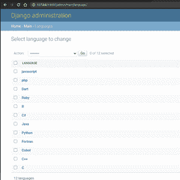
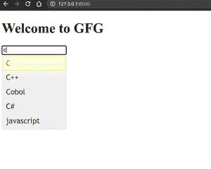

# 在 Django 中实现输入字段的搜索自动完成

> 原文:[https://www . geesforgeks . org/implement-search-autocomplete-for-input-field-in-django/](https://www.geeksforgeeks.org/implement-search-autocomplete-for-input-fields-in-django/)

Django 是一个基于 Python 的高级网络框架，允许快速开发和干净、实用的设计。它也被称为电池内置框架，因为 Django 为一切提供内置功能，包括 Django 管理界面、默认数据库——sqllite 3 等。今天我们将在 django 创建一个笑话应用。

在本文中，我们将学习如何从 django 模型中获取数据，并为其提供自动完成等功能。我们将使用 jquery 进行自动完成。

**安装:**

人的本质

```
pip3 install django
```

首先，我们将创建新项目

```
django-admin startproject AutoC
```

```
cd AutoC
```

然后我们将创建新的应用程序

```
python3 manage.py startapp main
```

然后在**设置中添加应用名称。在 INSTALLED_APPS 中复制**


**车型. py**

## 蟒蛇 3

```
from django.db import models

# Create your models here.
class Language(models.Model):
    name = models.CharField(max_length=20)

    def __str__(self):
        return f"{self.name}"
```

然后为了创建数据库表，我们必须进行迁移

```
python3 manage.py makemigrations
```

```
python3 manage.py migrate
```

我在表格中添加了这些语言。



## 蟒蛇 3

```
from django.shortcuts import render
from .models import Language

# Create your views here.
def home(request):
    languages = Language.objects.all()
    return render(request,'main/index.html',{"languages":languages})
```

然后在 app 内创建新目录**模板**在里面创建另一个目录**主**

然后创建新文件**index.html**

## 超文本标记语言

```
<!DOCTYPE html>
<html>
<head>
    <title>AutoComplete</title>
    <script src=  
"https://ajax.googleapis.com/ajax/libs/jquery/1.7.1/jquery.js">  
    </script>  

    <script src=  
"https://ajax.googleapis.com/ajax/libs/jqueryui/1.8.16/jquery-ui.js">  
    </script>  

    <link href=  
"http://ajax.googleapis.com/ajax/libs/jqueryui/1.8.16/themes/ui-lightness/jquery-ui.css"
        rel="stylesheet" type="text/css" />  
</head>
<body>
    <h1>Welcome to GFG</h1>
    <input type="text" id="tags">
    <script>
  $( function() {
    var availableTags = [
        
            "{{language.name}}",
        
    ];
    $( "#tags" ).autocomplete({
      source: availableTags
    });
  } );
  </script>
</body>
</html>
```

然后创建新文件**URL . py**

## 蟒蛇 3

```
from django.urls import path
from .views import  *

urlpatterns = [
    path('', home,name="home")
]
```

然后在我们的项目/URL 中添加应用/URL

**巴士/URL . py**

## 蟒蛇 3

```
from django.contrib import admin
from django.urls import path,include

urlpatterns = [
    path('admin/', admin.site.urls),
    path('',include("main.urls"))
]
```

然后运行这个应用程序

Windows 操作系统

```
python manage.py runserver
```

人的本质

```
python3 manage.py runserver
```

