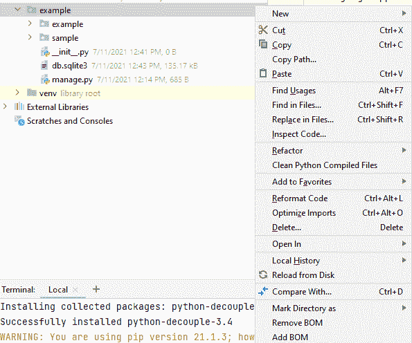
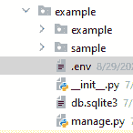

# 部署 Django 项目时保护敏感信息

> 原文:[https://www . geesforgeks . org/protection-敏感信息-同时部署-django-project/](https://www.geeksforgeeks.org/protecting-sensitive-information-while-deploying-django-project/)

在我们的 Django 项目中会有很多敏感信息驻留在 settings.py 中，或者包含敏感信息的局部变量，或者使用表单发出的 POST 请求。因此，在部署 Django 项目时，我们必须确保它们受到保护，尤其是那些公开可用的存储库。当一个项目在没有处理所有可能的测试用例的情况下被部署，并且 DEBUG=True 时，那么对于黑客来说，找到漏洞的工作就是小菜一碟。因此，忽略保护 settings.py 文件中敏感信息的重要性可能会暴露用户的数据。在许多情况下，主要通过公开公共存储库中的敏感信息可能会出现问题。

## 处理设置. py 文件

为了从 settings.py 文件中保护敏感信息，我们将使用 **Python 解耦库。**该库有助于将设置参数与源代码分离。与项目相关的参数转到源代码，与项目实例相关的参数转到环境文件。

### 装置

要安装此模块，请在终端中键入以下命令。

```py
pip install python-decouple
```

### 逐步实施

*   创建一个**。env** 文件来存储 mange.py 文件附近的敏感数据，如下图所示。



创建。它看起来像:



*   我们现在将**从 settings.py 文件中复制敏感信息**，如密钥、调试、数据库用户、数据库名称、数据库密码、数据库主机值，并将其粘贴到。环境文件创建为:


*   现在转到 settings.py 文件，并添加这一行来导入以前安装的解耦。

## 蟒蛇 3

```py
from decouple import config
```

*   **将 settings.py 文件中的密钥**替换为 config，在 config 中输入保存密钥的变量。环境文件为:

## 蟒蛇 3

```py
SECRET_KEY = config('SECRET_KEY')
```

*   同样，将调试值替换为:

## 蟒蛇 3

```py
DEBUG = config('DEBUG')
```