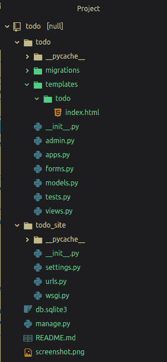
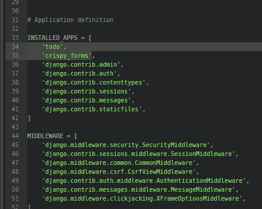
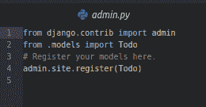
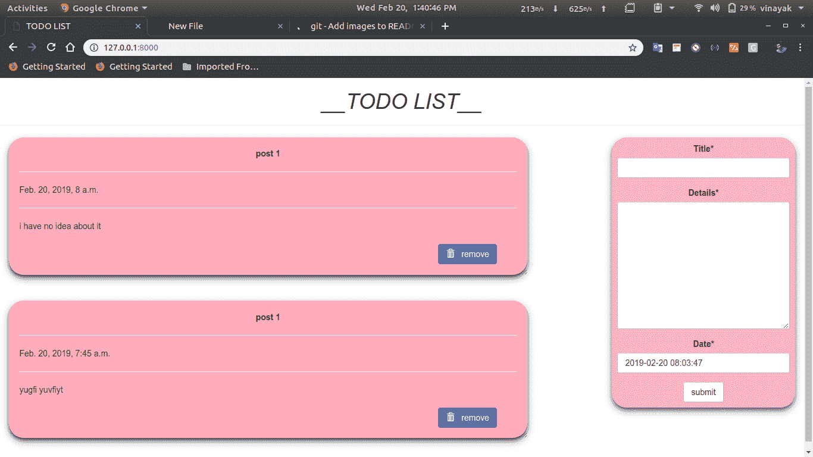

# Python | ToDo 使用 Django 的 web app

> 原文:[https://www . geesforgeks . org/python-todo-web app-using-django/](https://www.geeksforgeeks.org/python-todo-webapp-using-django/)

**先决条件:** [django 安装](https://www.geeksforgeeks.org/django-introduction-and-installation/)
Django 是一个基于高级 Python Web 框架的 Web 框架，允许快速开发和干净、实用的设计。今天我们将创建一个 todo 应用程序，用来了解 Django 的基础知识。在这个网络应用程序中，人们可以创建像谷歌保留或 Evernote 这样的笔记。
**所需模块:**

*   姜戈:[安装姜戈](https://www.geeksforgeeks.org/django-introduction-and-installation/)
*   脆皮形式:

```py
pip install --upgrade django-crispy-forms
```

**基本设置:**
通过以下命令启动项目–

```py
django-admin startproject todo-site
```

将目录更改为待办事项网站–

```py
cd todo-site
```

启动服务器-通过在终端中键入以下命令启动服务器–

```py
python manage.py runserver
```

*要检查服务器是否在运行，请转到网络浏览器，输入 http://127.0.0.1:8000/作为网址。*
现在按停止服务器

```py
ctrl-c
```

**我们现在创建一个应用。**

```py
python manage.py startapp todo
```

通过执行以下操作转到待办事项/文件夹:cd 待办事项并用 index.html 文件创建一个文件夹:templates/todo/index.html
使用文本编辑器打开项目文件夹。目录结构应该是这样的:



现在在**设置中的待办事项网站中添加待办事项 app 和 crispty _ form。** 



**编辑 todo_site 中的 urls.py 文件:**

## 蟒蛇 3

```py
from django.contrib import admin
from django.urls import path
from todo import views

urlpatterns = [
    #####################home_page###########################################
    path('', views.index, name="todo"),
    ####################give id no. item_id name or item_id=i.id ############
    path('del/', views.remove, name="del"),
    ########################################################################
    path('admin/', admin.site.urls),
]
```

**编辑模型. py in todo :**

## 蟒蛇 3

```py
from django.db import models
from django.utils import timezone

class Todo(models.Model):
    title=models.CharField(max_length=100)
    details=models.TextField()
    date=models.DateTimeField(default=timezone.now)

    def __str__(self):
        return self.title
```

**编辑视图. py in todo :**

## 蟒蛇 3

```py
from django.shortcuts import render, redirect
from django.contrib import messages

## import todo form and models

from .forms import TodoForm
from .models import Todo

###############################################

def index(request):

    item_list = Todo.objects.order_by("-date")
    if request.method == "POST":
        form = TodoForm(request.POST)
        if form.is_valid():
            form.save()
            return redirect('todo')
    form = TodoForm()

    page = {
             "forms" : form,
             "list" : item_list,
             "title" : "TODO LIST",
           }
    return render(request, 'todo/index.html', page)

### function to remove item, it receive todo item id from url ##
def remove(request, item_id):
    item = Todo.objects.get(id=item_id)
    item.delete()
    messages.info(request, "item removed !!!")
    return redirect('todo')
```

**现在在 todo 中创建一个 forms . py:**

## 蟒蛇 3

```py
from django import forms
from .models import Todo

class TodoForm(forms.ModelForm):
    class Meta:
        model = Todo
        fields="__all__"
```

**向管理员注册车型:**



**导航至模板/待办事项/index.html 并编辑:** [链接至 index.html 文件](https://github.com/itsvinayak/todo/blob/master/todo/templates/todo/index.html)
**进行迁移并迁移**

```py
python manage.py makemigrations
python manage.py migrate
```

现在，您可以运行服务器来查看您的待办事项应用程序

```py
python manage.py runserver
```

