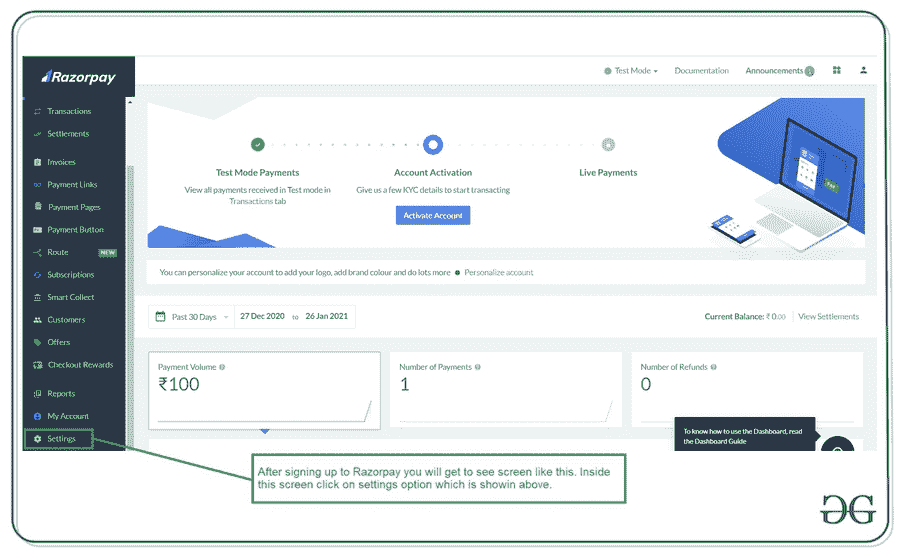
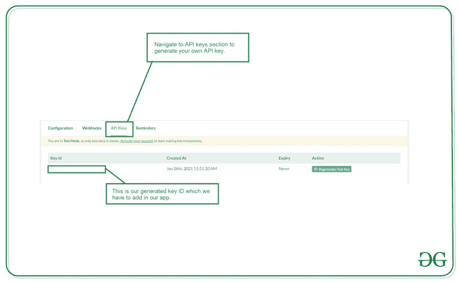

# Django 的 Razorpay 整合

> 原文:[https://www . geesforgeks . org/razor pay-integration-in-django/](https://www.geeksforgeeks.org/razorpay-integration-in-django/)

支付是在线生态系统不可或缺的一部分，无论是在电子商务商店处理订单还是向某人简单捐赠。将支付网关集成到您的网站可能是一个乏味的过程。让我们看看如何将 Razorpay 集成到 Django 网站中。

### 我们在建造什么？

我们将建立一个基本的复制品*给我买咖啡*~~呃*给我买柴*😉用户可以给我们捐款。~~

~~<video class="wp-video-shortcode" id="video-618468-1" width="640" height="360" preload="metadata" controls=""><source type="video/mp4" src="https://media.geeksforgeeks.org/wp-content/uploads/20210606141808/dj_razorpay_demo.mp4?_=1">[https://media.geeksforgeeks.org/wp-content/uploads/20210606141808/dj_razorpay_demo.mp4](https://media.geeksforgeeks.org/wp-content/uploads/20210606141808/dj_razorpay_demo.mp4)</video>~~

~~无论您在构建什么，集成过程都是一样的。让我们把整个过程分解成简单的步骤。~~

### ~~第一步:启动姜戈项目。~~

~~确保您已经完成了 django 的安装。创建一个名为 *dj_razorpay* 的新项目，然后启动一个名为*支付*的新应用。在*设置. py* 文件中的*已安装 _ 应用程序*列表中添加“支付”。另外，应用*迁移。*~~

```py
INSTALLED_APPS = [
    ...
    'payment',
    ...
]
```

### ~~第二步:获得剃刀支付钥匙。~~

~~首先，在 Razorpay 的[网站](https://razorpay.com/)上创建一个账户，你只需要用你的邮箱和密码注册，并添加一些基本信息，比如你的电话号码。~~

~~~~

~~在设置屏幕内，点击创建一个新的密钥选项，你的密钥将被生成。您将获得密钥标识和密钥秘密。目前，我们的支付将处于“测试模式”，即不会发生真正的交易，支付选项也是有限的。要接受真金白银并解锁更多支付选项，您需要填写您的 KYC 并提供您的银行详细信息。无论模式如何，集成过程都保持不变。~~

~~**注意:**你只会被显示一次密钥秘密，所以马上复制到某个地方。~~

~~~~

~~现在将*密钥 Id* 和*密钥秘密添加到设置. py 文件中。*~~

```py
RAZOR_KEY_ID = YOUR_KEY_ID
RAZOR_KEY_SECRET = YOUR_KEY_SECRET
```

~~在我们继续之前，让我们安装 razorpay 的 python 包。~~

```py
pip install razorpay
```

### ~~第三步:查看~~

~~这是这个过程的主要步骤。首先，我们需要了解 Razorpay 中的支付是如何工作的。~~

1.  ~~从我们的姜戈服务器创建剃刀订单。~~
2.  ~~将订单标识和其他选项传递给前端。~~
3.  ~~用户点击支付按钮，使用其中一种支付方式进行支付。~~
4.  ~~Razorpay 处理支付成功和失败。~~
5.  ~~失败时，Razorpay 会帮助重试支付。~~
6.  ~~成功后，Razorpay 向我们服务器上的回拨网址发出一个帖子请求。~~
7.  ~~验证付款签名，以确认付款是真实的，没有被篡改。~~
8.  ~~验证后，获取付款并呈现成功页面。~~

~~有关更多详细信息，请参见代码注释。~~

~~**注:**razor pay 中以货币为单位的金额，即 500 卢比将变为 50000 派斯。~~

## ~~蟒蛇 3~~

```py
from django.shortcuts import render
import razorpay
from django.conf import settings
from django.views.decorators.csrf import csrf_exempt
from django.http import HttpResponseBadRequest

# authorize razorpay client with API Keys.
razorpay_client = razorpay.Client(
    auth=(settings.RAZOR_KEY_ID, settings.RAZOR_KEY_SECRET))

def homepage(request):
    currency = 'INR'
    amount = 20000  # Rs. 200

    # Create a Razorpay Order
    razorpay_order = razorpay_client.order.create(dict(amount=amount,
                                                       currency=currency,
                                                       payment_capture='0'))

    # order id of newly created order.
    razorpay_order_id = razorpay_order['id']
    callback_url = 'paymenthandler/'

    # we need to pass these details to frontend.
    context = {}
    context['razorpay_order_id'] = razorpay_order_id
    context['razorpay_merchant_key'] = settings.RAZOR_KEY_ID
    context['razorpay_amount'] = amount
    context['currency'] = currency
    context['callback_url'] = callback_url

    return render(request, 'index.html', context=context)

# we need to csrf_exempt this url as
# POST request will be made by Razorpay
# and it won't have the csrf token.
@csrf_exempt
def paymenthandler(request):

    # only accept POST request.
    if request.method == "POST":
        try:

            # get the required parameters from post request.
            payment_id = request.POST.get('razorpay_payment_id', '')
            razorpay_order_id = request.POST.get('razorpay_order_id', '')
            signature = request.POST.get('razorpay_signature', '')
            params_dict = {
                'razorpay_order_id': razorpay_order_id,
                'razorpay_payment_id': payment_id,
                'razorpay_signature': signature
            }

            # verify the payment signature.
            result = razorpay_client.utility.verify_payment_signature(
                params_dict)
            if result is None:
                amount = 20000  # Rs. 200
                try:

                    # capture the payemt
                    razorpay_client.payment.capture(payment_id, amount)

                    # render success page on successful caputre of payment
                    return render(request, 'paymentsuccess.html')
                except:

                    # if there is an error while capturing payment.
                    return render(request, 'paymentfail.html')
            else:

                # if signature verification fails.
                return render(request, 'paymentfail.html')
        except:

            # if we don't find the required parameters in POST data
            return HttpResponseBadRequest()
    else:
       # if other than POST request is made.
        return HttpResponseBadRequest()
```

~~**注意:**需要抓拍付款，否则会自动退给付款人。~~

~~现在将以上视图映射到*URL . py .*中的 URL~~

## ~~蟒蛇 3~~

```py
# dj_razorpay/urls.py

from django.contrib import admin
from django.urls import path
from payment import views

urlpatterns = [
    path('', views.homepage, name='index'),
    path('paymenthandler/', views.paymenthandler, name='paymenthandler'),
    path('admin/', admin.site.urls),
]
```

### ~~第四步:前端~~

~~我们需要传递 Razorpay 订单 id 和上一步提到的其他选项。首先加载 Razorpay 的 javascript 代码，该代码将呈现支付窗口，并使用从后端接收的选项对其进行初始化。在支付按钮上添加一个事件监听器，这样一旦点击支付窗口就会打开。~~

~~这里我们在主页上呈现支付按钮。我们还需要另外两页支付成功和失败。~~

## ~~超文本标记语言~~

```py
<!DOCTYPE html>
<html lang="en">
  <head>
    <meta charset="UTF-8" />
    <meta http-equiv="X-UA-Compatible" content="IE=edge" />
    <meta name="viewport" content="width=device-width, initial-scale=1.0" />
    <title>GFG</title>
    <style>
      * {
        box-sizing: border-box;
        padding: 0px;
        margin: 0px;
        font-family: cursive;
      }
      html,
      body {
        height: 100%;
      }
      body {
        background-color: #f1f5f8;
        display: flex;
        justify-content: center;
        align-items: center;
      }
      .card {
        background-color: white;
        padding: 25px;
        border: 1px solid #bbbbbb;
        border-radius: 5px;
        box-shadow: 1px 1px 10px 0px rgb(0 0 0 / 25%);
      }
      .title {
        text-align: center;
        letter-spacing: 1px;
      }
      .muted {
        color: #8e7f7f;
        display: block;
        margin-bottom: 10px;
        text-align: center;
      }
      .btn_container {
        padding: 20px;
        text-align: center;
      }
      .btn {
        border-radius: 4px;
        cursor: pointer;
        padding: 4px 8px;
        background-color: #ffaaa7;
        color: white;
        font-size: 1.2em;
        font-weight: 600;
        letter-spacing: 1px;
      }
    </style>
  </head>
  <body>
    <div class="card">
      <h1 class="title">Buy Me a Chai ☕</h1>
      <small class="muted"
        >If you like my work, you can support me by donating ₹200</small
      >
      <div class="btn_container">
        <!-- Payment Button -->
        <button class="btn" id="pay-btn">Donate❤️</button>
      </div>
    </div>
  </body>

  <!-- Razorpay's Javascript code. -->
  <script src="https://checkout.razorpay.com/v1/checkout.js"></script>
  <script>
    var options = {

      // Enter the Key ID generated from the Dashboard
      key: "{{ razorpay_merchant_key }}",

      // Amount is in currency subunits.
      // Default currency is INR. Hence,
      // 50000 refers to 50000 paise
      amount: "{{ razorpay_amount }}",
      currency: "{{ currency }}",

      // Your/store name.
      name: "Dj Razorpay",

      // Pass the `id` obtained in the response of Step 1
      order_id: "{{ razorpay_order_id }}",
      callback_url: "{{ callback_url }}",
    };

    // initialise razorpay with the options.
    var rzp1 = new Razorpay(options);

    // add event listener to the payment button.
    document.getElementById("pay-btn").onclick = function (e) {
      rzp1.open();
      e.preventDefault();
    };
  </script>
</html>
```

### ~~第五步:测试~~

~~现在让我们启动服务器，检查是否一切正常！~~

```py
python manage.py runserver
```

~~<video class="wp-video-shortcode" id="video-618468-2" width="640" height="360" preload="metadata" controls=""><source type="video/mp4" src="https://media.geeksforgeeks.org/wp-content/uploads/20210606141808/dj_razorpay_demo.mp4?_=2">[https://media.geeksforgeeks.org/wp-content/uploads/20210606141808/dj_razorpay_demo.mp4](https://media.geeksforgeeks.org/wp-content/uploads/20210606141808/dj_razorpay_demo.mp4)</video>~~

~~我们成功收到付款！！你可以在 Razorpay 的仪表板上查看这些付款。~~