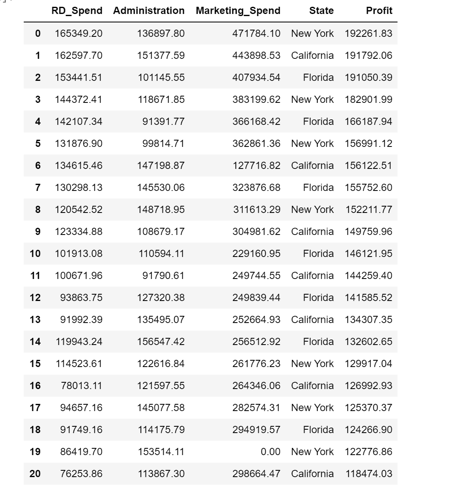
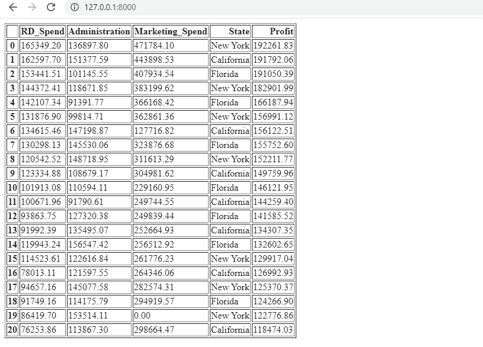
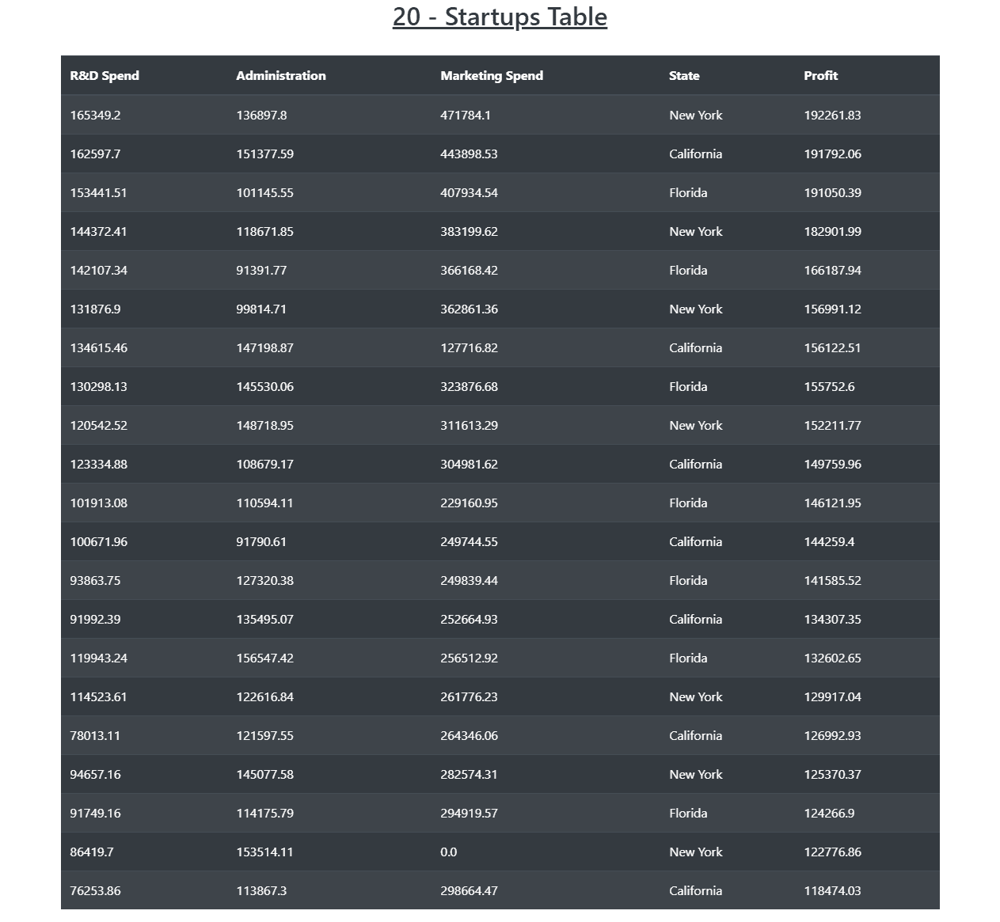

# 使用 Django 框架

在表格视图中将数据框渲染为 html 模板

> 原文:[https://www . geesforgeks . org/rendering-data-frame-to-html-template-in-table-view-use-django-framework/](https://www.geeksforgeeks.org/rendering-data-frame-to-html-template-in-table-view-using-django-framework/)

在 Django 中，通过设置各个网页的 URL 来呈现 HTML 模板是很容易的。在这里，我们将了解如何使用数据框在 HTML 模板或网页中为表视图修改它们，为此，我们必须使用“渲染”和“HttpResponse”函数来操作数据框中的数据。

**样本数据帧:**
[](https://media.geeksforgeeks.org/wp-content/uploads/20200621215435/df9.png) 

**将数据框渲染为 html 模板的方法–**

*   **利用熊猫。DataFrame.to_html():** 通过使用这个内置函数“ *to_html()* ”将 DataFrame 转换为 html 模板。使用这种方法后，整个数据框被转换成*“table”*html 元素，而每一列的名称被转换成表头的*“the”和*标签。而数据框的每一行都被转换为 HTML 模板页面中表格行元素的*【tr】*标记。
    **view . py**

    ```py
    from django.shortcuts import HttpResponse
    import pandas as pd

    def Table(request):
        df = pd.read_csv("tableview/static/csv/20_Startups.csv")
        #'tableview/static/csv/20_Startups.csv' is the django 
        # directory where csv file exist.
        # Manipulate DataFrame using to_html() function
        geeks_object = df.to_html()

        return HttpResponse(geeks_object)
    ```

    t0️URLs . py t1️

    ```py
    """
    The `urlpatterns` list routes URLs to views. For more information please see:
        https://docs.djangoproject.com/en/3.0/topics/http/urls/Examples:
    Function views
        1\. Add an import:  from my_app import views
        2\. Add a URL to urlpatterns:  path('', views.home, name ='home')
    Class-based views
        1\. Add an import:  from other_app.views import Home
        2\. Add a URL to urlpatterns:  path('', Home.as_view(), name ='home')
    Including another URLconf
        1\. Import the include() function: from django.urls import include, path
        2\. Add a URL to urlpatterns:  path('blog/', include('blog.urls'))
    """
    from django.contrib import admin
    from django.urls import path
    from tableview import views

    urlpatterns = [
        path('admin/', admin.site.urls),
        path('', views.Table, name ="table"),
    ]
    ```

    **输出:**
    [](https://media.geeksforgeeks.org/wp-content/uploads/20200621214952/df11.png)

*   **将 DataFrame 解析成 Json 对象并渲染成 bootstrap 模板:**这里我们使用合适的 bootstrap 模板并使用 render()函数得到一个表视图。

    **view . py**

    ```py
    # Write Python3 code here
    from django.shortcuts import render
    import pandas as pd
    import json

    # Create your views here.
    def Table(request):
        df = pd.read_csv("tableview/static/csv/20_Startups.csv")

        # parsing the DataFrame in json format.
        json_records = df.reset_index().to_json(orient ='records')
        data = []
        data = json.loads(json_records)
        context = {'d': data}

        return render(request, 'table.html', context)
    ```

    **table . html('引导超文本标记语言模板)**

    ```py
    <!-- Write HTML code here -->
    <!DOCTYPE html>
    <html lang="en">
    <head>
      <title>TableView - Startup</title>
      <meta charset="utf-8">
      <meta name="viewport" content="width=device-width, initial-scale=1">
      <link rel="stylesheet" href="https://maxcdn.bootstrapcdn.com/bootstrap/4.5.0/css/bootstrap.min.css">
      <script src="https://ajax.googleapis.com/ajax/libs/jquery/3.5.1/jquery.min.js"></script>
      <script src="https://cdnjs.cloudflare.com/ajax/libs/popper.js/1.16.0/umd/popper.min.js"></script>
      <script src="https://maxcdn.bootstrapcdn.com/bootstrap/4.5.0/js/bootstrap.min.js"></script>
    </head>
    <body>

    <div class="container">
      <h2 class="text-center"><u>20 - Startups Table</u></h2><br>            
      <table class="table table-dark table-striped">
        <thead>
          <tr>
            <th>R&D Spend</th>
            <th>Administration</th>
            <th>Marketing Spend</th>
            <th>State</th>
            <th>Profit</th>
          </tr>
        </thead>
        <tbody>
        <!-- jinja2 Technique -->
          
        
          <tr>
            <td>{{i.RD_Spend}}</td>
            <td>{{i.Administration}}</td>
            <td>{{i.Marketing_Spend}}</td>
            <td>{{i.State}}</td>
            <td>{{i.Profit}}</td>
          </tr>
        
        
        </tbody>
      </table>
    </div>

    </body>
    </html>
    ```

    **输出:**
    [](https://media.geeksforgeeks.org/wp-content/uploads/20200621214831/bootstrap_result.png)