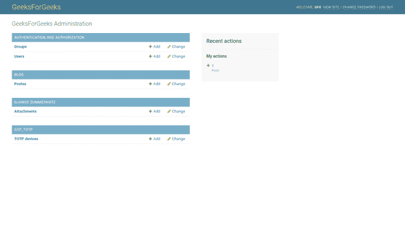
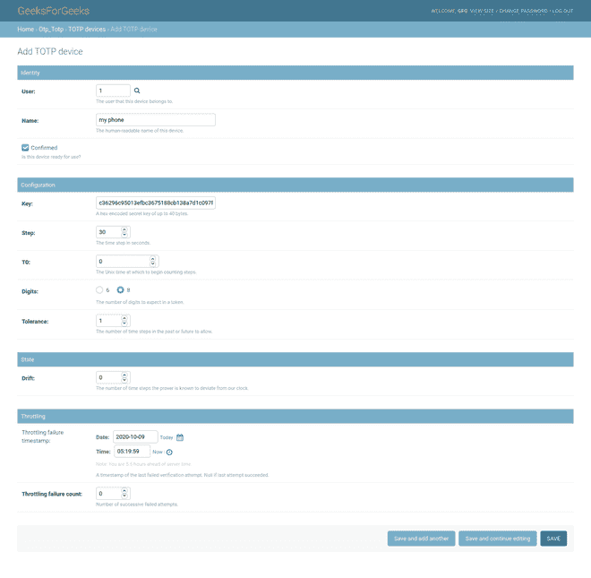
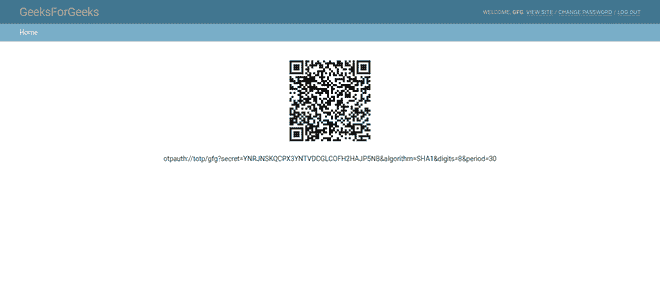
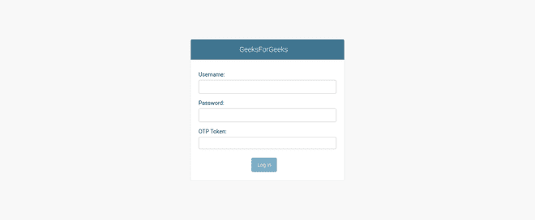

# 使用动态口令(双因素身份验证)保护姜戈管理员登录

> 原文:[https://www . geesforgeks . org/securing-django-admin-log in-with-OTP-2-factor-authentication/](https://www.geeksforgeeks.org/securing-django-admin-login-with-otp-2-factor-authentication/)

在为我们的应用程序增加安全性时，多因素身份验证是最基本的原则之一。在本教程中，我们将使用动态口令方法添加多因素身份验证。本文是 Django 博客 CMS 项目的续篇。在这里查看–[与姜戈](https://www.geeksforgeeks.org/building-blog-cms-content-management-system-with-django/)一起构建博客内容管理系统

### 为姜戈项目设置 2 因素认证

我们将为我们的博客内容管理系统安装 TOTP 软件包，这将为我们的管理员登录增加动态口令安全性。首先安装 django-otp 包

```
pip install django-otp
```

并在我们安装的应用程序中添加**‘django _ OTP，django _ OTP . plugins . OTP _ totp’**，在我们设置文件的中间件部分添加**django _ OTP . middleware . otpmiddleware**。

## 蟒蛇 3

```
INSTALLED_APPS = [
    'django.contrib.admin',
    'django.contrib.auth',
    'django.contrib.contenttypes',
    'django.contrib.sessions',
    'django.contrib.messages',
    'django.contrib.staticfiles',
    'django_otp',
    'django_otp.plugins.otp_totp'

]

MIDDLEWARE = [
    'django.middleware.security.SecurityMiddleware',
    'django.contrib.sessions.middleware.SessionMiddleware',
    'django.middleware.common.CommonMiddleware',
    'django.middleware.csrf.CsrfViewMiddleware',
    'django.contrib.auth.middleware.AuthenticationMiddleware',
    'django.contrib.messages.middleware.MessageMiddleware',
    'django.middleware.clickjacking.XFrameOptionsMiddleware',
    'django_otp.middleware.OTPMiddleware'
]
```

现在快跑，

```
# migrate our app
python3 manage.py migrate
```

### 创建 TOTP 设备–

现在登录 django admin 创建一个 TOTP 设备。登录后可以看到



登录页面

单击添加并填写详细信息以创建新的 TOTP 二维码



添加 TOTP 设备

现在再次进入 totp 设备部分，打开二维码，用你的 TOTP 应用程序扫描它，像 Authy，谷歌认证应用程序。



扫描二维码

### 设置管理动态口令类–

现在进入 gfgblog 中的 django urls.py 文件，而不是 blog urls.py 并添加行

## 蟒蛇 3

```
from django_otp.admin import OTPAdminSite

admin.site.__class__ = OTPAdminSite
```

### 输出–

现在注销并登录 django admin，每次需要登录 django admin 时，您都必须输入 OTP。



检察官办公室 django 管理员

#### 应遵循的一些基本安全原则

*   生产中保持调试=假
*   将允许的主机限制为我们的服务器 IP、本地主机和主机名
*   保持密钥的强大和安全
*   所有方法都在生产中使用 HTTPS
*   如果由多个用户管理，请检查用户上传
*   保护数据库安全，不要在生产中使用 SQLite
*   尝试在生产中使用安全性和内容头，下面给出了一些头，请在设置中添加这些头。复制

## 蟒蛇 3

```
SECURE_SSL_REDIRECT = True
SESSION_COOKIE_SECURE = True
SESSION_COOKIE_SECURE = True
SECURE_BROWSER_XSS_FILTER = True
SECURE_HSTS_SECONDS = 31536000
SECURE_HSTS_INCLUDE_SUBDOMAINS = True
SECURE_HSTS_PRELOAD = True
SECURE_CONTENT_TYPE_NOSNIFF = True
CSRF_COOKIE_SECURE = True
```