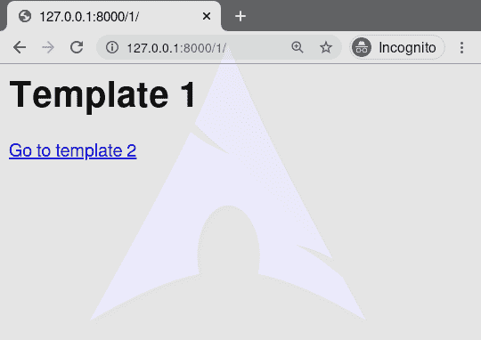
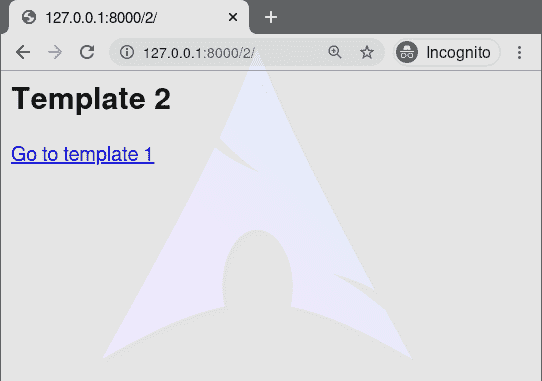

# URL–django 模板标记

> 哎哎哎:# t0]https://www . geeksforgeeks . org/URL-django 模板标签/

Django 模板是使用 Django 模板语言标记的文本文档或 Python 字符串。Django 是一个强大的包含电池的框架，为在模板中呈现数据提供了便利。Django 模板不仅允许在视图和模板之间传递数据，还提供了一些有限的编程特性，例如变量、for 循环、注释、扩展、url 等。
本文围绕如何在模板中使用 **url 标签**展开。`url`标记返回与给定视图和可选参数匹配的绝对路径引用(没有域名的 URL)。这是一种不违反 DRY 原则的输出链接的方法，它需要对模板中的 URL 进行硬编码:

###### 句法

```py


```

第一个参数是一个网址模式名。它可以是带引号的文字或任何其他上下文变量。附加参数是可选的，并且应该是将在 URL 中用作参数的空格分隔的值。

###### 例子

```py


```

## 网址–姜戈模板标签说明

举例说明如何在姜戈模板中使用 url 标签。考虑一个名为`geeksforgeeks`的项目，它有一个名为`geeks`的应用程序。

> 请参考以下文章，查看如何在 Django 中创建项目和应用程序。
> 
> *   [如何利用姜戈的 MVT 创建基础项目？](https://www.geeksforgeeks.org/how-to-create-a-basic-project-using-mvt-in-django/)
> *   [如何在姜戈创建 App？](https://www.geeksforgeeks.org/how-to-create-an-app-in-django/)

现在创建两个视图，我们将通过这两个视图访问模板，
在`geeks/views.py`中，

```py
# import Http Response from django
from django.shortcuts import render

# create a function
def geeks_view(request):
    # return response
    return render(request, "geeks.html")

def nav_view(request):
    # return response
    return render(request, "nav.html")
```

创建 url 路径以映射到此视图。网址需要有一个名称，然后可以用在模板和**网址标签**。在`geeks/urls.py`中，

```py
from django.urls import path

# importing views from views..py
from .views import geeks_view, nav_view

urlpatterns = [
    path('1/', geeks_view, name = "template1"),
    path('2/', nav_view, name = "template2"),
]
```

现在我们将创建两个模板来演示**现在标记**。在`geeks.html`创建模板，

```py
<html>
<h1>Template 1</h1>
<!-- Link to template 2 -->
<a href = "">Go to template 2</a>
</html>
```

在`geeks.html`创建模板，

```py
<html>
<<h2>Template 2</h2>
<!-- Link to template 1 -->
<a href = "">Go to template 1</a>
</html>
```

现在访问 [http://127.0.0.1:8000/1](http://127.0.0.1:8000/1) ，


点击链接，会重定向到其他网址。



#### 高级用法

假设你有一个视图，**app _ view . client**，它的 URLconf 取一个客户端 ID(这里，client()是 view 文件 app _ views.py 里面的一个方法)。URLconf 行可能如下所示:

```py
path('client/<int:id>/', app_views.client, name='app-views-client')
```

如果此应用程序的 URLconf 包含在项目的 URLconf 中，路径如下:

```py
path('clients/', include('project_name.app_name.urls'))
```

…然后，在模板中，您可以创建到此视图的链接，如下所示:

```py

```

模板标签将输出字符串 **/clients/client/123/。**