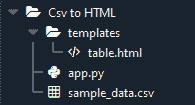
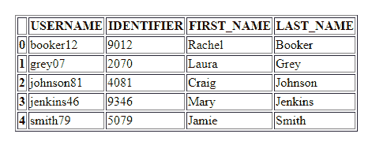

# 使用 Python 熊猫和 Flask 框架将 CSV 转换为 HTML 表格

> 原文:[https://www . geesforgeks . org/convert-CSV-to-html-table-using-python-pandas-and-flask-framework/](https://www.geeksforgeeks.org/convert-csv-to-html-table-using-python-pandas-and-flask-framework/)

在本文中，我们将使用 Python 熊猫和 Flask 框架将一个 **CSV 文件转换成一个** **HTML 表**。

**CSV 文件样本:**

```
USERNAME,IDENTIFIER,FIRST_NAME,LAST_NAME
booker12,9012,Rachel,Booker
grey07,2070,Laura,Grey
johnson81,4081,Craig,Johnson
jenkins46,9346,Mary,Jenkins
smith79,5079,Jamie,Smith
```

## 逐步实施

### **创造环境**

**第一步:**创造环境。在中创建项目文件夹和 venv 文件夹。

> py-3m venv 战斗机

**第二步:**激活环境。

> venv \脚本\激活

**第三步:**安装烧瓶和熊猫。

> pip 安装烧瓶
> 
> pip 安装熊猫

### **创建项目**

**第一步:**创建‘app . py’文件夹，写出下面给出的代码。

## 蟒蛇 3

```
# importing flask
from flask import Flask, render_template

# importing pandas module
import pandas as pd

app = Flask(__name__)

# reading the data in the csv file
df = pd.read_csv('sample_data.csv')
df.to_csv('sample_data.csv', index=None)

# route to html page - "table"
@app.route('/')
@app.route('/table')
def table():

    # converting csv to html
    data = pd.read_csv('sample_data.csv')
    return render_template('table.html', tables=[data.to_html()], titles=[''])

if __name__ == "__main__":
    app.run(host="localhost", port=int("5000"))
```

**步骤 2:** 创建文件夹“模板”。在“模板”文件夹中创建文件“table.html”。

## 超文本标记语言

```
<!DOCTYPE html>
<html lang="en">
    <head>
        <title> Table </title>              
    </head>
    <body>
        <div align="center">
            <table>
                <h1>
                <!--Displaying the converted table-->
                     
                    <h2>{{titles[loop.index]}}</h2>                            
                    {{ table|safe }}
                         
                </h1> 
            </table>
        </div>
    </body>
</html>
```

**第三步:**添加‘sample _ data . CSV’文件。

**第四步:**项目结构会是这样的。



项目结构

### **运行项目**

**步骤 1:** 运行服务器。

**第二步:**浏览网址‘localhost:5000’。

**第三步:**将显示输出网页。

**输出:**



输出:CSV 到 HTML 表格