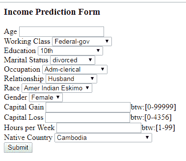
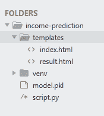

# 使用烧瓶部署机器学习模型

> 原文:[https://www . geesforgeks . org/deploy-机器学习-模型使用-flask/](https://www.geeksforgeeks.org/deploy-machine-learning-model-using-flask/)

**机器学习**是一个广泛用于预测的过程。n 个算法在各种库中可用，可用于预测。在本文中，我们将使用不同的机器学习算法和分类器来建立历史数据的预测模型，绘制结果图，并根据测试数据计算模型的准确性。
在大数据集上使用各种算法构建/训练模型是数据的一部分。但是在不同的应用程序中使用这些模型是在现实世界中部署机器学习的第二部分。
要投入使用为了预测新的数据，我们必须通过互联网部署，这样外界才能使用。在本文中，我们将讨论如何训练机器学习模型，如何使用 Flask 在其上创建网络应用程序。
我们必须安装许多将在这个模型中使用的必需库。使用 pip 命令安装所有库。

```
pip install pandas
pip install numpy
pip install sklearn
```

**决策树–**
决策树是一种众所周知的有监督机器学习算法，因为它易于使用，具有弹性和灵活性。我已经在 UCI 机器学习库中的成人数据集上实现了该算法。

**获取数据–**
可以从[这个链接](https://github.com/hoshangk/machine_learning_model_using_flask_web_framework)获取数据集。
获取数据集不是终点。我们必须对数据进行预处理，这意味着我们需要清理数据集。数据集的清理包括不同类型的过程，如删除缺失值、填充 NA 值等。

## 蟒蛇 3

```
# importing the dataset
import pandas
import numpy
from sklearn import preprocessing

df = pandas.read_csv('adult.csv')   
df.head()
```

**输出:**


**预处理数据集–**
它由 14 个属性和一个类别标签组成，告诉你个人年收入是低于还是高于 5 万。这些属性的范围从人的年龄、工人阶级标签到关系状态和人所属的种族。关于所有属性的信息可以在这里找到。
首先，我们从数据中找到并移除任何缺失的值。我们已经用该列中的模式值替换了缺少的值。有许多其他方法来替换丢失的值，但是对于这种类型的数据集，它似乎是最理想的。

## 蟒蛇 3

```
df = df.drop(['fnlwgt', 'educational-num'], axis = 1)

col_names = df.columns

for c in col_names:
    df = df.replace("?", numpy.NaN)
df = df.apply(lambda x:x.fillna(x.value_counts().index[0]))
```

机器学习算法不能处理分类数据值。它只能处理数值。
为了将数据拟合到预测模型中，我们需要将分类值转换为数字值。在此之前，我们将评估是否有必要对分类列进行任何转换。

**离散化–**使分类数据更整齐、更有意义是常用的方法。我们对婚姻状况列进行了离散化，将它们缩小到只包含已婚或未婚的值。稍后，我们将在剩余的数据列中应用标签编码器。此外，还有两个多余的列{'education '，' education-num ' }，因此，我们删除了其中一个。

## 蟒蛇 3

```
df.replace(['Divorced', 'Married-AF-spouse',
              'Married-civ-spouse', 'Married-spouse-absent',
              'Never-married', 'Separated', 'Widowed'],
             ['divorced', 'married', 'married', 'married',
              'not married', 'not married', 'not married'], inplace = True)

category_col =['workclass', 'race', 'education', 'marital-status', 'occupation',
               'relationship', 'gender', 'native-country', 'income']
labelEncoder = preprocessing.LabelEncoder()

mapping_dict ={}
for col in category_col:
    df[col] = labelEncoder.fit_transform(df[col])

    le_name_mapping = dict(zip(labelEncoder.classes_,
                        labelEncoder.transform(labelEncoder.classes_)))

    mapping_dict[col]= le_name_mapping
print(mapping_dict)
```

**输出:**

> {“workclass”:{“？”:0、“联邦-政府”:1、“地方-政府”:2、“从未工作过”:3、“私人”:4、“自我-EMP-Inc”:5、“自我-EMP-not-Inc”:6、“州-政府”:7、“无薪”:8}、“种族”:{“美洲印第安人-爱斯基摩人”:0、“亚裔-Pac-岛民”:1、“黑人”:2、“其他人”:3、“白人”:4}、“教育”:{“第 10 个”:0、“第 11 个”:1、“第 12 个”:2、“第 1-4 个”:3、“第 5-6 个”:4、“第 7-6 个” masters”:12、“学前班”:13、“教授-学校”:14、“某些-大学”:15}、“婚姻状况”:{“离异”:0、“已婚-AF-配偶”:1、“已婚-civ-配偶”:2、“已婚-配偶-缺席”:3、“从未结过婚”:4、“分居”:5、“丧偶”:6}、“职业”:{“？” :0，“行政-文书”:1，“武装力量”:2，“手艺-修理”:3，“执行-管理”:4，“农业-渔业”:5，“搬运员-清洁工”:6，“机器-操作-检查”:7，“其他-服务”:8，“私人-房屋-服务”:9，“教授-专业”:10，“保护-服务”:11，“销售”:12，“技术-支持”:13，“运输-移动”:14，“”关系:“{“丈夫”:0，“不在家庭”:1，“其他-亲戚”:2，“自己的孩子”:14:0，“柬埔寨”:1，“加拿大”:2，“中国”:3，“哥伦比亚”:4，“古巴”:5，“多米尼加-共和国”:6，“厄瓜多尔”:7，“萨尔瓦多”:8，“英国”:9，“法国”:10，“德国”:11，“希腊”:12，“危地马拉”:13，“海地”:14，“荷兰-荷兰”:15，“洪都拉斯”:16，“洪”:17，“匈牙利”:18，“印度”:19，“伊朗”:20，“爱尔兰”:21，“意大利”:22，“牙买加”:23，“日本”:24，“老挝”:25，“印度”:19，“伊朗”:20，“爱尔兰”:21，“意大利”:22，“牙买加”:23，“日本”:24，“老挝”:25 尼加拉瓜”:27，“边远地区-美国(关岛-USVI-等)”:28，“秘鲁”:29，“菲律宾”:30，“波兰”:31，“葡萄牙”:32，“波多黎各”:33，“苏格兰”:34，“南方”:35，“台湾”:36，“泰国”:37，“天合光能&多巴哥”:38，“美国”:39，“越南”:40，“南斯拉夫”:41}，“收入”:{“50K”:1 } }

**拟合模型–**
对数据进行预处理后，数据就可以输入机器学习算法了。然后，我们对数据进行切片，将标签和属性分开。现在，我们将数据集分成两半，一半用于训练，另一半用于测试。这是使用 sklearn 的 train_test_split()函数实现的。

## 蟒蛇 3

```
from sklearn.model_selection import train_test_split
from sklearn.tree import DecisionTreeClassifier
from sklearn.metrics import accuracy_score

X = df.values[:, 0:12]
Y = df.values[:, 12]
```

我们在这里使用决策树分类器作为预测模型。我们输入数据的训练部分来训练模型。
一旦训练完成，我们通过向模型提供测试部分数据来测试模型的准确性。
这样，我们达到了大约 84%的准确率。现在，为了将该模型用于新的未知数据，我们需要保存该模型，以便以后可以预测值。为此，我们利用 Python 中的 *pickle* ，这是一个用于序列化和反序列化 Python 对象结构的强大算法。

## 蟒蛇 3

```
X_train, X_test, y_train, y_test = train_test_split(
           X, Y, test_size = 0.3, random_state = 100)

dt_clf_gini = DecisionTreeClassifier(criterion = "gini",
                                     random_state = 100,
                                     max_depth = 5,
                                     min_samples_leaf = 5)

dt_clf_gini.fit(X_train, y_train)
y_pred_gini = dt_clf_gini.predict(X_test)

print ("Decision Tree using Gini Index\nAccuracy is ",
             accuracy_score(y_test, y_pred_gini)*100 )
```

**输出:**

```
Decision Tree using Gini Index
Accuracy is  83.13031016480704
```

**现在，Flask–**
Flask 是一个基于 Python 的微框架，用于开发小规模网站。使用 python 制作 Restful API 的 Flask 非常容易。到目前为止，我们已经开发了一个模型，即 model.pkl，它可以根据数据的各种属性来预测一类数据。等级标签为*工资> =50K 或< 50K* 。
现在我们将设计一个 web 应用程序，用户将输入所有的属性值，数据将被赋予模型，基于对模型的训练，模型将预测细节已经被输入的人的工资应该是多少。

**HTML 表单–**
为了预测来自各种属性的收入，我们首先需要收集数据(新的属性值)，然后使用我们上面构建的决策树模型来预测收入是大于还是小于 50K。因此，为了收集数据，我们创建了一个 html 表单，其中包含了从每个属性中选择的所有不同选项。这里，我们只使用 html 创建了一个简单的表单。如果你想让表单更具交互性，你也可以这样做。

## 超文本标记语言

```
<html>
<body>
    <h3>Income Prediction Form</h3>

<div>
  <form action="/result" method="POST">
    <label for="age">Age</label>
    <input type="text" id="age" name="age">
    <br>
    <label for="w_class">Working Class</label>
    <select id="w_class" name="w_class">
      <option value="0">Federal-gov</option>
      <option value="1">Local-gov</option>
      <option value="2">Never-worked</option>
      <option value="3">Private</option>
      <option value="4">Self-emp-inc</option>
      <option value="5">Self-emp-not-inc</option>
      <option value="6">State-gov</option>
      <option value="7">Without-pay</option>
    </select>
    <br>
    <label for="edu">Education</label>
    <select id="edu" name="edu">
      <option value="0">10th</option>
      <option value="1">11th</option>
      <option value="2">12th</option>
      <option value="3">1st-4th</option>
      <option value="4">5th-6th</option>
      <option value="5">7th-8th</option>
      <option value="6">9th</option>
      <option value="7">Assoc-acdm</option>
      <option value="8">Assoc-voc</option>
      <option value="9">Bachelors</option>
      <option value="10">Doctorate</option>
      <option value="11">HS-grad</option>
      <option value="12">Masters</option>
      <option value="13">Preschool</option>
      <option value="14">Prof-school</option>
      <option value="15">16 - Some-college</option>
    </select>
    <br>
    <label for="martial_stat">Marital Status</label>
    <select id="martial_stat" name="martial_stat">
      <option value="0">divorced</option>
      <option value="1">married</option>
      <option value="2">not married</option>
    </select>
    <br>
    <label for="occup">Occupation</label>
    <select id="occup" name="occup">
      <option value="0">Adm-clerical</option>
      <option value="1">Armed-Forces</option>
      <option value="2">Craft-repair</option>
      <option value="3">Exec-managerial</option>
      <option value="4">Farming-fishing</option>
      <option value="5">Handlers-cleaners</option>
      <option value="6">Machine-op-inspct</option>
      <option value="7">Other-service</option>
      <option value="8">Priv-house-serv</option>
      <option value="9">Prof-specialty</option>
      <option value="10">Protective-serv</option>
      <option value="11">Sales</option>
      <option value="12">Tech-support</option>
      <option value="13">Transport-moving</option>
    </select>
    <br>
    <label for="relation">Relationship</label>
    <select id="relation" name="relation">
      <option value="0">Husband</option>
      <option value="1">Not-in-family</option>
      <option value="2">Other-relative</option>
      <option value="3">Own-child</option>
      <option value="4">Unmarried</option>
      <option value="5">Wife</option>
    </select>
    <br>
    <label for="race">Race</label>
    <select id="race" name="race">
      <option value="0">Amer Indian Eskimo</option>
      <option value="1">Asian Pac Islander</option>
      <option value="2">Black</option>
      <option value="3">Other</option>
      <option value="4">White</option>
    </select>
    <br>
    <label for="gender">Gender</label>
    <select id="gender" name="gender">
      <option value="0">Female</option>
      <option value="1">Male</option>
    </select>
    <br>
    <label for="c_gain">Capital Gain </label>
    <input type="text" id="c_gain" name="c_gain">btw:[0-99999]
    <br>
    <label for="c_loss">Capital Loss </label>
    <input type="text" id="c_loss" name="c_loss">btw:[0-4356]
    <br>
    <label for="hours_per_week">Hours per Week </label>
    <input type="text" id="hours_per_week" name="hours_per_week">btw:[1-99]
    <br>
    <label for="native-country">Native Country</label>
    <select id="native-country" name="native-country">
      <option value="0">Cambodia</option>
      <option value="1">Canada</option>
      <option value="2">China</option>
      <option value="3">Columbia</option>
      <option value="4">Cuba</option>
      <option value="5">Dominican Republic</option>
      <option value="6">Ecuador</option>
      <option value="7">El Salvadorr</option>
      <option value="8">England</option>
      <option value="9">France</option>
      <option value="10">Germany</option>
      <option value="11">Greece</option>
      <option value="12">Guatemala</option>
      <option value="13">Haiti</option>
      <option value="14">Netherlands</option>
      <option value="15">Honduras</option>
      <option value="16">HongKong</option>
      <option value="17">Hungary</option>
      <option value="18">India</option>
      <option value="19">Iran</option>
      <option value="20">Ireland</option>
      <option value="21">Italy</option>
      <option value="22">Jamaica</option>
      <option value="23">Japan</option>
      <option value="24">Laos</option>
      <option value="25">Mexico</option>
      <option value="26">Nicaragua</option>
      <option value="27">Outlying-US(Guam-USVI-etc)</option>
      <option value="28">Peru</option>
      <option value="29">Philippines</option>
      <option value="30">Poland</option>
      <option value="11">Portugal</option>
      <option value="32">Puerto-Rico</option>
      <option value="33">Scotland</option>
      <option value="34">South</option>
      <option value="35">Taiwan</option>
      <option value="36">Thailand</option>
      <option value="37">Trinadad&Tobago</option>
      <option value="38">United States</option>
      <option value="39">Vietnam</option>
      <option value="40">Yugoslavia</option>
    </select>
    <br>
    <input type="submit" value="Submit">
  </form>
</div>
</body>
</html>
```

**输出:**



**注意:**
为了正确预测数据，每个标签对应的值应该与每个选择输入的值相匹配。例如，在属性关系中有 6 个分类值。这些被转换成像这样的数字{“丈夫”:0，“不在家庭中”:1，“其他亲属”:2，“自己的孩子”:3，“未婚”:4，“妻子”:5}。因此，我们需要将相同的值放入 html 表单。

## 蟒蛇 3

```
# prediction function
def ValuePredictor(to_predict_list):
    to_predict = np.array(to_predict_list).reshape(1, 12)
    loaded_model = pickle.load(open("model.pkl", "rb"))
    result = loaded_model.predict(to_predict)
    return result[0]

@app.route('/result', methods = ['POST'])
def result():
    if request.method == 'POST':
        to_predict_list = request.form.to_dict()
        to_predict_list = list(to_predict_list.values())
        to_predict_list = list(map(int, to_predict_list))
        result = ValuePredictor(to_predict_list)       
        if int(result)== 1:
            prediction ='Income more than 50K'
        else:
            prediction ='Income less that 50K'           
        return render_template("result.html", prediction = prediction)
```

一旦从表单中发布了数据，就应该将数据输入到模型中。

**Flask 脚本–**
在开始编码部分之前，我们需要下载 Flask 和其他一些库。在这里，我们使用虚拟环境，所有的库都在虚拟环境中进行管理，这使得开发和部署工作变得更加容易。
下面是使用虚拟环境运行代码的代码。

```
mkdir income-prediction
cd income-prediction
python3 -m venv venv
```

```
source venv/bin/activate
```

现在让我们安装 Flask。

```
pip install flask
```

让我们创建文件夹模板。在您的应用程序中，您将使用模板来呈现显示在用户浏览器中的 HTML。这个文件夹包含我们的 html 表单文件 index.html。

```
mkdir templates
```

在项目文件夹中创建 script.py 文件，并复制以下代码。
这里我们导入库，然后使用 app=Flask(__name__)创建一个 Flask 的实例。@app.route('/')用于告诉 flask 什么 url 应该触发函数 index()，在函数 index 中，我们使用 render_template('index.html ')在浏览器中显示脚本 index.html。

让我们运行应用程序。

```
export FLASK_APP=script.py   #this line will work in linux
set FLASK_APP=script.py      # this it the code  for windows.
run flask
```

这应该运行应用程序并启动一个简单的服务器。打开 http://127.0.0.1:5000/查看 html 表单。

**预测收益值–**
当有人提交表单时，网页应该显示收益的预测值。为此，我们需要我们之前在同一个项目文件夹中创建的模型文件(model.pkl)。
这里表单提交后，表单值以字典的形式存储在变量 to_predict_list 中。我们将其转换为字典值的列表，并将其作为参数传递给 ValuePredictor()函数。在这个函数中，我们加载 model.pkl 文件并预测新值并返回结果。
该结果/预测(收入大于或小于 50k)然后作为参数传递给模板引擎，并显示 html 页面。

创建以下 result.html 文件，并将其添加到模板文件夹。

## 超文本标记语言

```
<!doctype html>
<html>
   <body>
       <h1> {{ prediction }}</h1>
   </body>
</html>
```

**输出:**



再次运行应用程序，它应该在提交表单后预测收入，并将在结果页面上显示输出。