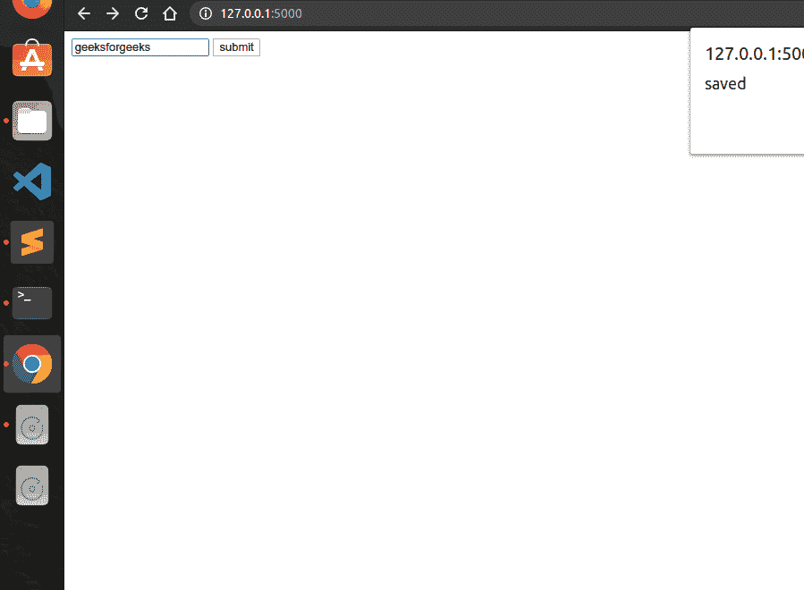
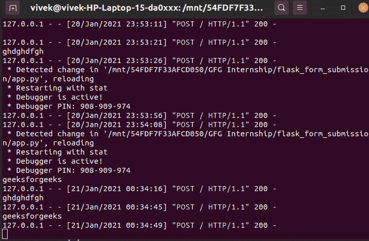

# 提交烧瓶表格而不重新加载页面

> 原文:[https://www . geesforgeks . org/flask-form-submission-不带页面-reload/](https://www.geeksforgeeks.org/flask-form-submission-without-page-reload/)

有许多模块或框架允许使用 python 构建网页，如 bottle、django、flask 等。但真正受欢迎的是 Flask 和 Django。与 Flask 相比，Django 易于使用，但 Flask 为您提供了编程的多功能性。

**问题:**

如果我们发布请求，那么整个页面将重新加载。因此，本文围绕如何在不重新加载页面的情况下将表单数据发送到 flask 后端展开。为了提交表单而不重新加载页面，我们使用 jquery 和 ajax。所以在使用烧瓶之前，我们必须安装它

人的本质

```
pip3 install flask
```

为您的项目创建新目录。在里面创建一个新文件并命名为 **app.py**

**app.py**

## 蟒蛇 3

```
from flask import Flask,render_template,request

app = Flask(__name__)

@app.route("/",methods=["POST","GET"])
def home():
    if request.method == "POST":
        todo = request.form.get("todo")
        print(todo)
    return render_template('home.html')

if __name__ == '__main__':
    app.run(debug=True)

```

然后新建一个目录，命名为**模板**

在里面创建新的文件，并将其命名为**home.html**

**home.html**

## 超文本标记语言

```
<!DOCTYPE html>
<html>
<head>
    <title>GFG</title>
</head>
<body>
  <form method="post" id="todo-form">
        <input type="text" name="todo" id="todo">
        <button type="submit">submit</button>
    </form>

        <!--Jquery Cdn -->
  <script src="https://code.jquery.com/jquery-3.5.1.js"
          integrity="sha256-QWo7LDvxbWT2tbbQ97B53yJnYU3WhH/C8ycbRAkjPDc="
          crossorigin="anonymous"></script>

  <script type="text/javascript">
    $(document).on('submit','#todo-form',function(e)
                   {
      console.log('hello');
      e.preventDefault();
      $.ajax({
        type:'POST',
        url:'/',
        data:{
          todo:$("#todo").val()
        },
        success:function()
        {
          alert('saved');
        }
      })
    });
  </script>

</body>
</html>
```

*   **e.preventDefault() :-该功能不重新加载页面**
*   **类型:**获取或开机自检请求
*   **url :** 我们在 flask 应用程序中指定的 url
*   **数据:**形成我们想要传递的数据
*   **成功:函数():-** 该函数在成功提交值后运行，并且在提交数据时没有出现错误。

**输出:-**





在 cmd 或终端上，它将打印我们使用表单提交的值。