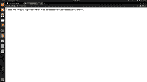

# Flask 项目–使用 py challels 创建一个笑话应用程序

> 原文:[https://www . geesforgeks . org/flask-project-create-a-chambers-app-with-py chambers/](https://www.geeksforgeeks.org/flask-project-create-a-joke-app-with-pyjokes/)

Flask 是一个用 Python 编写的微网络框架。它被归类为微框架，因为它不需要特定的工具或库。Flask 是一个轻量级的 WSGI web 应用框架。它旨在使入门变得快速简单，并能够扩展到复杂的应用程序。

为了创建笑话应用程序，我们需要两个库烧瓶和 py chambers。

#### **安装–**

首先我们安装烧瓶

```
pip install flask

```

第二个库安装

```
pip install pyjokes

```

你会得到有趣的一行，大部分与编程有关，只需导入一个名为 py challels 的库。

**皮笑话库的一些方法**

py chambers 中有两种主要方法 get _ jokes()和 get _ jokes()。

*   **get _ joke()**–它只返回一个笑话。我们每次都会收到随机的笑话。
*   **参数**–有两个参数——语言和类别。你可以从上面的语言和类别中选择。
*   **返回类型**–返回字符串类型(字符串)。
*   **get _ challenges()**–这里，我们得到一个笑话列表。
*   **参数**–参数同上-语言和类别。
*   **返回类型**–列表。

**皮笑话支持的语言:**

*   英语-' en '
*   德语–“de”
*   西班牙语–“是”
*   加利西亚语–“GL”
*   巴斯克语–“我”
*   意大利语——“它”

**皮笑话中包含的类别:**

*   对于极客笑话——“中性”(默认选择)
*   克里斯·诺里斯的笑话——《恰克》。
*   如果你想要所有类型的笑话——“所有”
*   还有一个被称为“绕口令”的类别只适用于德语。这主要包括绕口令。

## 创建烧瓶项目–

我创建了一个文件，并将其命名为 app.py

**app.py**

## 蟒蛇 3

```
from flask import Flask
import pyjokes

app=Flask(__name__)

@app.route("/")
def home():
    joke=pyjokes.get_joke()  #It only returns one joke. We get random joke each time. 
    return f'<h2>{joke}</h2>'

@app.route("/MultipleJokes")
def jokes():
    jokes=pyjokes.get_jokes()  #Here, we get a list of jokes.  
    return f'<h2>{jokes}</h2>'

if __name__ == "__main__":
    app.run(debug=True)
```

要运行 flask 应用程序，您需要在命令提示符或终端中运行以下命令:

对于窗口

```
python app.py

```

对于 ubuntu

```
python3 app.py

```

运行该应用程序后，您将获得如下输出

### “http://127.0.0.1:5000”上的输出



### 在“http://127 . 0 . 0 . 1:5000/multiplechokets”上的输出

