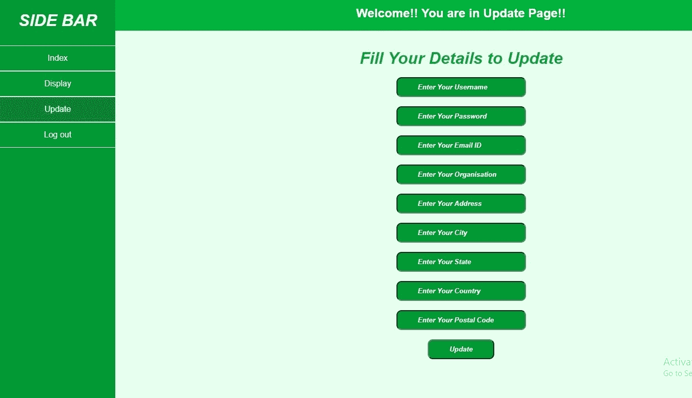
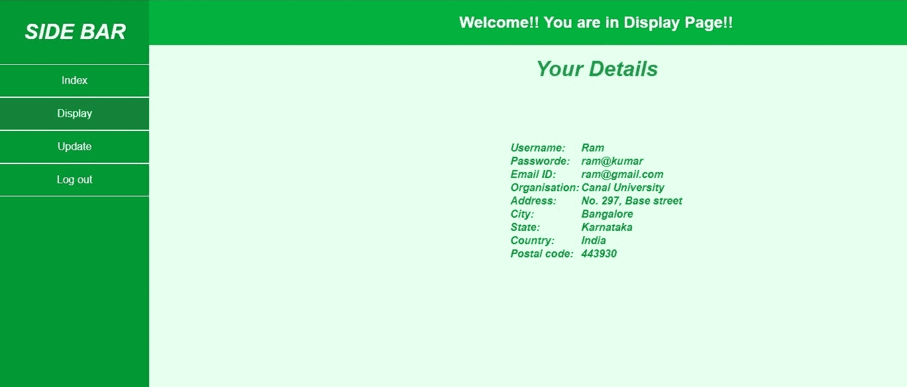

# 使用 Python 烧瓶和 MySQL 的概要文件应用程序

> 原文:[https://www . geesforgeks . org/profile-application-use-python-flask-and-MySQL/](https://www.geeksforgeeks.org/profile-application-using-python-flask-and-mysql/)

**项目名称:**使用 Python Flask 和 MySQL 的概要文件应用程序

**应用类型(类别):** Web 应用。

**简介:**框架是一个代码库，它通过为常见操作提供可重用的代码，使开发人员在构建 web 应用程序时的生活变得更加轻松。Python 有许多框架，包括 Flask、Tornado、金字塔和 Django。Flask 是一个轻量级的 web 应用程序框架。它被归类为微框架，因为它不需要特定的工具或库。侧选项卡用于单页 web 应用程序或显示不同的内容。

**先决条件:**Python 知识、MySQL 工作台和 Flask 框架基础。系统中应该安装 Python 和 MySQL Workbench。Visual studio 代码或 Spyder 或任何代码编辑器来处理应用程序。

**项目使用的技术:** Flask 框架，MySQL Workbench。

**项目实施:**

**(1)创造环境**

**第一步:**创造环境。在中创建项目文件夹和 venv 文件夹。

> **py -3 -m venv venv**

**步骤 2:** 激活环境。

> **venv \ Scripts \激活**

**步骤 3:** 安装烧瓶。

> **pip 安装烧瓶**

**(2) MySQL 工作台**

**步骤-1:** 安装 MySQL 工作台。
链接安装:[https://dev.mysql.com/downloads/workbench/](https://dev.mysql.com/downloads/workbench/)T5】了解详情:[https://www.mysql.com/products/workbench/](https://www.mysql.com/products/workbench/)

**步骤 2:** 在你的 venv 中安装“mysqlbd”模块。

> **pip 安装烧瓶-mysqldb**

**步骤-3:** 打开 MySQL 工作台。

**步骤-4:** 编写以下代码。上面的 SQL 语句将创建我们的数据库**极客档案**和表**账户**。

**第 5 步:**执行查询。
T3】

**(3)创建项目**

**步骤 1:** 创建一个空文件夹**“极客程序文件”**。

**步骤 2:** 现在打开你的代码编辑器，打开这个‘geeksprofile’文件夹。

**第三步:**创建**【app . py】**文件夹，并写出下面给出的代码。

```py
# Store this code in 'app.py' file
from flask import Flask, render_template, request, redirect, url_for, session
from flask_mysqldb import MySQL
import MySQLdb.cursors
import re

app = Flask(__name__)

app.secret_key = 'your secret key'

app.config['MYSQL_HOST'] = 'localhost'
app.config['MYSQL_USER'] = 'root'
app.config['MYSQL_PASSWORD'] = 'password'
app.config['MYSQL_DB'] = 'geekprofile'

mysql = MySQL(app)

@app.route('/')
@app.route('/login', methods =['GET', 'POST'])
def login():
    msg = ''
    if request.method == 'POST' and 'username' in request.form and 'password' in request.form:
        username = request.form['username']
        password = request.form['password']
        cursor = mysql.connection.cursor(MySQLdb.cursors.DictCursor)
        cursor.execute('SELECT * FROM accounts WHERE username = % s AND password = % s', (username, password, ))
        account = cursor.fetchone()
        if account:
            session['loggedin'] = True
            session['id'] = account['id']
            session['username'] = account['username']
            msg = 'Logged in successfully !'
            return render_template('index.html', msg = msg)
        else:
            msg = 'Incorrect username / password !'
    return render_template('login.html', msg = msg)

@app.route('/logout')
def logout():
   session.pop('loggedin', None)
   session.pop('id', None)
   session.pop('username', None)
   return redirect(url_for('login'))

@app.route('/register', methods =['GET', 'POST'])
def register():
    msg = ''
    if request.method == 'POST' and 'username' in request.form and 'password' in request.form and 'email' in request.form and 'address' in request.form and 'city' in request.form and 'country' in request.form and 'postalcode' in request.form and 'organisation' in request.form:
        username = request.form['username']
        password = request.form['password']
        email = request.form['email']
        organisation = request.form['organisation']  
        address = request.form['address']
        city = request.form['city']
        state = request.form['state']
        country = request.form['country']    
        postalcode = request.form['postalcode'] 
        cursor = mysql.connection.cursor(MySQLdb.cursors.DictCursor)
        cursor.execute('SELECT * FROM accounts WHERE username = % s', (username, ))
        account = cursor.fetchone()
        if account:
            msg = 'Account already exists !'
        elif not re.match(r'[^@]+@[^@]+\.[^@]+', email):
            msg = 'Invalid email address !'
        elif not re.match(r'[A-Za-z0-9]+', username):
            msg = 'name must contain only characters and numbers !'
        else:
            cursor.execute('INSERT INTO accounts VALUES (NULL, % s, % s, % s, % s, % s, % s, % s, % s, % s)', (username, password, email, organisation, address, city, state, country, postalcode, ))
            mysql.connection.commit()
            msg = 'You have successfully registered !'
    elif request.method == 'POST':
        msg = 'Please fill out the form !'
    return render_template('register.html', msg = msg)

@app.route("/index")
def index():
    if 'loggedin' in session: 
        return render_template("index.html")
    return redirect(url_for('login'))

@app.route("/display")
def display():
    if 'loggedin' in session:
        cursor = mysql.connection.cursor(MySQLdb.cursors.DictCursor)
        cursor.execute('SELECT * FROM accounts WHERE id = % s', (session['id'], ))
        account = cursor.fetchone()    
        return render_template("display.html", account = account)
    return redirect(url_for('login'))

@app.route("/update", methods =['GET', 'POST'])
def update():
    msg = ''
    if 'loggedin' in session:
        if request.method == 'POST' and 'username' in request.form and 'password' in request.form and 'email' in request.form and 'address' in request.form and 'city' in request.form and 'country' in request.form and 'postalcode' in request.form and 'organisation' in request.form:
            username = request.form['username']
            password = request.form['password']
            email = request.form['email']
            organisation = request.form['organisation']  
            address = request.form['address']
            city = request.form['city']
            state = request.form['state']
            country = request.form['country']    
            postalcode = request.form['postalcode'] 
            cursor = mysql.connection.cursor(MySQLdb.cursors.DictCursor)
            cursor.execute('SELECT * FROM accounts WHERE username = % s', (username, ))
            account = cursor.fetchone()
            if account:
                msg = 'Account already exists !'
            elif not re.match(r'[^@]+@[^@]+\.[^@]+', email):
                msg = 'Invalid email address !'
            elif not re.match(r'[A-Za-z0-9]+', username):
                msg = 'name must contain only characters and numbers !'
            else:
                cursor.execute('UPDATE accounts SET  username =% s, password =% s, email =% s, organisation =% s, address =% s, city =% s, state =% s, country =% s, postalcode =% s WHERE id =% s', (username, password, email, organisation, address, city, state, country, postalcode, (session['id'], ), ))
                mysql.connection.commit()
                msg = 'You have successfully updated !'
        elif request.method == 'POST':
            msg = 'Please fill out the form !'
        return render_template("update.html", msg = msg)
    return redirect(url_for('login'))

if __name__ == "__main__":
    app.run(host ="localhost", port = int("5000"))
```

**第 4 步:**创建文件夹**“模板”**。在“模板”文件夹中创建文件“index.html”、“display.html”、“update.html”、“login.html”、“register.html”。

**步骤-5:** 打开**【log in . html】**文件，写出下面给出的代码。在“login.html”中，我们有两个字段，即用户名和密码。当用户输入正确的用户名和密码时，它会将您路由到索引页面，否则会显示“用户名/密码不正确”。

```py
<!--Store this code in 'login.html' file inside the 'templates' folder-->
<html>
    <head>
        <meta charset="UTF-8">
        <title> Login </title>
        <link rel="stylesheet" href="../static/style.css">       
    </head>
    <body>
        <div class="logincontent" align="center">
            <div class="logintop">
                <h1>Login</h1>
            </div></br></br></br></br>
            <div class="loginbottom">
              <form action="{{ url_for('login')}}" method="post" autocomplete="off">
            <div class="msg">{{ msg }}</div>
            <input type="text" name="username" placeholder="Enter Your Username" class="textbox" id="username" required></br></br>
            <input type="password" name="password" placeholder="Enter Your Password" class="textbox" id="password" required></br></br></br>
            <input type="submit" class="btn" value="Login">
              </form></br></br>
              <p class="worddark">New to this page? <a class="worddark" href="{{ url_for('register')}}">Register here</a></p>
            </div>
        </div>
    </body>
</html>
```

**第 6 步:**打开**【register . html】**文件，写出下面给出的代码。在“register.html”中，我们有九个字段，即用户名、密码、电子邮件、组织、地址、城市、州、国家、邮政编码。当用户输入所有信息时，它将数据存储在数据库中，并显示“注册成功”。

```py
<!--Store this code in 'register.html' file inside the 'templates' folder--> 
<html>
    <head>
        <meta charset="UTF-8">
        <title> register </title>
        <link rel="stylesheet" href="../static/style.css">       
    </head>
    <body>
        <div class="registercontent" align="center">
            <div class="registertop">
                <h1>Register</h1>
            </div></br></br>
            <div class="registerbottom">
              <form action="{{ url_for('register')}}" method="post" autocomplete="off">
            <div class="msg">{{ msg }}</div>
            <input type="text" name="username" placeholder="Enter Your Username" class="textbox" id="username" required></br></br>
            <input type="password" name="password" placeholder="Enter Your Password" class="textbox" id="password" required></br></br>
            <input type="email" name="email" placeholder="Enter Your Email ID" class="textbox" id="email" required></br></br>
            <input type="text" name="organisation" placeholder="Enter Your Organisation" class="textbox" id="organisation" required></br></br>
            <input type="text" name="address" placeholder="Enter Your Address" class="textbox" id="address" required></br></br>
            <input type="text" name="city" placeholder="Enter Your City" class="textbox" id="city" required></br></br>
            <input type="text" name="state" placeholder="Enter Your State" class="textbox" id="state" required></br></br>
            <input type="text" name="country" placeholder="Enter Your Country" class="textbox" id="country" required></br></br>
            <input type="text" name="postalcode" placeholder="Enter Your Postal Code" class="textbox" id="postalcode" required></br></br>
            <input type="submit" class="btn" value="Register">
              </form>
              <p class="worddark">Already have account? <a class="worddark" href="{{ url_for('login')}}">Login here</a></p>
            </div>
        </div>
    </body>
</html>
```

**第 7 步:**打开**【index . html】**文件，写出下面给出的代码。当用户成功登录时，将显示此页面并显示“登录成功！”显示。

```py
<!--Store this code in 'index.html' file inside the 'templates' folder-->
<html lang="en">
    <head>
        <title>index</title>
        <link rel="stylesheet" href="../static/style.css">
    </head>

    <body bgcolor="#e6ffee">
        <div class="one">
            <div class="two">
                <h1>Side Bar</h1>
                <ul>
                    <li class="active"><a href="{{url_for('index')}}">Index</a></li>
                    <li><a href="{{url_for('display')}}">Display</a></li>
                    <li><a href="{{url_for('update')}}">Update</a></li>
                    <li><a href="{{url_for('logout')}}">Log out</a></li>
                </ul> 
            </div>
            <div class="content" align="center">
                <div class="topbar">
                    <h2>Welcome!! You are in Index Page!! </h2>                        
                </div></br></br>
                <div class="contentbar">
                     <div class="msg">{{ msg }}</div>
                </div>  

            </div>
        </div>
    </body>
</html>
```

**第 8 步:**打开**【display . html】**文件，写出下面给出的代码。这里，显示存储在数据库中的用户信息。

```py
<!--Store this code in 'display.html' file inside the 'templates' folder-->

<html lang="en">
    <head>
        <title>display</title>
        <link rel="stylesheet" href="../static/style.css">
    </head>
    <body bgcolor="#e6ffee">
        <div class="one">
            <div class="two">
                <h1>Side Bar</h1>
                <ul>
                    <li><a href="{{url_for('index')}}">Index</a></li>
                    <li class="active"><a href="{{url_for('display')}}">Display</a></li>
                    <li><a href="{{url_for('update')}}">Update</a></li>
                    <li><a href="{{url_for('logout')}}">Log out</a></li>
                </ul> 
            </div>
            <div class="content" align="center">
                <div class="topbar">
                    <h2>Welcome!! You are in Display Page!! </h2>                        
                </div>  </br>
                <div class="contentbar">
                    <h1>Your Details</h1>    </br>
                     
                        <div class="border">
                            <table class="worddark"></br></br></br></br>
                                <tr>
                                    <td>Username:</td>
                                    <td>{{ account['username'] }}</td>
                                </tr>
                                <tr>
                                    <td>Passworde:</td>
                                    <td>{{ account['password'] }}</td>
                                </tr>
                                <tr>
                                    <td>Email ID:</td>
                                    <td>{{ account['email'] }}</td>
                                </tr>
                                <tr>
                                    <td>Organisation:</td>
                                    <td>{{ account['organisation'] }}</td>
                                </tr>
                                <tr>
                                    <td>Address:</td>
                                    <td>{{ account['address'] }}</td>
                                </tr>
                                <tr>
                                    <td>City:</td>
                                    <td>{{ account['city'] }}</td>
                                </tr>
                                <tr>
                                    <td>State:</td>
                                    <td>{{ account['state'] }}</td>
                                </tr>
                                <tr>
                                    <td>Country:</td>
                                    <td>{{ account['country'] }}</td>
                                </tr>  
                                <tr>
                                    <td>Postal code:</td>
                                    <td>{{ account['postalcode'] }}</td>
                                </tr>                          
                            </table>
                        </div>
                                                               
                </div>

            </div>
        </div>
    </body>
</html>
```

**步骤-9:** 打开**【update . html】**文件，写出下面给出的代码。用户可以更新他/她的数据，这也更新了数据库。

```py
<!--Store this code in 'update.html' file inside the 'templates' folder-->
<html lang="en">
    <head>
        <title>update</title>
        <link rel="stylesheet" href="../static/style.css">
    </head>
    <body bgcolor="#e6ffee">
        <div class="one">
            <div class="two">
                <h1>Side Bar</h1>
                <ul>
                    <li><a href="{{url_for('index')}}">Index</a></li>
                    <li><a href="{{url_for('display')}}">Display</a></li>
                    <li class="active"><a href="{{url_for('update')}}">Update</a></li>
                    <li><a href="{{url_for('logout')}}">Log out</a></li>
                </ul> 
            </div>
            <div class="content" align="center">
                <div class="topbar">
                    <h2>Welcome!! You are in Update Page!! </h2>                        
                </div></br></br>
                <div class="contentbar">
                  <h1>Fill Your Details to Update</h1></br>
              <form action="{{ url_for('update') }}" method="post" autocomplete="off">
                    <div class="msg">{{ msg }}</div>
                    <input type="text" name="username" placeholder="Enter Your Username" class="textbox" id="username" required></br></br>
                    <input type="password" name="password" placeholder="Enter Your Password" class="textbox" id="password" required></br></br>
                    <input type="email" name="email" placeholder="Enter Your Email ID" class="textbox" id="email" required></br></br>
                    <input type="text" name="organisation" placeholder="Enter Your Organisation" class="textbox" id="organisation" required></br></br>
                    <input type="text" name="address" placeholder="Enter Your Address" class="textbox" id="address" required></br></br>
                    <input type="text" name="city" placeholder="Enter Your City" class="textbox" id="city" required></br></br>
                    <input type="text" name="state" placeholder="Enter Your State" class="textbox" id="state" required></br></br>
                    <input type="text" name="country" placeholder="Enter Your Country" class="textbox" id="country" required></br></br>
                    <input type="text" name="postalcode" placeholder="Enter Your Postal Code" class="textbox" id="postalcode" required></br></br>
                    <input type="submit" class="btn" value="Update">
              </form>                     
                </div>  

            </div>
        </div>
    </body>
</html>
```

**第 10 步:**创建文件夹**【静态】**。在“静态”文件夹中创建文件“style.css”，并粘贴给定的 css 代码。

```py
/*Store this code in 'style.css' file inside the 'static' folder*/

.logincontent{
    margin: 0 auto;
    height: 500px;
    width: 400px;
    background-color: #e6ffee; 
    border-radius: 10px;
}

.registercontent{
    margin: 0 auto;
    height: 720px;
    width: 400px;
    background-color: #e6ffee; 
    border-radius: 10px;
}

.logintop{
    height: 60px;
    width: 400px;
    background-color: #009933; 
    color: #ffffff;
}

.registertop{
    height: 60px;
    width: 400px;
    background-color: #009933; 
    color: #ffffff;
}

.textbox{
    padding: 10px 40px;
    background-color: #009933; 
    border-radius: 10px;
}

::placeholder {
    color: #FFFFFF;
    opacity: 1;
    font-style: oblique;
    font-weight: bold;
}

.btn {
    padding: 10px 40px;
    background-color: #009933; 
    color: #FFFFFF;
    font-style: oblique;
    font-weight: bold;
    border-radius: 10px;
}

.worddark{
    color: #009933;
    font-style: oblique;
    font-weight: bold;
}

.wordlight{
    color: #FFFFFF;
    font-style: oblique;
    font-weight: bold;
}

*{
    margin: 0;
    padding: 0;
    box-sizing: border-box;
    list-style: none;
    text-decoration: none;
    font-family: 'Josefin Sans', sans-serif;
}

.one{
    display: flex;
    position: relative;
}

.one .two{
     width: 225px;
    height: 100%;
    background: #009933;
    padding: 30px 0px;
    position: fixed;
}

.one .two h1{
    color: #fff;
    text-transform: uppercase;
    text-align: center;
    margin-bottom: 30px;
    font-style: oblique;
    font-weight: bold;
}

.one .two h2{
    color: #fff;
    text-align: center;
}

.one .two .active{
     background: #0a8032;
}

.one .two ul li{
    text-align: center;
    padding: 15px;
    border-bottom: 0.1px solid white;
    border-top: 0.1px solid white;
}    

.one .two ul li a{
    color: #ffffff;
    display: block;
}

.one .two ul li a .side{
    width: 25px;
    align:center;
}

.one .content{
    width: 100%;
    margin-left: 200px;
}

.one .content .topbar{
    text-align: center;
    padding: 20px;
    background: #00b33c;
    color: white;
}

.one .content .contentbar{
    margin: auto;
}

.one .content .contentbar h1{
    color: #11a844;
    text-align: center;
    font-style: oblique;
    font-weight: bold;
}
```

**步骤-11:** 项目结构会是这样的。
T3】

**(4)运行项目**

**步骤-1:** 运行服务器。

**第 2 步:**浏览网址‘localhost:5000’。

**步骤-3:** 将显示输出网页。

**(5)应用测试**

**第一步:**如果你是新用户，去报名页面填写详细信息。

**第 2 步:**注册后，进入登录页面。输入您的用户名和密码并登录。

**步骤-3:** 如果登录成功，将移至索引页面，并显示您的姓名。

**第 4 步:**您可以在显示页面查看您的个人资料详细信息，也可以在更新页面更新您的详细信息。

**输出:**
**登录页面** :


**注册页面:**


**如果登录成功，索引页:**


**更新页面:**


**更新前，显示页面:**


**更新后，显示页面:**


**数据库–更新前:**


**数据库–更新后:**
