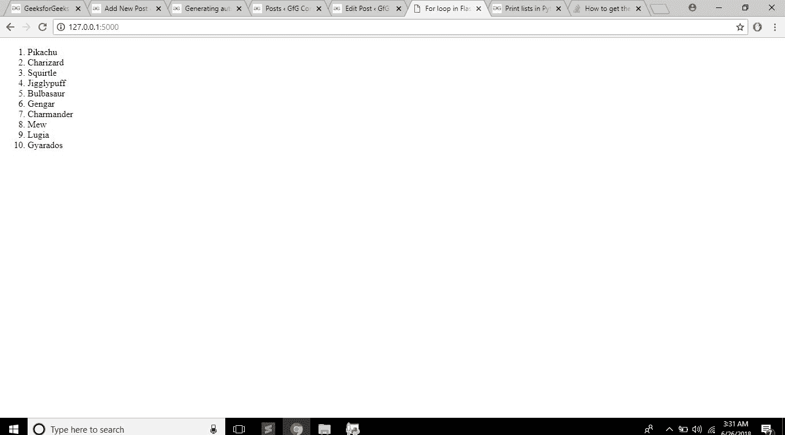
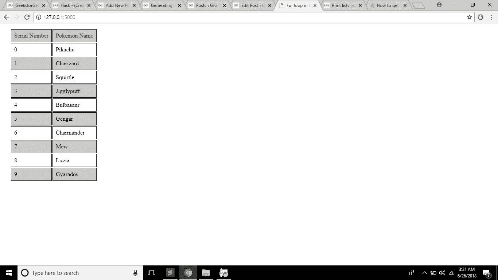

# Python |用于烧瓶中的循环

> 原文:[https://www . geesforgeks . org/python-for-loop-in-flask/](https://www.geeksforgeeks.org/python-using-for-loop-in-flask/)

**先决条件:** [HTML 基础](https://www.geeksforgeeks.org/html-basics/)[Python 基础](https://www.geeksforgeeks.org/python-3-basics/)[烧瓶](https://www.geeksforgeeks.org/flask-creating-first-simple-application/)

不可能每次用户在个人资料中进行更改时都编写前端课程。我们使用一个模板，它根据内容生成代码。

Flask 是用 Python 编写的网络开发框架之一。通过 flask，可以使用 jinja 模板在 HTML 代码中运行一个循环，并使用该模板自动生成 HTML 代码。

代码将以 Flask 的格式存储在目录中。所以我们将制作两个目录，

*   **静态**–对于静态文件，如图像、css、js
*   **模板**–针对 Html 模板

包含所有 Python 文件的 app.py 文件将存储在主目录中，index.html 文件将存储在模板中。

**app . py**
app . py 的代码对于两个例子都是一样的。我们会先以列表
的格式打印一个 Python 列表，上面有一些口袋妖怪的名字，然后是一个表格。

```
# importing modules
from flask import Flask, render_template

# declaring app name
app = Flask(__name__)

# making list of pokemons
Pokemons =["Pikachu", "Charizard", "Squirtle", "Jigglypuff", 
           "Bulbasaur", "Gengar", "Charmander", "Mew", "Lugia", "Gyarados"]

# defining home page
@app.route('/')
def homepage():

# returning index.html and list
# and length of list to html page
    return render_template("index.html", len = len(Pokemons), Pokemons = Pokemons)

    # if __name__ == '__main__':

    # running app
    app.run(use_reloader = True, debug = True)
```

**示例#1:制作列表**
我们将在这里使用 python 文件传递的参数 Pokemons 来自动打印列表，而不是每次都写。

**index.html**

```
<!DOCTYPE html>

<html>
<head>
    <title>For loop in Flask</title>
</head>
<body>

<ol>
<!-- For loop logic of jinja template -->


    <li>{{Pokemons[i]}}</li>


</ol>

</body>
</html>
```

**输出:**
不写列表任何数据，自动生成列表。你可以使用 css 和 js 让它们看起来很漂亮。


**例 2:制作表格**

我们将在这里使用 python 文件传递的参数 Pokemons 来自动打印一个表，而不是自己写。本例中 app.py 的代码与上面的代码相同。

**index.html**

```
<!DOCTYPE html>

<html>
<head>
    <title>For loop in Flask</title>
</head>

<!-- Adding some style to table (OPTIONAL) -->
<style type="text/css">

    th:tr{
        color: blue;

    }
    tr:nth-of-type(2n){
        border: 1px solid black;
        background-color: rgba(150, 150, 150, 0.5);

    }

    td{
        padding: 8px 8px;
        border: 1px solid black;
    }
</style>

<body>

<table style="margin-left: 20px;">
<!-- Table headers -->
    <th>
        <tr style="color: green; ">    
        <td>Serial Number</td>
        <td>Pokemon Name</td>
</tr>
    </th>

<!-- For loop logic of jinja template -->


<!-- table rows -->
<tr>
    <td>{{i}}</td>
    <td>{{Pokemons[i]}}</td>



</tr>

</table>

</body>
</html>
```

**输出:**
不写列表任何数据，自动生成表格。


**运行代码的说明:**

*   从上面提供的链接下载文件，或者以相同的格式制作和存储代码
*   在根目录下运行 app.py 文件
*   转到本地主机(在我的例子中是 http://127.0.0.1:5000/